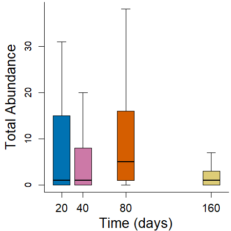

Abundance Analyses - Herbivore and Detritivores - Amphibians
================
Rodolfo Pelinson
26/12/2022

``` r
library(glmmTMB)
library(car)
library(emmeans)
library(DHARMa)
library(AICcmodavg)
```

Before anything, lets load and prepare some data sheets and vectors for
the analysis.

# Amphibians

First, lets make vectors of the abundances (summing up the abundance of
all amphatory taxa in each sample):

``` r
#cheking if the order of row in Trait_og and columns in com_orig match

data.frame(com = colnames(com_orig), trait = Trait_orig$genus)
```

    ##                      com                 trait
    ## 1                   Anax                  Anax
    ## 2                Berosus               Berosus
    ## 3           Bidessonotus          Bidessonotus
    ## 4                 Buenoa                Buenoa
    ## 5                 Caenis                Caenis
    ## 6            Callibaetis           Callibaetis
    ## 7        Ceratopogonidae       Ceratopogonidae
    ## 8              Chaoborus             Chaoborus
    ## 9           Chironominae          Chironominae
    ## 10             Copelatus             Copelatus
    ## 11                 Culex                 Culex
    ## 12               Curicta               Curicta
    ## 13          Derovatellus          Derovatellus
    ## 14    Elachistocleis.sp.    Elachistocleis sp.
    ## 15         Erythrodiplax         Erythrodiplax
    ## 16            Heterelmis            Heterelmis
    ## 17          Hydrocanthus          Hydrocanthus
    ## 18            Hypodessus            Hypodessus
    ## 19           Laccophilus           Laccophilus
    ## 20            Limnocoris            Limnocoris
    ## 21             Liodessus             Liodessus
    ## 22            Microvelia            Microvelia
    ## 23             Notonecta             Notonecta
    ## 24              Orthemis              Orthemis
    ## 25             Oxyagrion             Oxyagrion
    ## 26               Pantala               Pantala
    ## 27             Pelocoris             Pelocoris
    ## 28 Physalaemos.nattereri Physalaemos nattereri
    ## 29            Progomphus            Progomphus
    ## 30               Rhantus               Rhantus
    ## 31            Scinax.sp.            Scinax sp.
    ## 32                Sigara                Sigara
    ## 33           Tanypodinae           Tanypodinae
    ## 34          Thermonectus          Thermonectus
    ## 35              Tholymis              Tholymis
    ## 36          Tropisternus          Tropisternus

``` r
com_amphibian_ab <- rowSums(com_orig[,which(Trait_orig$trait == "amphibian_consumer")])

com_amphibian_ab_SS1 <- com_amphibian_ab[SS == "1"]
com_amphibian_ab_SS2 <- com_amphibian_ab[SS == "2"]
com_amphibian_ab_SS3 <- com_amphibian_ab[SS == "3"]
com_amphibian_ab_SS4 <- com_amphibian_ab[SS == "4"]
```

## All surveys

First, lets see what is the best probability distribution to model the
data

``` r
par(cex = 0.6)

data <- data.frame(isolation = isolation_all, treatments = treatments_all, ID, survey = SS)

#Gaussian
mod_amphibian_G <- glmmTMB(com_amphibian_ab ~ isolation * treatments * survey + (1|ID), family = "gaussian", data = data)
simulationResiduals_mod_amphibian_G <- simulateResiduals(fittedModel = mod_amphibian_G, plot = F, seed = 3, n = 1000)
plotQQunif(simulationResiduals_mod_amphibian_G, testUniformity = F, testOutliers = F, testDispersion = F, cex.lab = 1.5, cex.main = 1.5) 
```


``` r
plotResiduals(simulationResiduals_mod_amphibian_G,  quantreg = F, cex.lab = 1.5, cex.main = 1.5)
```


``` r
#Poisson
mod_amphibian_P <- glmmTMB(com_amphibian_ab ~ isolation * treatments * survey + (1|ID), family = "poisson", data = data)
simulationResiduals_mod_amphibian_P <- simulateResiduals(fittedModel = mod_amphibian_P, plot = F, seed = 3, n = 1000)
plotQQunif(simulationResiduals_mod_amphibian_P, testUniformity = F, testOutliers = F, testDispersion = F, cex.lab = 1.5, cex.main = 1.5) 
```


``` r
plotResiduals(simulationResiduals_mod_amphibian_P,  quantreg = F, cex.lab = 1.5, cex.main = 1.5)
```


``` r
#Negative Binomial
mod_amphibian_NB <- glmmTMB(com_amphibian_ab ~ isolation * treatments * survey + (1|ID), family = nbinom2(link = "log"), data = data)
simulationResiduals_mod_amphibian_NB <- simulateResiduals(fittedModel = mod_amphibian_NB, plot = F, seed = 3, n = 1000)
plotQQunif(simulationResiduals_mod_amphibian_NB, testUniformity = F, testOutliers = F, testDispersion = F, cex.lab = 1.5, cex.main = 1.5) 
```


``` r
plotResiduals(simulationResiduals_mod_amphibian_NB,  quantreg = F, cex.lab = 1.5, cex.main = 1.5)
```


``` r
AIC(mod_amphibian_G, mod_amphibian_P, mod_amphibian_NB)
```

    ##                  df      AIC
    ## mod_amphibian_G  38 4945.145
    ## mod_amphibian_P  37 6621.067
    ## mod_amphibian_NB 38 3115.593

It looks like the negative binomial distribution is the one to be
chosen.

Now the analysis

``` r
mod_amphibian_no_effect <- glmmTMB(com_amphibian_ab ~ 1 + (1|ID), family = nbinom2(link = "log"), data = data)
mod_amphibian_survey <- glmmTMB(com_amphibian_ab ~ survey + (1|ID), family = nbinom2(link = "log"), data = data)
mod_amphibian_treatments <- glmmTMB(com_amphibian_ab ~ isolation * treatments + (1|ID), family = nbinom2(link = "log"), data = data)
mod_amphibian_survey_treatments <- glmmTMB(com_amphibian_ab ~ survey + (isolation * treatments) + (1|ID), family = nbinom2(link = "log"), data = data)
mod_amphibian_survey_i_treatments <- glmmTMB(com_amphibian_ab ~ survey * (isolation * treatments) + (1|ID), family = nbinom2(link = "log"), data = data)

model_selection_amphibian <- aictab(list(mod_amphibian_no_effect,
                                        mod_amphibian_survey,
                                        mod_amphibian_treatments,
                                        mod_amphibian_survey_treatments,
                                        mod_amphibian_survey_i_treatments),
                                        modnames = c("No Effect",
                                                     "Survey",
                                                     "Treatments",
                                                     "Survey + Treatments",
                                                     "Survey * Treatments"), sort = FALSE)

model_selection_amphibian
```

    ## 
    ## Model selection based on AICc:
    ## 
    ##                      K    AICc Delta_AICc AICcWt       LL
    ## No Effect            3 3189.38      68.36      0 -1591.67
    ## Survey               6 3133.26      12.24      0 -1560.56
    ## Treatments          11 3189.32      68.30      0 -1583.43
    ## Survey + Treatments 14 3134.98      13.96      0 -1553.12
    ## Survey * Treatments 38 3121.02       0.00      1 -1519.80

It seems the effect of treatments are different in each survey.

## First Survey (20 day)

``` r
data_SS1 <- data.frame(isolation = isolation_SS1, treatments = treatments_SS1)


mod_amph_SS1_no_effect <- glmmTMB(com_amphibian_ab_SS1 ~ 1, family = nbinom2(link = "log"), data = data_SS1)
mod_amph_SS1_treatments <- glmmTMB(com_amphibian_ab_SS1 ~ treatments, family = nbinom2(link = "log"), data = data_SS1)
mod_amph_SS1_isolation <- glmmTMB(com_amphibian_ab_SS1 ~ isolation, family = nbinom2(link = "log"), data = data_SS1)
mod_amph_SS1_isolation_treatments <- glmmTMB(com_amphibian_ab_SS1 ~ isolation + treatments, family = nbinom2(link = "log"), data = data_SS1)
mod_amph_SS1_isolation_i_treatments <- glmmTMB(com_amphibian_ab_SS1 ~ isolation * treatments, family = nbinom2(link = "log"), data = data_SS1)

model_selection_amphibian_SS1 <- aictab(list(mod_amph_SS1_no_effect,
                                             mod_amph_SS1_treatments,
                                             mod_amph_SS1_isolation,
                                             mod_amph_SS1_isolation_treatments,
                                             mod_amph_SS1_isolation_i_treatments),
                                        modnames = c("No Effect",
                                                     "Treatments",
                                                     "Isolation",
                                                     "Treatments + Isolation",
                                                     "Treatments * Isolation"), sort = FALSE)

model_selection_amphibian_SS1
```

    ## 
    ## Model selection based on AICc:
    ## 
    ##                         K   AICc Delta_AICc AICcWt      LL
    ## No Effect               2 255.25       1.77   0.26 -125.48
    ## Treatments              4 258.43       4.94   0.05 -124.71
    ## Isolation               4 253.49       0.00   0.62 -122.24
    ## Treatments + Isolation  6 258.07       4.58   0.06 -121.93
    ## Treatments * Isolation 10 265.74      12.26   0.00 -119.64

No effects here.

Ploting it:

``` r
col_sugarcane <- "#CC6677"
col_pasture <- "#DDCC77"
col_control <- "#88CCEE"

par(mar = c(3.5, 4, 0.1, 0.1)+ 0.1, cex = 0.7, bty = "l")
boxplot(com_amphibian_ab_SS1 ~ treatments_SS1*isolation_SS1, outline = T,
        ylab = "", xlab = "", at = c(1,2,3, 5,6,7, 9,10,11), lwd = 0.5,
        main = "", xaxt="n", yaxt = "n", range = 1.5,
        col = rep(c(col_control, col_pasture, col_sugarcane),3), lty = 1,
        pch = 21, bg = rep(c(col_control, col_pasture, col_sugarcane),3), cex = 1)
        #ylim = c(0,140))

title(ylab="Total Abundance", line=2.5, cex.lab=1.52)
#title(main= "Predatory Insects", adj = 1)
axis(2, cex.axis = 1, gap.axis = -1)
axis(1,labels = c("30 m","120 m","480 m"), cex.axis = 1.25, at =c(2,6,10), line = 0.5, tick = F, gap.axis = -1)
axis(1,labels = rep("",9), cex.axis = 0.8, at =c(1,2,3, 5,6,7, 9,10,11), line = 0,tick = T)

legend(x = 1, y = 100, fill = c(col_control, col_pasture, col_sugarcane), legend = c("Control", "Pasture", "Sugarcane"), cex = 1)
```



## Second Survey (40 day)

``` r
data_SS2 <- data.frame(ID = ID_SS2_3_4, isolation = isolation_SS2_3_4, treatments = treatments_SS2_3_4,
                       treatments_contpast_sug = treatments_SS2_3_4_contpast_sug,
                       treatments_cont_pastsug = treatments_SS2_3_4_cont_pastsug,
                       treatments_contsug_past = treatments_SS2_3_4_contsug_past,
                       isolation30120_480 = isolation30120_480_SS2_3_4,
                       isolation30_120480 = isolation30_120480_SS2_3_4)


mod_amph_SS2_no_effect <- glmmTMB(com_amphibian_ab_SS2 ~ 1 + (1|ID), family = nbinom2(link = "log"), data = data_SS2)
mod_amph_SS2_isolation <- glmmTMB(com_amphibian_ab_SS2 ~ isolation + (1|ID), family = nbinom2(link = "log"), data = data_SS2)
mod_amph_SS2_treatments <- glmmTMB(com_amphibian_ab_SS2 ~ treatments + (1|ID), family = nbinom2(link = "log"), data = data_SS2)
mod_amph_SS2_treatments_isolation <- glmmTMB(com_amphibian_ab_SS2 ~ treatments + isolation + (1|ID), family = nbinom2(link = "log"), data = data_SS2)
mod_amph_SS2_treatments_i_isolation <- glmmTMB(com_amphibian_ab_SS2 ~ treatments * isolation + (1|ID), family = nbinom2(link = "log"), data = data_SS2)


model_selection_amphibian_SS2 <- aictab(list(mod_amph_SS2_no_effect,
                                             mod_amph_SS2_treatments,
                                             mod_amph_SS2_isolation,
                                             mod_amph_SS2_treatments_isolation,
                                             mod_amph_SS2_treatments_i_isolation),
                                        modnames = c("No Effect",
                                                     "Treatments",
                                                     "Isolation",
                                                     "Treatments + Isolation",
                                                     "Treatments * Isolation"), sort = FALSE)

model_selection_amphibian_SS2
```

    ## 
    ## Model selection based on AICc:
    ## 
    ##                         K   AICc Delta_AICc AICcWt      LL
    ## No Effect               3 896.05       7.24   0.02 -444.95
    ## Treatments              5 900.04      11.23   0.00 -444.85
    ## Isolation               5 888.81       0.00   0.86 -439.23
    ## Treatments + Isolation  7 892.93       4.12   0.11 -439.14
    ## Treatments * Isolation 11 899.75      10.95   0.00 -438.09

Ok. There is an important effect of isolation. Now lets take a look at
pairwise differences.

``` r
mod_amph_SS2_30120_480 <- glmmTMB(com_amphibian_ab_SS2 ~ isolation30120_480 + (1|ID), family = nbinom2(link = "log"), data = data_SS2)
mod_amph_SS2_30_120480 <- glmmTMB(com_amphibian_ab_SS2 ~ isolation30_120480 + (1|ID), family = nbinom2(link = "log"), data = data_SS2)

model_selection_amphibian_SS2_post_hoc_isolation <- aictab(list(mod_amph_SS2_isolation,
                                                               mod_amph_SS2_30120_480,
                                                               mod_amph_SS2_30_120480),
                                                          modnames = c("30 # 120 # 480",
                                                                       "(30 = 120) # 480",
                                                                       "30 # (120 = 480)"), sort = FALSE)

model_selection_amphibian_SS2_post_hoc_isolation
```

    ## 
    ## Model selection based on AICc:
    ## 
    ##                  K   AICc Delta_AICc AICcWt      LL
    ## 30 # 120 # 480   5 888.81       0.06   0.42 -439.23
    ## (30 = 120) # 480 4 891.08       2.34   0.14 -441.43
    ## 30 # (120 = 480) 4 888.74       0.00   0.44 -440.26

It looks like we only have enough evidence to say that the 30m is
different from 120 and 480m.

``` r
par(mar = c(3.5, 4, 0.1, 0.1)+ 0.1, cex = 0.7, bty = "l")
boxplot(com_amphibian_ab_SS2 ~ treatments_SS2_3_4*isolation_SS2_3_4, outline = T,
        ylab = "", xlab = "", at = c(1,2,3, 5,6,7, 9,10,11), lwd = 0.5,
        main = "", xaxt="n", yaxt = "n", range = 1.5,
        col = rep(c(col_control, col_pasture, col_sugarcane),3), lty = 1,
        pch = 21, bg = rep(c(col_control, col_pasture, col_sugarcane),3), cex = 1,
        ylim = c(0,250))

title(ylab="Total Abundance", line=2.5, cex.lab=1.52)
#title(main= "Predatory Insects", adj = 1)
axis(2, cex.axis = 1, gap.axis = -1)
axis(1,labels = c("30 m","120 m","480 m"), cex.axis = 1.25, at =c(2,6,10), line = 0.5, tick = F, gap.axis = -1)
axis(1,labels = rep("",9), cex.axis = 0.8, at =c(1,2,3, 5,6,7, 9,10,11), line = 0,tick = T)


position1 <- 250
text(y = rep(position1, 3),x = c(2, 6, 10),
     labels = c("a","b","b"),
     cex = 1, adj = c(0.5,0.5),
     col = c("grey50","grey0","grey0"))

arrows(x0 = c(1, 5, 9) - 0.4,
       y0 = rep(position1*0.95, 9),
       x1 = c(3, 7, 11) + 0.4,
       y1 = rep(position1*0.95, 9),
       code = 0, col = c("grey50","grey0","grey0"))
```


## Third Survey (80 day)

``` r
data_SS3 <- data.frame(ID = ID_SS2_3_4, isolation = isolation_SS2_3_4, treatments = treatments_SS2_3_4,
                       treatments_contpast_sug = treatments_SS2_3_4_contpast_sug,
                       treatments_cont_pastsug = treatments_SS2_3_4_cont_pastsug,
                       treatments_contsug_past = treatments_SS2_3_4_contsug_past,
                       isolation30120_480 = isolation30120_480_SS2_3_4,
                       isolation30_120480 = isolation30_120480_SS2_3_4)


mod_amph_SS3_no_effect <- glmmTMB(com_amphibian_ab_SS3 ~ 1 + (1|ID), family = nbinom2(link = "log"), data = data_SS3)
mod_amph_SS3_isolation <- glmmTMB(com_amphibian_ab_SS3 ~ isolation + (1|ID), family = nbinom2(link = "log"), data = data_SS3)
mod_amph_SS3_treatments <- glmmTMB(com_amphibian_ab_SS3 ~ treatments + (1|ID), family = nbinom2(link = "log"), data = data_SS3)
mod_amph_SS3_treatments_isolation <- glmmTMB(com_amphibian_ab_SS3 ~ treatments + isolation + (1|ID), family = nbinom2(link = "log"), data = data_SS3)
mod_amph_SS3_treatments_i_isolation <- glmmTMB(com_amphibian_ab_SS3 ~ treatments * isolation + (1|ID), family = nbinom2(link = "log"), data = data_SS3)


model_selection_amphibian_SS3 <- aictab(list(mod_amph_SS3_no_effect,
                                             mod_amph_SS3_treatments,
                                             mod_amph_SS3_isolation,
                                             mod_amph_SS3_treatments_isolation,
                                             mod_amph_SS3_treatments_i_isolation),
                                        modnames = c("No Effect",
                                                     "Treatments",
                                                     "Isolation",
                                                     "Treatments + Isolation",
                                                     "Treatments * Isolation"), sort = FALSE)

model_selection_amphibian_SS3
```

    ## 
    ## Model selection based on AICc:
    ## 
    ##                         K    AICc Delta_AICc AICcWt      LL
    ## No Effect               3 1202.62       4.39   0.08 -598.24
    ## Treatments              5 1198.24       0.00   0.71 -593.95
    ## Isolation               5 1205.50       7.26   0.02 -597.58
    ## Treatments + Isolation  7 1200.90       2.66   0.19 -593.12
    ## Treatments * Isolation 11 1207.96       9.72   0.01 -592.19

Ok. There is an important effect of treatments. Now lets take a look at
pairwise differences.

``` r
mod_amph_SS3_contpast_sug <- glmmTMB(com_amphibian_ab_SS3 ~ treatments_contpast_sug + (1|ID), family = nbinom2(link = "log"), data = data_SS3)
mod_amph_SS3_cont_pastsug <- glmmTMB(com_amphibian_ab_SS3 ~ treatments_cont_pastsug + (1|ID), family = nbinom2(link = "log"), data = data_SS3)
mod_amph_SS3_contsug_past <- glmmTMB(com_amphibian_ab_SS3 ~ treatments_contsug_past + (1|ID), family = nbinom2(link = "log"), data = data_SS3)

model_selection_amphibian_SS3_post_hoc_treatments <- aictab(list(mod_amph_SS3_treatments,
                                                                mod_amph_SS3_contpast_sug,
                                                                mod_amph_SS3_cont_pastsug,
                                                                mod_amph_SS3_contsug_past),
                                                           modnames = c("Control # Pasture # Sugarcane",
                                                                        "(Control = Pasture) # Sugarcane",
                                                                        "Control # (Pasture = Sugarcane)",
                                                                        "(Control = Sugarcane) # Pasture"), sort = FALSE)

model_selection_amphibian_SS3_post_hoc_treatments
```

    ## 
    ## Model selection based on AICc:
    ## 
    ##                                 K    AICc Delta_AICc AICcWt      LL
    ## Control # Pasture # Sugarcane   5 1198.24       2.10   0.25 -593.95
    ## (Control = Pasture) # Sugarcane 4 1196.14       0.00   0.70 -593.95
    ## Control # (Pasture = Sugarcane) 4 1202.37       6.23   0.03 -597.07
    ## (Control = Sugarcane) # Pasture 4 1202.95       6.81   0.02 -597.36

It looks like we only have enough evidence to say that Sugarcane is
different from Pasture and Control.

``` r
par(mar = c(3.5, 4, 0.1, 0.1)+ 0.1, cex = 0.7, bty = "l")
boxplot(com_amphibian_ab_SS3 ~ treatments_SS2_3_4*isolation_SS2_3_4, outline = T,
        ylab = "", xlab = "", at = c(1,2,3, 5,6,7, 9,10,11), lwd = 0.5,
        main = "", xaxt="n", yaxt = "n", range = 1.5,
        col = rep(c(col_control, col_pasture, col_sugarcane),3), lty = 1,
        pch = 21, bg = rep(c(col_control, col_pasture, col_sugarcane),3), cex = 1,
        ylim = c(0,130))

title(ylab="Total Abundance", line=2.5, cex.lab=1.52)
#title(main= "Predatory Insects", adj = 1)
axis(2, cex.axis = 1, gap.axis = -1)
axis(1,labels = c("30 m","120 m","480 m"), cex.axis = 1.25, at =c(2,6,10), line = 0.5, tick = F, gap.axis = -1)
axis(1,labels = rep("",9), cex.axis = 0.8, at =c(1,2,3, 5,6,7, 9,10,11), line = 0,tick = T)

position1 <- 130

text(y = rep(position1, 9),x = c(1,2,3, 5,6,7, 9,10,11),
     labels = c("a","a","b",   "a","a","b",   "a","a","b"),
     cex = 1, adj = c(0.5,0.5),
     col = c("grey50","grey50","grey0",   "grey50","grey50","grey0",   "grey50","grey50","grey0"))

arrows(x0 = c(1, 2,3, 5, 6,7, 9,10,11) - 0.4,
       y0 = rep(position1*0.95, 9),
       x1 = c(1, 2,3, 5, 6,7, 9,10,11) + 0.4,
       y1 = rep(position1*0.95, 9),
       code = 0, col = c("grey50","grey50","grey0",   "grey50","grey50","grey0",   "grey50","grey50","grey0"))
```


## Fourth Survey (160 day)

``` r
data_SS4 <- data.frame(ID = ID_SS2_3_4, isolation = isolation_SS2_3_4, treatments = treatments_SS2_3_4,
                       treatments_contpast_sug = treatments_SS2_3_4_contpast_sug,
                       treatments_cont_pastsug = treatments_SS2_3_4_cont_pastsug,
                       treatments_contsug_past = treatments_SS2_3_4_contsug_past,
                       isolation30120_480 = isolation30120_480_SS2_3_4,
                       isolation30_120480 = isolation30_120480_SS2_3_4)


mod_amph_SS4_no_effect <- glmmTMB(com_amphibian_ab_SS4 ~ 1 + (1|ID), family = nbinom2(link = "log"), data = data_SS4)
mod_amph_SS4_isolation <- glmmTMB(com_amphibian_ab_SS4 ~ isolation + (1|ID), family = nbinom2(link = "log"), data = data_SS4)
mod_amph_SS4_treatments <- glmmTMB(com_amphibian_ab_SS4 ~ treatments + (1|ID), family = nbinom2(link = "log"), data = data_SS4)
mod_amph_SS4_treatments_isolation <- glmmTMB(com_amphibian_ab_SS4 ~ treatments + isolation + (1|ID), family = nbinom2(link = "log"), data = data_SS4)
mod_amph_SS4_treatments_i_isolation <- glmmTMB(com_amphibian_ab_SS4 ~ treatments * isolation + (1|ID), family = nbinom2(link = "log"), data = data_SS4)


model_selection_amphibian_SS4 <- aictab(list(mod_amph_SS4_no_effect,
                                            mod_amph_SS4_treatments,
                                            mod_amph_SS4_isolation,
                                            mod_amph_SS4_treatments_isolation,
                                            mod_amph_SS4_treatments_i_isolation),
                                       modnames = c("No Effect",
                                                    "Treatments",
                                                    "Isolation",
                                                    "Treatments + Isolation",
                                                    "Treatments * Isolation"), sort = FALSE)


model_selection_amphibian_SS4
```

    ## 
    ## Model selection based on AICc:
    ## 
    ##                         K   AICc Delta_AICc AICcWt      LL
    ## No Effect               3 706.31       0.00   0.41 -350.09
    ## Treatments              5 708.61       2.30   0.13 -349.13
    ## Isolation               5 706.70       0.38   0.34 -348.18
    ## Treatments + Isolation  7 708.84       2.52   0.12 -347.09
    ## Treatments * Isolation 11 716.22       9.91   0.00 -346.32

No effect.

``` r
par(mar = c(3.5, 4, 0.1, 0.1)+ 0.1, cex = 0.7, bty = "l")

boxplot(com_amphibian_ab_SS4 ~ treatments_SS2_3_4*isolation_SS2_3_4, outline = T,
        ylab = "", xlab = "", at = c(1,2,3, 5,6,7, 9,10,11), lwd = 0.5,
        main = "", xaxt="n", yaxt = "n", range = 1.5,
        col = rep(c(col_control, col_pasture, col_sugarcane),3), lty = 1,
        pch = 21, bg = rep(c(col_control, col_pasture, col_sugarcane),3), cex = 1)

title(ylab="Total Abundance", line=2.5, cex.lab=1.52)
axis(2, cex.axis = 1, gap.axis = -1)
axis(1,labels = c("30 m","120 m","480 m"), cex.axis = 1.25, at =c(2,6,10), line = 0.5, tick = F, gap.axis = -1)
axis(1,labels = rep("",9), cex.axis = 0.8, at =c(1,2,3, 5,6,7, 9,10,11), line = 0,tick = T)
```


