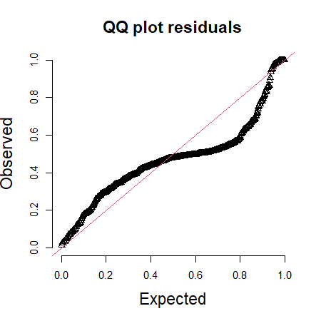
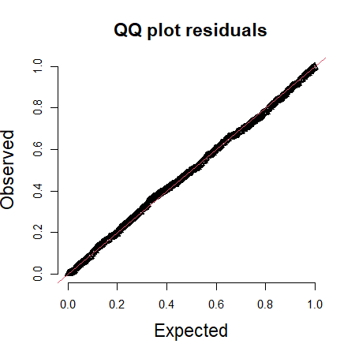
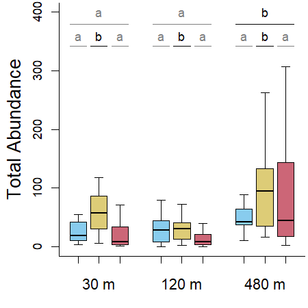

Abundance Analyses - Herbivore and Detritivore Insects
================
Rodolfo Pelinson
26/12/2022

``` r
library(glmmTMB)
library(car)
library(emmeans)
library(DHARMa)
library(AICcmodavg)
```

Before anything, lets load and prepare some data sheets and vectors for
the analysis.

# Herbivore and Detritivore Insects

First, lets make vectors of the abundances (summing up the abundance of
all herbivore and detritivore insects in each sample):

``` r
#cheking if the order of row in Trait_og and columns in com_orig match
data.frame(com = colnames(com_orig), trait = Trait_orig$genus)
```

    ##                      com                 trait
    ## 1                   Anax                  Anax
    ## 2                Berosus               Berosus
    ## 3           Bidessonotus          Bidessonotus
    ## 4                 Buenoa                Buenoa
    ## 5                 Caenis                Caenis
    ## 6            Callibaetis           Callibaetis
    ## 7        Ceratopogonidae       Ceratopogonidae
    ## 8              Chaoborus             Chaoborus
    ## 9           Chironominae          Chironominae
    ## 10             Copelatus             Copelatus
    ## 11                 Culex                 Culex
    ## 12               Curicta               Curicta
    ## 13          Derovatellus          Derovatellus
    ## 14    Elachistocleis.sp.    Elachistocleis sp.
    ## 15         Erythrodiplax         Erythrodiplax
    ## 16            Heterelmis            Heterelmis
    ## 17          Hydrocanthus          Hydrocanthus
    ## 18            Hypodessus            Hypodessus
    ## 19           Laccophilus           Laccophilus
    ## 20            Limnocoris            Limnocoris
    ## 21             Liodessus             Liodessus
    ## 22            Microvelia            Microvelia
    ## 23             Notonecta             Notonecta
    ## 24              Orthemis              Orthemis
    ## 25             Oxyagrion             Oxyagrion
    ## 26               Pantala               Pantala
    ## 27             Pelocoris             Pelocoris
    ## 28 Physalaemos.nattereri Physalaemos nattereri
    ## 29            Progomphus            Progomphus
    ## 30               Rhantus               Rhantus
    ## 31            Scinax.sp.            Scinax sp.
    ## 32                Sigara                Sigara
    ## 33           Tanypodinae           Tanypodinae
    ## 34          Thermonectus          Thermonectus
    ## 35              Tholymis              Tholymis
    ## 36          Tropisternus          Tropisternus

``` r
com_herb_det_ab <- rowSums(com_orig[,which(Trait_orig$trait == "insect_consumer")])

com_herb_det_ab_SS1 <- com_herb_det_ab[SS == "1"]
com_herb_det_ab_SS2 <- com_herb_det_ab[SS == "2"]
com_herb_det_ab_SS3 <- com_herb_det_ab[SS == "3"]
com_herb_det_ab_SS4 <- com_herb_det_ab[SS == "4"]
```

## All surveys

First, lets see what is the best probability distribution to model the
data

``` r
par(cex = 0.6)

data <- data.frame(ID = ID,
                         treatments = treatments_all,
                         isolation = isolation_all,
                         survey = SS,
                         survey_12_3_4 = SS_12_3_4,
                         survey_1_2_34 = SS_1_2_34,
                         survey_1_23_4 = SS_1_23_4,
                         survey_123_4 = SS_123_4,
                         survey_1_234 = SS_1_234)
#Gaussian
mod_herb_det_G <- glmmTMB(com_herb_det_ab ~ isolation * treatments * survey  + (1|ID), family = "gaussian", data = data)
simulationResiduals_mod_herb_det_G <- simulateResiduals(fittedModel = mod_herb_det_G, plot = F, seed = 3, n = 1000)
plotQQunif(simulationResiduals_mod_herb_det_G, testUniformity = F, testOutliers = F, testDispersion = F, cex.lab = 1.5, cex.main = 1.5) 
```



``` r
plotResiduals(simulationResiduals_mod_herb_det_G,  quantreg = F, cex.lab = 1.5, cex.main = 1.5)
```


``` r
#Poisson
mod_herb_det_P <- glmmTMB(com_herb_det_ab ~ isolation * treatments * survey  + (1|ID), family = "poisson", data = data)
simulationResiduals_mod_herb_det_P <- simulateResiduals(fittedModel = mod_herb_det_P, plot = F, seed = 3, n = 1000)
plotQQunif(simulationResiduals_mod_herb_det_P, testUniformity = F, testOutliers = F, testDispersion = F, cex.lab = 1.5, cex.main = 1.5) 
```


``` r
plotResiduals(simulationResiduals_mod_herb_det_P,  quantreg = F, cex.lab = 1.5, cex.main = 1.5)
```


``` r
#Negative Binomial
mod_herb_det_NB <- glmmTMB(com_herb_det_ab ~ isolation * treatments * survey  + (1|ID), family = nbinom2(link = "log"), data = data)
simulationResiduals_mod_herb_det_NB <- simulateResiduals(fittedModel = mod_herb_det_NB, plot = F, seed = 3, n = 1000)
plotQQunif(simulationResiduals_mod_herb_det_NB, testUniformity = F, testOutliers = F, testDispersion = F, cex.lab = 1.5, cex.main = 1.5) 
```



``` r
plotResiduals(simulationResiduals_mod_herb_det_NB,  quantreg = F, cex.lab = 1.5, cex.main = 1.5)
```


``` r
AIC(mod_herb_det_G, mod_herb_det_P, mod_herb_det_NB)
```

    ##                 df       AIC
    ## mod_herb_det_G  38  6510.221
    ## mod_herb_det_P  37 19510.184
    ## mod_herb_det_NB 38  4958.292

It looks like the negative binomial distribution is the one to be
chosen.

Now the analysis

``` r
mod_herb_det_no_effect <- glmmTMB(com_herb_det_ab ~ 1 + (1|ID), family = nbinom2(link = "log"), data = data)
mod_herb_det_survey <- glmmTMB(com_herb_det_ab ~ survey+ (1|ID), family = nbinom2(link = "log"), data = data)
mod_herb_det_treatments <- glmmTMB(com_herb_det_ab ~ isolation * treatments+ (1|ID), family = nbinom2(link = "log"), data = data)
mod_herb_det_survey_treatments <- glmmTMB(com_herb_det_ab ~ survey + (isolation * treatments)+ (1|ID), family = nbinom2(link = "log"), data = data)
mod_herb_det_survey_i_treatments <- glmmTMB(com_herb_det_ab ~ survey * (isolation * treatments)+ (1|ID), family = nbinom2(link = "log"), data = data)

model_selection_herb_det <- aictab(list(mod_herb_det_no_effect,
                                        mod_herb_det_survey,
                                        mod_herb_det_treatments,
                                        mod_herb_det_survey_treatments,
                                        mod_herb_det_survey_i_treatments),
                                        modnames = c("No Effect",
                                                     "Survey",
                                                     "Treatments",
                                                     "Survey + Treatments",
                                                     "Survey * Treatments"), sort = FALSE)

model_selection_herb_det
```

    ## 
    ## Model selection based on AICc:
    ## 
    ##                      K    AICc Delta_AICc AICcWt       LL
    ## No Effect            3 5434.62     470.90      0 -2714.29
    ## Survey               6 5227.72     264.00      0 -2607.79
    ## Treatments          11 5427.34     463.62      0 -2702.44
    ## Survey + Treatments 14 5209.64     245.92      0 -2590.45
    ## Survey * Treatments 38 4963.72       0.00      1 -2441.15

It seems that the an additive effect of treatments and survey are
equally plausible.

Lets see of all surveys are different

``` r
mod_herb_det_survey_1_2_3_4 <- glmmTMB(com_herb_det_ab ~ survey * (isolation * treatments) + (1|ID), family = nbinom2(link = "log"), data = data)
mod_herb_det_survey_12_3_4 <- glmmTMB(com_herb_det_ab ~ survey_12_3_4 * (isolation * treatments) + (1|ID), family = nbinom2(link = "log"), data = data)
mod_herb_det_survey_1_2_34 <- glmmTMB(com_herb_det_ab ~ survey_1_2_34 * (isolation * treatments) + (1|ID), family = nbinom2(link = "log"), data = data)
mod_herb_det_survey_1_23_4 <- glmmTMB(com_herb_det_ab ~ survey_1_23_4 * (isolation * treatments) + (1|ID), family = nbinom2(link = "log"), data = data)
mod_herb_det_survey_123_4 <- glmmTMB(com_herb_det_ab ~ survey_123_4 * (isolation * treatments) + (1|ID), family = nbinom2(link = "log"), data = data)
mod_herb_det_survey_1_234 <- glmmTMB(com_herb_det_ab ~ survey_1_234 * (isolation * treatments) + (1|ID), family = nbinom2(link = "log"), data = data)

model_selection_herb_det_survey <- aictab(list(mod_herb_det_survey_1_2_3_4,
                                        mod_herb_det_survey_12_3_4,
                                        mod_herb_det_survey_1_2_34,
                                        mod_herb_det_survey_1_23_4,
                                        mod_herb_det_survey_123_4,
                                        mod_herb_det_survey_1_234),
                                        modnames = c("1 # 2 # 3 # 4",
                                                              "(1 = 2) # 3 # 4",
                                                              "1 # 2 # (3 = 4)",
                                                              "1 # (2 = 3) # 4",
                                                              "(1 = 2 = 3) # 4",
                                                              "1 # (2 = 3 = 4)"), sort = FALSE)

model_selection_herb_det_survey
```

    ## 
    ## Model selection based on AICc:
    ## 
    ##                  K    AICc Delta_AICc AICcWt       LL
    ## 1 # 2 # 3 # 4   38 4963.72       0.00      1 -2441.15
    ## (1 = 2) # 3 # 4 29 5115.78     152.06      0 -2527.32
    ## 1 # 2 # (3 = 4) 29 5025.80      62.08      0 -2482.33
    ## 1 # (2 = 3) # 4 29 5301.22     337.50      0 -2620.04
    ## (1 = 2 = 3) # 4 20 5329.05     365.33      0 -2643.78
    ## 1 # (2 = 3 = 4) 20 5398.41     434.69      0 -2678.46

It looks like all surveys are different.

Ploting it:

``` r
col_survey_1 <- "#0072B2"
col_survey_2 <- "#CC79A7"
col_survey_3 <- "#D55E00"
col_survey_4 <- "#E69F00"

par(mar = c(3.5, 4, 0.1, 0.1)+ 0.1, cex = 0.7, bty = "l")
boxplot(com_herb_det_ab ~ SS, outline = T,
        ylab = "", xlab = "", at = c(1,2,4,8), lwd = 0.5,
        main = "", xaxt="n", yaxt = "n", range = 1.5,
        col = rep(c(col_survey_1, col_survey_2, col_survey_3, col_survey_4),3), lty = 1,
        pch = 21, bg = rep(c(col_survey_1, col_survey_2, col_survey_3, col_survey_4),3), cex = 1)
        #ylim = c(0,140))

title(ylab="Total Abundance", line=2.5, cex.lab=1.52)
#title(main= "Predatory Insects", adj = 1)
axis(2, cex.axis = 1, gap.axis = -1)
axis(1,labels = c("20","40","80", "160"), cex.axis = 1.25, at =c(1,2,4,8), line = 0, tick = F, gap.axis = -1)
title(xlab="Time (days)", line=2.5, cex.lab=1.52)
axis(1,labels = rep("",4), cex.axis = 0.8, at =c(1,2,4,8), line = 0,tick = T)
```


## First Survey (20 day)

``` r
data_SS1 <- data.frame(isolation = isolation_SS1, treatments = treatments_SS1, isolation30120_480, isolation30120_480)


mod_herb_det_SS1_no_effect <- glmmTMB(com_herb_det_ab_SS1 ~ 1, family = nbinom2(link = "log"), data = data_SS1)
mod_herb_det_SS1_treatments <- glmmTMB(com_herb_det_ab_SS1 ~ treatments, family = nbinom2(link = "log"), data = data_SS1)
mod_herb_det_SS1_isolation <- glmmTMB(com_herb_det_ab_SS1 ~ isolation, family = nbinom2(link = "log"), data = data_SS1)
mod_herb_det_SS1_isolation_treatments <- glmmTMB(com_herb_det_ab_SS1 ~ isolation + treatments, family = nbinom2(link = "log"), data = data_SS1)
mod_herb_det_SS1_isolation_i_treatments <- glmmTMB(com_herb_det_ab_SS1 ~ isolation * treatments, family = nbinom2(link = "log"), data = data_SS1)

model_selection_herb_det_SS1 <- aictab(list(mod_herb_det_SS1_no_effect,
                                             mod_herb_det_SS1_treatments,
                                             mod_herb_det_SS1_isolation,
                                             mod_herb_det_SS1_isolation_treatments,
                                             mod_herb_det_SS1_isolation_i_treatments),
                                        modnames = c("No Effect",
                                                     "Treatments",
                                                     "Isolation",
                                                     "Treatments + Isolation",
                                                     "Treatments * Isolation"), sort = FALSE)

model_selection_herb_det_SS1
```

    ## 
    ## Model selection based on AICc:
    ## 
    ##                         K   AICc Delta_AICc AICcWt      LL
    ## No Effect               2 301.71       4.43   0.07 -148.71
    ## Treatments              4 304.28       7.00   0.02 -147.64
    ## Isolation               4 297.28       0.00   0.67 -144.14
    ## Treatments + Isolation  6 300.63       3.35   0.13 -143.21
    ## Treatments * Isolation 10 300.85       3.57   0.11 -137.19

There is an important effect of isolation, lets see which levels are
different from which.

``` r
mod_herb_det_SS1_30120_480 <- glmmTMB(com_herb_det_ab_SS1 ~ isolation30120_480, family = nbinom2(link = "log"), data = data_SS1)
mod_herb_det_SS1_30_120480 <- glmmTMB(com_herb_det_ab_SS1 ~ isolation30_120480, family = nbinom2(link = "log"), data = data_SS1)

model_selection_herb_det_SS1_post_hoc_isolation <- aictab(list(mod_herb_det_SS1_isolation,
                                                                mod_herb_det_SS1_30120_480,
                                                                mod_herb_det_SS1_30_120480),
                                                           modnames = c("30 # 120 # 480",
                                                                        "(30 = 120) # 480",
                                                                        "30 # (120 = 480)"), sort = FALSE)

model_selection_herb_det_SS1_post_hoc_isolation
```

    ## 
    ## Model selection based on AICc:
    ## 
    ##                  K   AICc Delta_AICc AICcWt      LL
    ## 30 # 120 # 480   4 297.28       2.13   0.24 -144.14
    ## (30 = 120) # 480 3 299.92       4.78   0.06 -146.67
    ## 30 # (120 = 480) 3 295.14       0.00   0.70 -144.28

It appears that 30m is different from 120m and 480m.

Ploting it:

``` r
col_sugarcane <- "#CC6677"
col_pasture <- "#DDCC77"
col_control <- "#88CCEE"

par(mar = c(3.5, 4, 0.1, 0.1)+ 0.1, cex = 0.7, bty = "l")
boxplot(com_herb_det_ab_SS1 ~ treatments_SS1*isolation_SS1, outline = T,
        ylab = "", xlab = "", at = c(1,2,3, 5,6,7, 9,10,11), lwd = 0.5,
        main = "", xaxt="n", yaxt = "n", range = 1.5,
        col = rep(c(col_control, col_pasture, col_sugarcane),3), lty = 1,
        pch = 21, bg = rep(c(col_control, col_pasture, col_sugarcane),3), cex = 1,
ylim = c(0,150))

title(ylab="Total Abundance", line=2.5, cex.lab=1.52)
#title(main= "Predatory Insects", adj = 1)
axis(2, cex.axis = 1, gap.axis = -1)
axis(1,labels = c("30 m","120 m","480 m"), cex.axis = 1.25, at =c(2,6,10), line = 0.5, tick = F, gap.axis = -1)
axis(1,labels = rep("",9), cex.axis = 0.8, at =c(1,2,3, 5,6,7, 9,10,11), line = 0,tick = T)


position1 <- 150
text(y = rep(position1, 3),x = c(2, 6, 10),
     labels = c("b","a","a"),
     cex = 1, adj = c(0.5,0.5),
     col = c("grey0","grey50","grey50"))

arrows(x0 = c(1, 5, 9) - 0.4,
       y0 = rep(position1*0.95, 9),
       x1 = c(3, 7, 11) + 0.4,
       y1 = rep(position1*0.95, 9),
       code = 0, col = c("grey0","grey50","grey50"))

legend(x = 7, y = 100, fill = c(col_control, col_pasture, col_sugarcane), legend = c("Control", "Pasture", "Sugarcane"), cex = 1)
```


## Second Survey (40 day)

Now the analysis

``` r
data_SS2 <- data.frame(ID = ID_SS2_3_4, isolation = isolation_SS2_3_4, treatments = treatments_SS2_3_4,
                       treatments_contpast_sug = treatments_SS2_3_4_contpast_sug,
                       treatments_cont_pastsug = treatments_SS2_3_4_cont_pastsug,
                       treatments_contsug_past = treatments_SS2_3_4_contsug_past,
                       isolation30120_480 = isolation30120_480_SS2_3_4,
                       isolation30_120480 = isolation30_120480_SS2_3_4)


mod_herb_det_SS2_no_effect <- glmmTMB(com_herb_det_ab_SS2 ~ 1 + (1|ID), family = nbinom2(link = "log"), data = data_SS2)
mod_herb_det_SS2_isolation <- glmmTMB(com_herb_det_ab_SS2 ~ isolation + (1|ID), family = nbinom2(link = "log"), data = data_SS2)
mod_herb_det_SS2_treatments <- glmmTMB(com_herb_det_ab_SS2 ~ treatments + (1|ID), family = nbinom2(link = "log"), data = data_SS2)
mod_herb_det_SS2_treatments_isolation <- glmmTMB(com_herb_det_ab_SS2 ~ treatments + isolation + (1|ID), family = nbinom2(link = "log"), data = data_SS2)
mod_herb_det_SS2_treatments_i_isolation <- glmmTMB(com_herb_det_ab_SS2 ~ treatments * isolation + (1|ID), family = nbinom2(link = "log"), data = data_SS2)


model_selection_herb_det_SS2 <- aictab(list(mod_herb_det_SS2_no_effect,
                                             mod_herb_det_SS2_treatments,
                                             mod_herb_det_SS2_isolation,
                                             mod_herb_det_SS2_treatments_isolation,
                                             mod_herb_det_SS2_treatments_i_isolation),
                                        modnames = c("No Effect",
                                                     "Treatments",
                                                     "Isolation",
                                                     "Treatments + Isolation",
                                                     "Treatments * Isolation"), sort = FALSE)

model_selection_herb_det_SS2
```

    ## 
    ## Model selection based on AICc:
    ## 
    ##                         K    AICc Delta_AICc AICcWt      LL
    ## No Effect               3 1072.62      67.53   0.00 -533.24
    ## Treatments              5 1012.24       7.15   0.02 -500.95
    ## Isolation               5 1074.77      69.68   0.00 -532.21
    ## Treatments + Isolation  7 1005.09       0.00   0.80 -495.22
    ## Treatments * Isolation 11 1008.07       2.98   0.18 -492.25

Ok. There are important effects of treatments and isolation. The model
that includes an interaction between the two was also plausible, but not
as much. In this case, it is parcimonious to stick with the model that
only contains main effects.

``` r
mod_herb_det_SS2_contpast_sug <- glmmTMB(com_herb_det_ab_SS2 ~ isolation + treatments_contpast_sug + (1|ID), family = nbinom2(link = "log"), data = data_SS2)
mod_herb_det_SS2_cont_pastsug <- glmmTMB(com_herb_det_ab_SS2 ~ isolation + treatments_cont_pastsug + (1|ID), family = nbinom2(link = "log"), data = data_SS2)
mod_herb_det_SS2_contsug_past <- glmmTMB(com_herb_det_ab_SS2 ~ isolation + treatments_contsug_past + (1|ID), family = nbinom2(link = "log"), data = data_SS2)

model_selection_herb_det_SS2_post_hoc_treatments <- aictab(list(mod_herb_det_SS2_treatments_isolation,
                                                                 mod_herb_det_SS2_contpast_sug,
                                                                 mod_herb_det_SS2_cont_pastsug,
                                                                 mod_herb_det_SS2_contsug_past),
                                                            modnames = c("Control # Pasture # Sugarcane",
                                                                         "(Control = Pasture) # Sugarcane",
                                                                         "Control # (Pasture = Sugarcane)",
                                                                         "(Control = Sugarcane) # Pasture"), sort = FALSE)


model_selection_herb_det_SS2_post_hoc_treatments
```

    ## 
    ## Model selection based on AICc:
    ## 
    ##                                 K    AICc Delta_AICc AICcWt      LL
    ## Control # Pasture # Sugarcane   7 1005.09       1.76   0.29 -495.22
    ## (Control = Pasture) # Sugarcane 6 1003.33       0.00   0.71 -495.42
    ## Control # (Pasture = Sugarcane) 6 1068.49      65.16   0.00 -528.00
    ## (Control = Sugarcane) # Pasture 6 1065.57      62.24   0.00 -526.54

It looks like we only have enough evidence to say that the sugarcane
treatment is different from the others.

``` r
mod_herb_det_SS2_30120_480 <- glmmTMB(com_herb_det_ab_SS2 ~ treatments + isolation30120_480 + (1|ID), family = nbinom2(link = "log"), data = data_SS2)
mod_herb_det_SS2_30_120480 <- glmmTMB(com_herb_det_ab_SS2 ~ treatments + isolation30_120480 + (1|ID), family = nbinom2(link = "log"), data = data_SS2)

model_selection_herb_det_SS2_post_hoc_isolation <- aictab(list(mod_herb_det_SS2_treatments_isolation,
                                                               mod_herb_det_SS2_30120_480,
                                                               mod_herb_det_SS2_30_120480),
                                                          modnames = c("30 # 120 # 480",
                                                                       "(30 = 120) # 480",
                                                                       "30 # (120 = 480)"), sort = FALSE)

model_selection_herb_det_SS2_post_hoc_isolation
```

    ## 
    ## Model selection based on AICc:
    ## 
    ##                  K    AICc Delta_AICc AICcWt      LL
    ## 30 # 120 # 480   7 1005.09       0.00   0.46 -495.22
    ## (30 = 120) # 480 6 1006.55       1.45   0.22 -497.03
    ## 30 # (120 = 480) 6 1005.87       0.78   0.31 -496.69

It looks like we only have enough evidence to say that the 480m of
isolation is different from the 30m.

``` r
par(mar = c(3.5, 4, 0.1, 0.1)+ 0.1, cex = 0.7, bty = "l")
boxplot(com_herb_det_ab_SS2 ~ treatments_SS2_3_4*isolation_SS2_3_4, outline = T,
        ylab = "", xlab = "", at = c(1,2,3, 5,6,7, 9,10,11), lwd = 0.5,
        main = "", xaxt="n", yaxt = "n", range = 1.5,
        col = rep(c(col_control, col_pasture, col_sugarcane),3), lty = 1,
        pch = 21, bg = rep(c(col_control, col_pasture, col_sugarcane),3), cex = 1,
        ylim = c(0,230))

title(ylab="Total Abundance", line=2.5, cex.lab=1.52)
#title(main= "Predatory Insects", adj = 1)
axis(2, cex.axis = 1, gap.axis = -1)
axis(1,labels = c("30 m","120 m","480 m"), cex.axis = 1.25, at =c(2,6,10), line = 0.5, tick = F, gap.axis = -1)
axis(1,labels = rep("",9), cex.axis = 0.8, at =c(1,2,3, 5,6,7, 9,10,11), line = 0,tick = T)


position1 <- 230
text(y = rep(position1, 3),x = c(2, 6, 10),
     labels = c("a","ab","b"),
     cex = 1, adj = c(0.5,0.5),
     col = c("grey50","grey25","grey0"))

arrows(x0 = c(1, 5, 9) - 0.4,
       y0 = rep(position1*0.95, 9),
       x1 = c(3, 7, 11) + 0.4,
       y1 = rep(position1*0.95, 9),
       code = 0, col = c("grey50","grey25","grey0"))


position2 <- position1 * 0.9

text(y = rep(position2, 9),x = c(1,2,3, 5,6,7, 9,10,11),
     labels = c("b","b","a",   "b","b","a",   "b","b","a"),
     cex = 1, adj = c(0.5,0.5),
     col = c("grey0","grey0","grey50",   "grey0","grey0","grey50",   "grey0","grey0","grey50"))

arrows(x0 = c(1, 2,3, 5, 6,7, 9,10,11) - 0.4,
       y0 = rep(position2*0.95, 9),
       x1 = c(1, 2,3, 5, 6,7, 9,10,11) + 0.4,
       y1 = rep(position2*0.95, 9),
       code = 0, col = c("grey0","grey0","grey50",   "grey0","grey0","grey50",   "grey0","grey0","grey50"))
```


## Third Survey (80 day)

``` r
data_SS3 <- data.frame(ID = ID_SS2_3_4, isolation = isolation_SS2_3_4, treatments = treatments_SS2_3_4,
                       treatments_contpast_sug = treatments_SS2_3_4_contpast_sug,
                       treatments_cont_pastsug = treatments_SS2_3_4_cont_pastsug,
                       treatments_contsug_past = treatments_SS2_3_4_contsug_past,
                       isolation30120_480 = isolation30120_480_SS2_3_4,
                       isolation30_120480 = isolation30_120480_SS2_3_4)


mod_herb_det_SS3_no_effect <- glmmTMB(com_herb_det_ab_SS3 ~ 1 + (1|ID), family = nbinom2(link = "log"), data = data_SS3)
mod_herb_det_SS3_isolation <- glmmTMB(com_herb_det_ab_SS3 ~ isolation + (1|ID), family = nbinom2(link = "log"), data = data_SS3)
mod_herb_det_SS3_treatments <- glmmTMB(com_herb_det_ab_SS3 ~ treatments + (1|ID), family = nbinom2(link = "log"), data = data_SS3)
mod_herb_det_SS3_treatments_isolation <- glmmTMB(com_herb_det_ab_SS3 ~ treatments + isolation + (1|ID), family = nbinom2(link = "log"), data = data_SS3)
mod_herb_det_SS3_treatments_i_isolation <- glmmTMB(com_herb_det_ab_SS3 ~ treatments * isolation + (1|ID), family = nbinom2(link = "log"), data = data_SS3)


model_selection_herb_det_SS3 <- aictab(list(mod_herb_det_SS3_no_effect,
                                             mod_herb_det_SS3_treatments,
                                             mod_herb_det_SS3_isolation,
                                             mod_herb_det_SS3_treatments_isolation,
                                             mod_herb_det_SS3_treatments_i_isolation),
                                        modnames = c("No Effect",
                                                     "Treatments",
                                                     "Isolation",
                                                     "Treatments + Isolation",
                                                     "Treatments * Isolation"), sort = FALSE)

model_selection_herb_det_SS3
```

    ## 
    ## Model selection based on AICc:
    ## 
    ##                         K    AICc Delta_AICc AICcWt      LL
    ## No Effect               3 1746.04      13.02   0.00 -869.95
    ## Treatments              5 1745.35      12.32   0.00 -867.50
    ## Isolation               5 1735.42       2.40   0.21 -862.54
    ## Treatments + Isolation  7 1733.03       0.00   0.70 -859.19
    ## Treatments * Isolation 11 1737.13       4.11   0.09 -856.78

Again, important main effects of isolation and agrochemical treatments.

``` r
mod_herb_det_SS3_contpast_sug <- glmmTMB(com_herb_det_ab_SS3 ~ isolation + treatments_contpast_sug + (1|ID), family = nbinom2(link = "log"), data = data_SS3)
mod_herb_det_SS3_cont_pastsug <- glmmTMB(com_herb_det_ab_SS3 ~ isolation + treatments_cont_pastsug + (1|ID), family = nbinom2(link = "log"), data = data_SS3)
mod_herb_det_SS3_contsug_past <- glmmTMB(com_herb_det_ab_SS3 ~ isolation + treatments_contsug_past + (1|ID), family = nbinom2(link = "log"), data = data_SS3)

model_selection_herb_det_SS3_post_hoc_treatments <- aictab(list(mod_herb_det_SS3_treatments_isolation,
                                                                mod_herb_det_SS3_contpast_sug,
                                                                mod_herb_det_SS3_cont_pastsug,
                                                                mod_herb_det_SS3_contsug_past),
                                                           modnames = c("Control # Pasture # Sugarcane",
                                                                        "(Control = Pasture) # Sugarcane",
                                                                        "Control # (Pasture = Sugarcane)",
                                                                        "(Control = Sugarcane) # Pasture"), sort = FALSE)

model_selection_herb_det_SS3_post_hoc_treatments
```

    ## 
    ## Model selection based on AICc:
    ## 
    ##                                 K    AICc Delta_AICc AICcWt      LL
    ## Control # Pasture # Sugarcane   7 1733.03       1.43   0.26 -859.19
    ## (Control = Pasture) # Sugarcane 6 1733.82       2.22   0.18 -860.67
    ## Control # (Pasture = Sugarcane) 6 1737.31       5.72   0.03 -862.41
    ## (Control = Sugarcane) # Pasture 6 1731.59       0.00   0.53 -859.55

It looks like Pasture is actually different from both control and
sugarcane!

``` r
mod_herb_det_SS3_30120_480 <- glmmTMB(com_herb_det_ab_SS3 ~ treatments + isolation30120_480 + (1|ID), family = nbinom2(link = "log"), data = data_SS3)
mod_herb_det_SS3_30_120480 <- glmmTMB(com_herb_det_ab_SS3 ~ treatments + isolation30_120480 + (1|ID), family = nbinom2(link = "log"), data = data_SS3)

model_selection_herb_det_SS3_post_hoc_isolation <- aictab(list(mod_herb_det_SS3_treatments_isolation,
                                                               mod_herb_det_SS3_30120_480,
                                                               mod_herb_det_SS3_30_120480),
                                                          modnames = c("30 # 120 # 480",
                                                                       "(30 = 120) # 480",
                                                                       "30 # (120 = 480)"), sort = FALSE)
model_selection_herb_det_SS3_post_hoc_isolation
```

    ## 
    ## Model selection based on AICc:
    ## 
    ##                  K    AICc Delta_AICc AICcWt      LL
    ## 30 # 120 # 480   7 1733.03       0.00   0.51 -859.19
    ## (30 = 120) # 480 6 1733.08       0.05   0.49 -860.30
    ## 30 # (120 = 480) 6 1747.00      13.97   0.00 -867.26

For isolation , 480m is different from 30 and 120m.

Ploting it

``` r
par(mar = c(3.5, 4, 0.1, 0.1)+ 0.1, cex = 0.7, bty = "l")

boxplot(com_herb_det_ab_SS3 ~ treatments_SS2_3_4*isolation_SS2_3_4, outline = T,
        ylab = "", xlab = "", at = c(1,2,3, 5,6,7, 9,10,11), lwd = 0.5,
        main = "", xaxt="n", yaxt = "n", range = 1.5,
        col = rep(c(col_control, col_pasture, col_sugarcane),3), lty = 1,
        pch = 21, bg = rep(c(col_control, col_pasture, col_sugarcane),3), cex = 1,
        ylim = c(0,700))

title(ylab="Total Abundance", line=2.5, cex.lab=1.52)
#title(main= "Predatory Insects", adj = 1)
axis(2, cex.axis = 1, gap.axis = -1)
axis(1,labels = c("30 m","120 m","480 m"), cex.axis = 1.25, at =c(2,6,10), line = 0.5, tick = F, gap.axis = -1)
axis(1,labels = rep("",9), cex.axis = 0.8, at =c(1,2,3, 5,6,7, 9,10,11), line = 0,tick = T)

position1 <- 700
text(y = rep(position1, 3),x = c(2, 6, 10),
     labels = c("a","a","b"),
     cex = 1, adj = c(0.5,0.5),
     col = c("grey50","grey50","grey0"))

arrows(x0 = c(1, 5, 9) - 0.4,
       y0 = rep(position1*0.95, 9),
       x1 = c(3, 7, 11) + 0.4,
       y1 = rep(position1*0.95, 9),
       code = 0, col = c("grey50","grey50","grey0"))


position2 <- position1 * 0.9

text(y = rep(position2, 9),x = c(1,2,3, 5,6,7, 9,10,11),
     labels = c("a","b","a",   "a","b","a",   "a","b","a"),
     cex = 1, adj = c(0.5,0.5),
     col = c("grey50","grey0","grey50",   "grey50","grey0","grey50",   "grey50","grey0","grey50"))

arrows(x0 = c(1, 2,3, 5, 6,7, 9,10,11) - 0.4,
       y0 = rep(position2*0.95, 9),
       x1 = c(1, 2,3, 5, 6,7, 9,10,11) + 0.4,
       y1 = rep(position2*0.95, 9),
       code = 0, col = c("grey50","grey0","grey50",   "grey50","grey0","grey50",   "grey50","grey0","grey50"))
```



## Fourth Survey (160 day)

``` r
data_SS4 <- data.frame(ID = ID_SS2_3_4, isolation = isolation_SS2_3_4, treatments = treatments_SS2_3_4,
                       treatments_contpast_sug = treatments_SS2_3_4_contpast_sug,
                       treatments_cont_pastsug = treatments_SS2_3_4_cont_pastsug,
                       treatments_contsug_past = treatments_SS2_3_4_contsug_past,
                       isolation30120_480 = isolation30120_480_SS2_3_4,
                       isolation30_120480 = isolation30_120480_SS2_3_4)


mod_herb_det_SS4_no_effect <- glmmTMB(com_herb_det_ab_SS4 ~ 1 + (1|ID), family = nbinom2(link = "log"), data = data_SS4)
mod_herb_det_SS4_isolation <- glmmTMB(com_herb_det_ab_SS4 ~ isolation + (1|ID), family = nbinom2(link = "log"), data = data_SS4)
mod_herb_det_SS4_treatments <- glmmTMB(com_herb_det_ab_SS4 ~ treatments + (1|ID), family = nbinom2(link = "log"), data = data_SS4)
mod_herb_det_SS4_treatments_isolation <- glmmTMB(com_herb_det_ab_SS4 ~ treatments + isolation + (1|ID), family = nbinom2(link = "log"), data = data_SS4)
mod_herb_det_SS4_treatments_i_isolation <- glmmTMB(com_herb_det_ab_SS4 ~ treatments * isolation + (1|ID), family = nbinom2(link = "log"), data = data_SS4)


model_selection_herb_det_SS4 <- aictab(list(mod_herb_det_SS4_no_effect,
                                            mod_herb_det_SS4_treatments,
                                            mod_herb_det_SS4_isolation,
                                            mod_herb_det_SS4_treatments_isolation,
                                            mod_herb_det_SS4_treatments_i_isolation),
                                       modnames = c("No Effect",
                                                    "Treatments",
                                                    "Isolation",
                                                    "Treatments + Isolation",
                                                    "Treatments * Isolation"), sort = FALSE)


model_selection_herb_det_SS4
```

    ## 
    ## Model selection based on AICc:
    ## 
    ##                         K    AICc Delta_AICc AICcWt      LL
    ## No Effect               3 1909.70       4.36   0.09 -951.78
    ## Treatments              5 1909.52       4.18   0.10 -949.59
    ## Isolation               5 1913.13       7.79   0.02 -951.39
    ## Treatments + Isolation  7 1913.02       7.68   0.02 -949.18
    ## Treatments * Isolation 11 1905.34       0.00   0.78 -940.88

There is an interaction between isolation and agrochemical treatments.
Now we will make multiple comparisons of treatments in each isolation
and of isolation in multiple treatments.

First, treatments

``` r
#30
mod_herb_det_SS4_no_effect_30 <- glmmTMB(com_herb_det_ab_SS4[data_SS4$isolation == "30"] ~  1 + (1|ID), family = nbinom2(link = "log"), data = data_SS4[data_SS4$isolation == "30",])
mod_herb_det_SS4_treatments_30 <- glmmTMB(com_herb_det_ab_SS4[data_SS4$isolation == "30"] ~  treatments + (1|ID), family = nbinom2(link = "log"), data = data_SS4[data_SS4$isolation == "30",])
mod_herb_det_SS4_contpast_sug_30 <- glmmTMB(com_herb_det_ab_SS4[data_SS4$isolation == "30"] ~  treatments_contpast_sug + (1|ID), family = nbinom2(link = "log"), data = data_SS4[data_SS4$isolation == "30",])
mod_herb_det_SS4_cont_pastsug_30 <- glmmTMB(com_herb_det_ab_SS4[data_SS4$isolation == "30"] ~  treatments_cont_pastsug + (1|ID), family = nbinom2(link = "log"), data = data_SS4[data_SS4$isolation == "30",])
mod_herb_det_SS4_contsug_past_30 <- glmmTMB(com_herb_det_ab_SS4[data_SS4$isolation == "30"] ~  treatments_contsug_past + (1|ID), family = nbinom2(link = "log"), data = data_SS4[data_SS4$isolation == "30",])

model_selection_herb_det_SS4_post_hoc_treatments_30 <- aictab(list(mod_herb_det_SS4_no_effect_30,
                                                                   mod_herb_det_SS4_treatments_30,
                                                                   mod_herb_det_SS4_contpast_sug_30,
                                                                   mod_herb_det_SS4_cont_pastsug_30,
                                                                   mod_herb_det_SS4_contsug_past_30),
                                                           modnames = c("No Effect",
                                                             "Control # Pasture # Sugarcane",
                                                                        "(Control = Pasture) # Sugarcane",
                                                                        "Control # (Pasture = Sugarcane)",
                                                                        "(Control = Sugarcane) # Pasture"), sort = FALSE)


model_selection_herb_det_SS4_post_hoc_treatments_30
```

    ## 
    ## Model selection based on AICc:
    ## 
    ##                                 K   AICc Delta_AICc AICcWt      LL
    ## No Effect                       3 636.64      14.60   0.00 -315.10
    ## Control # Pasture # Sugarcane   5 623.87       1.84   0.28 -306.38
    ## (Control = Pasture) # Sugarcane 4 637.62      15.58   0.00 -314.45
    ## Control # (Pasture = Sugarcane) 4 634.30      12.26   0.00 -312.78
    ## (Control = Sugarcane) # Pasture 4 622.03       0.00   0.71 -306.65

``` r
#120
mod_herb_det_SS4_no_effect_120 <- glmmTMB(com_herb_det_ab_SS4[data_SS4$isolation == "120"] ~  1 + (1|ID), family = nbinom2(link = "log"), data = data_SS4[data_SS4$isolation == "120",])
mod_herb_det_SS4_treatments_120 <- glmmTMB(com_herb_det_ab_SS4[data_SS4$isolation == "120"] ~  treatments + (1|ID), family = nbinom2(link = "log"), data = data_SS4[data_SS4$isolation == "120",])
mod_herb_det_SS4_contpast_sug_120 <- glmmTMB(com_herb_det_ab_SS4[data_SS4$isolation == "120"] ~  treatments_contpast_sug + (1|ID), family = nbinom2(link = "log"), data = data_SS4[data_SS4$isolation == "120",])
mod_herb_det_SS4_cont_pastsug_120 <- glmmTMB(com_herb_det_ab_SS4[data_SS4$isolation == "120"] ~  treatments_cont_pastsug + (1|ID), family = nbinom2(link = "log"), data = data_SS4[data_SS4$isolation == "120",])
mod_herb_det_SS4_contsug_past_120 <- glmmTMB(com_herb_det_ab_SS4[data_SS4$isolation == "120"] ~  treatments_contsug_past + (1|ID), family = nbinom2(link = "log"), data = data_SS4[data_SS4$isolation == "120",])

model_selection_herb_det_SS4_post_hoc_treatments_120 <- aictab(list(mod_herb_det_SS4_no_effect_120,
                                                                   mod_herb_det_SS4_treatments_120,
                                                                   mod_herb_det_SS4_contpast_sug_120,
                                                                   mod_herb_det_SS4_cont_pastsug_120,
                                                                   mod_herb_det_SS4_contsug_past_120),
                                                              modnames = c("No Effect",
                                                                           "Control # Pasture # Sugarcane",
                                                                           "(Control = Pasture) # Sugarcane",
                                                                           "Control # (Pasture = Sugarcane)",
                                                                           "(Control = Sugarcane) # Pasture"), sort = FALSE)


model_selection_herb_det_SS4_post_hoc_treatments_120
```

    ## 
    ## Model selection based on AICc:
    ## 
    ##                                 K   AICc Delta_AICc AICcWt      LL
    ## No Effect                       3 628.92       0.76   0.22 -311.25
    ## Control # Pasture # Sugarcane   5 629.80       1.64   0.14 -309.35
    ## (Control = Pasture) # Sugarcane 4 628.16       0.00   0.33 -309.72
    ## Control # (Pasture = Sugarcane) 4 631.20       3.05   0.07 -311.24
    ## (Control = Sugarcane) # Pasture 4 628.80       0.64   0.24 -310.04

``` r
#480
mod_herb_det_SS4_no_effect_480 <- glmmTMB(com_herb_det_ab_SS4[data_SS4$isolation == "480"] ~  1 + (1|ID), family = nbinom2(link = "log"), data = data_SS4[data_SS4$isolation == "480",])
mod_herb_det_SS4_treatments_480 <- glmmTMB(com_herb_det_ab_SS4[data_SS4$isolation == "480"] ~  treatments + (1|ID), family = nbinom2(link = "log"), data = data_SS4[data_SS4$isolation == "480",])
mod_herb_det_SS4_contpast_sug_480 <- glmmTMB(com_herb_det_ab_SS4[data_SS4$isolation == "480"] ~  treatments_contpast_sug + (1|ID), family = nbinom2(link = "log"), data = data_SS4[data_SS4$isolation == "480",])
mod_herb_det_SS4_cont_pastsug_480 <- glmmTMB(com_herb_det_ab_SS4[data_SS4$isolation == "480"] ~  treatments_cont_pastsug + (1|ID), family = nbinom2(link = "log"), data = data_SS4[data_SS4$isolation == "480",])
mod_herb_det_SS4_contsug_past_480 <- glmmTMB(com_herb_det_ab_SS4[data_SS4$isolation == "480"] ~  treatments_contsug_past + (1|ID), family = nbinom2(link = "log"), data = data_SS4[data_SS4$isolation == "480",])

model_selection_herb_det_SS4_post_hoc_treatments_480 <- aictab(list(mod_herb_det_SS4_no_effect_480,
                                                                    mod_herb_det_SS4_treatments_480,
                                                                    mod_herb_det_SS4_contpast_sug_480,
                                                                    mod_herb_det_SS4_cont_pastsug_480,
                                                                    mod_herb_det_SS4_contsug_past_480),
                                                               modnames = c("No Effect",
                                                                            "Control # Pasture # Sugarcane",
                                                                            "(Control = Pasture) # Sugarcane",
                                                                            "Control # (Pasture = Sugarcane)",
                                                                            "(Control = Sugarcane) # Pasture"), sort = FALSE)


model_selection_herb_det_SS4_post_hoc_treatments_480
```

    ## 
    ## Model selection based on AICc:
    ## 
    ##                                 K   AICc Delta_AICc AICcWt      LL
    ## No Effect                       3 655.08       0.06   0.31 -324.32
    ## Control # Pasture # Sugarcane   5 657.26       2.25   0.10 -323.08
    ## (Control = Pasture) # Sugarcane 4 656.30       1.28   0.17 -323.79
    ## Control # (Pasture = Sugarcane) 4 655.02       0.00   0.32 -323.14
    ## (Control = Sugarcane) # Pasture 4 657.14       2.12   0.11 -324.20

There is only an effect of treatments in the lowest isolation distance
(30m), where pasture is different from control and sugarcane.

Now isolation

``` r
#control
mod_herb_det_SS4_no_effect_control <- glmmTMB(com_herb_det_ab_SS4[data_SS4$treatments == "control"] ~  1 + (1|ID), family = nbinom2(link = "log"), data = data_SS4[data_SS4$treatments == "control",])
mod_herb_det_SS4_isolation_control <- glmmTMB(com_herb_det_ab_SS4[data_SS4$treatments == "control"] ~  isolation + (1|ID), family = nbinom2(link = "log"), data = data_SS4[data_SS4$treatments == "control",])
mod_herb_det_SS4_isolation30_120480_control  <- glmmTMB(com_herb_det_ab_SS4[data_SS4$treatments == "control"] ~  isolation30_120480 + (1|ID), family = nbinom2(link = "log"), data = data_SS4[data_SS4$treatments == "control",])
mod_herb_det_SS4_isolation30120_480_control  <- glmmTMB(com_herb_det_ab_SS4[data_SS4$treatments == "control"] ~  isolation30120_480 + (1|ID), family = nbinom2(link = "log"), data = data_SS4[data_SS4$treatments == "control",])

model_selection_herb_det_SS4_post_hoc_isolation_control <- aictab(list(mod_herb_det_SS4_no_effect_control,
                                                                        mod_herb_det_SS4_isolation_control,
                                                                        mod_herb_det_SS4_isolation30_120480_control,
                                                                        mod_herb_det_SS4_isolation30120_480_control),
                                                              modnames = c("No Effect",
                                                                           "30 # 120 # 480",
                                                                           "30 # (120 = 480)",
                                                                           "(30 = 120) # 480"), sort = FALSE)

model_selection_herb_det_SS4_post_hoc_isolation_control
```

    ## 
    ## Model selection based on AICc:
    ## 
    ##                  K   AICc Delta_AICc AICcWt      LL
    ## No Effect        3 677.89       0.00   0.46 -335.73
    ## 30 # 120 # 480   5 680.07       2.18   0.15 -334.48
    ## 30 # (120 = 480) 4 679.41       1.52   0.21 -335.34
    ## (30 = 120) # 480 4 679.78       1.89   0.18 -335.53

``` r
#pasture
mod_herb_det_SS4_no_effect_pasture <- glmmTMB(com_herb_det_ab_SS4[data_SS4$treatments == "pasture"] ~  1 + (1|ID), family = nbinom2(link = "log"), data = data_SS4[data_SS4$treatments == "pasture",])
mod_herb_det_SS4_isolation_pasture <- glmmTMB(com_herb_det_ab_SS4[data_SS4$treatments == "pasture"] ~  isolation + (1|ID), family = nbinom2(link = "log"), data = data_SS4[data_SS4$treatments == "pasture",])
mod_herb_det_SS4_isolation30_120480_pasture  <- glmmTMB(com_herb_det_ab_SS4[data_SS4$treatments == "pasture"] ~  isolation30_120480 + (1|ID), family = nbinom2(link = "log"), data = data_SS4[data_SS4$treatments == "pasture",])
mod_herb_det_SS4_isolation30120_480_pasture  <- glmmTMB(com_herb_det_ab_SS4[data_SS4$treatments == "pasture"] ~  isolation30120_480 + (1|ID), family = nbinom2(link = "log"), data = data_SS4[data_SS4$treatments == "pasture",])

model_selection_herb_det_SS4_post_hoc_isolation_pasture <- aictab(list(mod_herb_det_SS4_no_effect_pasture,
                                                                       mod_herb_det_SS4_isolation_pasture,
                                                                       mod_herb_det_SS4_isolation30_120480_pasture,
                                                                       mod_herb_det_SS4_isolation30120_480_pasture),
                                                                  modnames = c("No Effect",
                                                                               "30 # 120 # 480",
                                                                               "30 # (120 = 480)",
                                                                               "(30 = 120) # 480"), sort = FALSE)


model_selection_herb_det_SS4_post_hoc_isolation_pasture
```

    ## 
    ## Model selection based on AICc:
    ## 
    ##                  K   AICc Delta_AICc AICcWt      LL
    ## No Effect        3 617.24       5.61   0.04 -305.41
    ## 30 # 120 # 480   5 613.38       1.74   0.28 -301.13
    ## 30 # (120 = 480) 4 611.63       0.00   0.67 -301.45
    ## (30 = 120) # 480 4 619.09       7.46   0.02 -305.18

``` r
#sugarcane
mod_herb_det_SS4_no_effect_sugarcane <- glmmTMB(com_herb_det_ab_SS4[data_SS4$treatments == "sugar_cane"] ~  1 + (1|ID), family = nbinom2(link = "log"), data = data_SS4[data_SS4$treatments == "sugar_cane",])
mod_herb_det_SS4_isolation_sugarcane <- glmmTMB(com_herb_det_ab_SS4[data_SS4$treatments == "sugar_cane"] ~  isolation + (1|ID), family = nbinom2(link = "log"), data = data_SS4[data_SS4$treatments == "sugar_cane",])
mod_herb_det_SS4_isolation30_120480_sugarcane  <- glmmTMB(com_herb_det_ab_SS4[data_SS4$treatments == "sugar_cane"] ~  isolation30_120480 + (1|ID), family = nbinom2(link = "log"), data = data_SS4[data_SS4$treatments == "sugar_cane",])
mod_herb_det_SS4_isolation30120_480_sugarcane  <- glmmTMB(com_herb_det_ab_SS4[data_SS4$treatments == "sugar_cane"] ~  isolation30120_480 + (1|ID), family = nbinom2(link = "log"), data = data_SS4[data_SS4$treatments == "sugar_cane",])

model_selection_herb_det_SS4_post_hoc_isolation_sugarcane <- aictab(list(mod_herb_det_SS4_no_effect_sugarcane,
                                                                       mod_herb_det_SS4_isolation_sugarcane,
                                                                       mod_herb_det_SS4_isolation30_120480_sugarcane,
                                                                       mod_herb_det_SS4_isolation30120_480_sugarcane),
                                                                  modnames = c("No Effect",
                                                                               "30 # 120 # 480",
                                                                               "30 # (120 = 480)",
                                                                               "(30 = 120) # 480"), sort = FALSE)

model_selection_herb_det_SS4_post_hoc_isolation_sugarcane
```

    ## 
    ## Model selection based on AICc:
    ## 
    ##                  K   AICc Delta_AICc AICcWt      LL
    ## No Effect        3 621.59       1.97   0.17 -307.58
    ## 30 # 120 # 480   5 620.26       0.64   0.33 -304.58
    ## 30 # (120 = 480) 4 619.62       0.00   0.45 -305.45
    ## (30 = 120) # 480 4 623.89       4.27   0.05 -307.58

We can consider that only isolation is important only for pasture and
sugarcane ponds. In both, 30m is different from 120 and 480m.

``` r
par(mar = c(3.5, 4, 0.1, 0.1)+ 0.1, cex = 0.7, bty = "l")

boxplot(com_herb_det_ab_SS4 ~ treatments_SS2_3_4*isolation_SS2_3_4, outline = T,
        ylab = "", xlab = "", at = c(1,2,3, 5,6,7, 9,10,11), lwd = 0.5,
        main = "", xaxt="n", yaxt = "n", range = 1.5,
        col = rep(c(col_control, col_pasture, col_sugarcane),3), lty = 1,
        pch = 21, bg = rep(c(col_control, col_pasture, col_sugarcane),3), cex = 1,
        ylim = c(0,550))

title(ylab="Total Abundance", line=2.5, cex.lab=1.52)
#title(main= "Predatory Insects", adj = 1)
axis(2, cex.axis = 1, gap.axis = -1)
axis(1,labels = c("30 m","120 m","480 m"), cex.axis = 1.25, at =c(2,6,10), line = 0.5, tick = F, gap.axis = -1)
axis(1,labels = rep("",9), cex.axis = 0.8, at =c(1,2,3, 5,6,7, 9,10,11), line = 0,tick = T)

position1 <- 550

text(y = rep(position1, 9),x = c(1,2,3 ),
     labels = c("b","a","b"  ),
     cex = 1, adj = c(0.5,0.5),
     col = c("grey0","grey50","grey0"))

arrows(x0 = c(1, 2,3) - 0.4,
       y0 = rep(position1*0.95, 9),
       x1 = c(1, 2,3) + 0.4,
       y1 = rep(position1*0.95, 9),
       code = 0, col = c("grey0","grey50","grey0"))
```


