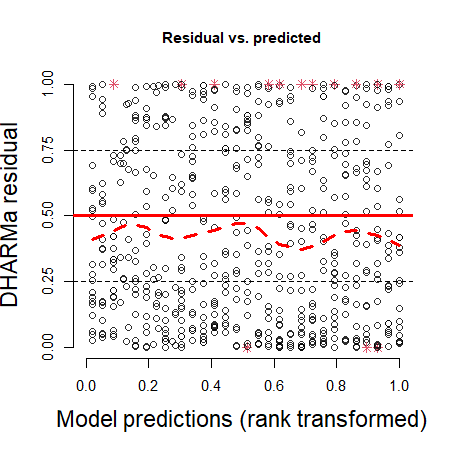
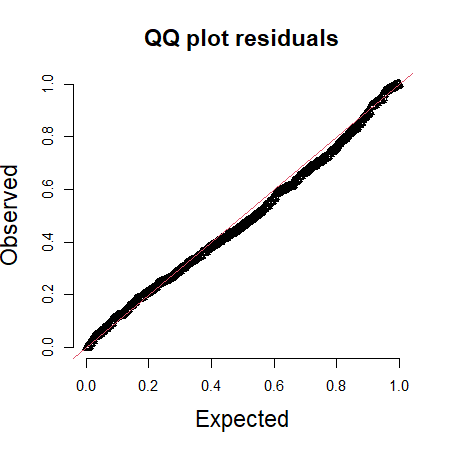
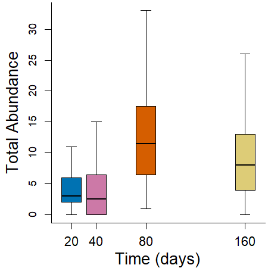
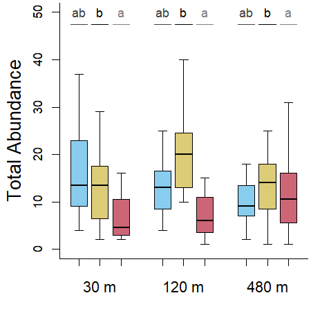

Abundance Analyses - Predatory Insects
================
Rodolfo Pelinson
26/12/2022

``` r
library(glmmTMB)
library(car)
library(emmeans)
library(DHARMa)
library(AICcmodavg)
```

Before anything, lets load and prepare some data sheets and vectors for
the analysis.

# Predators

First, lets make vectors of the abundances (summing up the abundance of
all predatory taxa in each sample):

``` r
#cheking if the order of row in Trait_og and columns in com_orig match

data.frame(com = colnames(com_orig), trait = Trait_orig$genus)
```

    ##                      com                 trait
    ## 1                   Anax                  Anax
    ## 2                Berosus               Berosus
    ## 3           Bidessonotus          Bidessonotus
    ## 4                 Buenoa                Buenoa
    ## 5                 Caenis                Caenis
    ## 6            Callibaetis           Callibaetis
    ## 7        Ceratopogonidae       Ceratopogonidae
    ## 8              Chaoborus             Chaoborus
    ## 9           Chironominae          Chironominae
    ## 10             Copelatus             Copelatus
    ## 11                 Culex                 Culex
    ## 12               Curicta               Curicta
    ## 13          Derovatellus          Derovatellus
    ## 14    Elachistocleis.sp.    Elachistocleis sp.
    ## 15         Erythrodiplax         Erythrodiplax
    ## 16            Heterelmis            Heterelmis
    ## 17          Hydrocanthus          Hydrocanthus
    ## 18            Hypodessus            Hypodessus
    ## 19           Laccophilus           Laccophilus
    ## 20            Limnocoris            Limnocoris
    ## 21             Liodessus             Liodessus
    ## 22            Microvelia            Microvelia
    ## 23             Notonecta             Notonecta
    ## 24              Orthemis              Orthemis
    ## 25             Oxyagrion             Oxyagrion
    ## 26               Pantala               Pantala
    ## 27             Pelocoris             Pelocoris
    ## 28 Physalaemos.nattereri Physalaemos nattereri
    ## 29            Progomphus            Progomphus
    ## 30               Rhantus               Rhantus
    ## 31            Scinax.sp.            Scinax sp.
    ## 32                Sigara                Sigara
    ## 33           Tanypodinae           Tanypodinae
    ## 34          Thermonectus          Thermonectus
    ## 35              Tholymis              Tholymis
    ## 36          Tropisternus          Tropisternus

``` r
com_predators_ab <- rowSums(com_orig[,which(Trait_orig$trait == "insect_predator")])

com_predators_ab_SS1 <- com_predators_ab[SS == "1"]
com_predators_ab_SS2 <- com_predators_ab[SS == "2"]
com_predators_ab_SS3 <- com_predators_ab[SS == "3"]
com_predators_ab_SS4 <- com_predators_ab[SS == "4"]
```

## First Survey (20 day)

First, lets see what is the best probability distribution to model the
data

``` r
par(cex = 0.6)

data_SS1 <- data.frame(isolation = isolation_SS1, treatments = treatments_SS1)

#Gaussian
mod_pred_SS1_G <- glmmTMB(com_predators_ab_SS1 ~ isolation * treatments, family = "gaussian", data = data_SS1)
simulationResiduals_mod_pred_SS1_G <- simulateResiduals(fittedModel = mod_pred_SS1_G, plot = F, seed = 3, n = 1000)
plotQQunif(simulationResiduals_mod_pred_SS1_G, testUniformity = F, testOutliers = F, testDispersion = F, cex.lab = 1.5, cex.main = 1.5) 
```


``` r
plotResiduals(simulationResiduals_mod_pred_SS1_G,  quantreg = F, cex.lab = 1.5, cex.main = 1.5)
```


``` r
#Poisson
mod_pred_SS1_P <- glmmTMB(com_predators_ab_SS1 ~ isolation * treatments, family = "poisson", data = data_SS1)
simulationResiduals_mod_pred_SS1_P <- simulateResiduals(fittedModel = mod_pred_SS1_P, plot = F, seed = 3, n = 1000)
plotQQunif(simulationResiduals_mod_pred_SS1_P, testUniformity = F, testOutliers = F, testDispersion = F, cex.lab = 1.5, cex.main = 1.5) 
```


``` r
plotResiduals(simulationResiduals_mod_pred_SS1_P,  quantreg = F, cex.lab = 1.5, cex.main = 1.5)
```



``` r
#Negative Binomial
mod_pred_SS1_NB <- glmmTMB(com_predators_ab_SS1 ~ isolation * treatments, family = nbinom2(link = "log"), data = data_SS1)
simulationResiduals_mod_pred_SS1_NB <- simulateResiduals(fittedModel = mod_pred_SS1_NB, plot = F, seed = 3, n = 1000)
plotQQunif(simulationResiduals_mod_pred_SS1_NB, testUniformity = F, testOutliers = F, testDispersion = F, cex.lab = 1.5, cex.main = 1.5) 
```



``` r
plotResiduals(simulationResiduals_mod_pred_SS1_NB,  quantreg = F, cex.lab = 1.5, cex.main = 1.5)
```


``` r
AIC(mod_pred_SS1_G, mod_pred_SS1_P, mod_pred_SS1_NB)
```

    ##                 df      AIC
    ## mod_pred_SS1_G  10 268.5282
    ## mod_pred_SS1_P   9 273.3386
    ## mod_pred_SS1_NB 10 242.4323

It looks like the negative binomial distribution is the one to be
chosen.

Now the analysis

``` r
mod_pred_SS1_no_effect <- glmmTMB(com_predators_ab_SS1 ~ 1, family = nbinom2(link = "log"), data = data_SS1)
mod_pred_SS1_treatments <- glmmTMB(com_predators_ab_SS1 ~ treatments, family = nbinom2(link = "log"), data = data_SS1)
mod_pred_SS1_isolation <- glmmTMB(com_predators_ab_SS1 ~ isolation, family = nbinom2(link = "log"), data = data_SS1)
mod_pred_SS1_isolation_treatments <- glmmTMB(com_predators_ab_SS1 ~ isolation + treatments, family = nbinom2(link = "log"), data = data_SS1)
mod_pred_SS1_isolation_i_treatments <- glmmTMB(com_predators_ab_SS1 ~ isolation * treatments, family = nbinom2(link = "log"), data = data_SS1)

model_selection_predators_SS1 <- aictab(list(mod_pred_SS1_no_effect,
                                             mod_pred_SS1_treatments,
                                             mod_pred_SS1_isolation,
                                             mod_pred_SS1_isolation_treatments,
                                             mod_pred_SS1_isolation_i_treatments),
                                        modnames = c("No Effect",
                                                     "Treatments",
                                                     "Isolation",
                                                     "Treatments + Isolation",
                                                     "Treatments * Isolation"), sort = FALSE)

model_selection_predators_SS1
```

    ## 
    ## Model selection based on AICc:
    ## 
    ##                         K   AICc Delta_AICc AICcWt      LL
    ## No Effect               2 231.59       0.00   0.58 -113.65
    ## Treatments              4 232.71       1.13   0.33 -111.86
    ## Isolation               4 235.99       4.40   0.06 -113.50
    ## Treatments + Isolation  6 237.50       5.91   0.03 -111.64
    ## Treatments * Isolation 10 248.90      17.32   0.00 -111.22

No effects here.

Ploting it:

``` r
col_sugarcane <- "#CC6677"
col_pasture <- "#DDCC77"
col_control <- "#88CCEE"

par(mar = c(3.5, 4, 0.1, 0.1)+ 0.1, cex = 0.7, bty = "l")
boxplot(com_predators_ab_SS1 ~ treatments_SS1*isolation_SS1, outline = T,
        ylab = "", xlab = "", at = c(1,2,3, 5,6,7, 9,10,11), lwd = 0.5,
        main = "", xaxt="n", yaxt = "n", range = 1.5,
        col = rep(c( col_control, col_pasture, col_sugarcane),3), lty = 1,
        pch = 21, bg = rep(c( col_control, col_pasture, col_sugarcane),3), cex = 1)

title(ylab="Total Abundance", line=2.5, cex.lab=1.52)
axis(2, cex.axis = 1, gap.axis = -1)
axis(1,labels = c("30 m","120 m","480 m"), cex.axis = 1.25, at =c(2,6,10), line = 0.5, tick = F, gap.axis = -1)
axis(1,labels = rep("",9), cex.axis = 0.8, at =c(1,2,3, 5,6,7, 9,10,11), line = 0,tick = T)

legend(x = 7, y = 20, fill = c(col_control, col_pasture, col_sugarcane), legend = c("Control", "Pasture", "Sugarcane"), cex = 1)
```


## Second Survey (40 day)

``` r
par(cex = 0.6)

data_SS2 <- data.frame(ID = ID_SS2_3_4, isolation = isolation_SS2_3_4, treatments = treatments_SS2_3_4,
                       treatments_contpast_sug = treatments_SS2_3_4_contpast_sug,
                       treatments_cont_pastsug = treatments_SS2_3_4_cont_pastsug,
                       treatments_contsug_past = treatments_SS2_3_4_contsug_past)

#Gaussian
mod_pred_SS2_G <- glmmTMB(com_predators_ab_SS2  ~ (isolation * treatments) + (1|ID), family = "gaussian", data = data_SS2)
simulationResiduals_mod_pred_SS2_G <- simulateResiduals(fittedModel = mod_pred_SS2_G, plot = F, seed = 3, n = 1000)
plotQQunif(simulationResiduals_mod_pred_SS2_G, testUniformity = F, testOutliers = F, testDispersion = F, cex.lab = 1.5, cex.main = 1.5) 
```



``` r
plotResiduals(simulationResiduals_mod_pred_SS2_G,  quantreg = F, cex.lab = 1.5, cex.main = 1.5)
```


``` r
#Poisson
mod_pred_SS2_P <- glmmTMB(com_predators_ab_SS2 ~ (isolation * treatments) + (1|ID), family = "poisson", data = data_SS2)
simulationResiduals_mod_pred_SS2_P <- simulateResiduals(fittedModel = mod_pred_SS2_P, plot = F, seed = 3, n = 1000)
plotQQunif(simulationResiduals_mod_pred_SS2_P, testUniformity = F, testOutliers = F, testDispersion = F, cex.lab = 1.5, cex.main = 1.5) 
```


``` r
plotResiduals(simulationResiduals_mod_pred_SS2_P,  quantreg = F, cex.lab = 1.5, cex.main = 1.5)
```


``` r
#Negative Binomial
mod_pred_SS2_NB <- glmmTMB(com_predators_ab_SS2 ~ (isolation * treatments) + (1|ID), family = nbinom2(link = "log"), data = data_SS2)
simulationResiduals_mod_pred_SS2_NB <- simulateResiduals(fittedModel = mod_pred_SS2_NB, plot = F, seed = 3, n = 1000)
plotQQunif(simulationResiduals_mod_pred_SS2_NB, testUniformity = F, testOutliers = F, testDispersion = F, cex.lab = 1.5, cex.main = 1.5) 
```


``` r
plotResiduals(simulationResiduals_mod_pred_SS2_NB,  quantreg = F, cex.lab = 1.5, cex.main = 1.5)
```


``` r
AIC(mod_pred_SS2_G, mod_pred_SS2_P, mod_pred_SS2_NB)
```

    ##                 df       AIC
    ## mod_pred_SS2_G  11 1160.8242
    ## mod_pred_SS2_P  10  962.2339
    ## mod_pred_SS2_NB 11  813.5906

Now the analysis

``` r
mod_pred_SS2_no_effect <- glmmTMB(com_predators_ab_SS2 ~ 1 + (1|ID), family = nbinom2(link = "log"), data = data_SS2)
mod_pred_SS2_isolation <- glmmTMB(com_predators_ab_SS2 ~ isolation + (1|ID), family = nbinom2(link = "log"), data = data_SS2)
mod_pred_SS2_treatments <- glmmTMB(com_predators_ab_SS2 ~ treatments + (1|ID), family = nbinom2(link = "log"), data = data_SS2)
mod_pred_SS2_treatments_isolation <- glmmTMB(com_predators_ab_SS2 ~ treatments + isolation + (1|ID), family = nbinom2(link = "log"), data = data_SS2)
mod_pred_SS2_treatments_i_isolation <- glmmTMB(com_predators_ab_SS2 ~ treatments * isolation + (1|ID), family = nbinom2(link = "log"), data = data_SS2)


model_selection_predators_SS2 <- aictab(list(mod_pred_SS2_no_effect,
                                             mod_pred_SS2_treatments,
                                             mod_pred_SS2_isolation,
                                             mod_pred_SS2_treatments_isolation,
                                             mod_pred_SS2_treatments_i_isolation),
                                        modnames = c("No Effect",
                                                     "Treatments",
                                                     "Isolation",
                                                     "Treatments + Isolation",
                                                     "Treatments * Isolation"), sort = FALSE)

model_selection_predators_SS2
```

    ## 
    ## Model selection based on AICc:
    ## 
    ##                         K   AICc Delta_AICc AICcWt      LL
    ## No Effect               3 854.57      47.93   0.00 -424.22
    ## Treatments              5 806.63       0.00   0.79 -398.14
    ## Isolation               5 858.30      51.67   0.00 -423.98
    ## Treatments + Isolation  7 809.42       2.78   0.20 -397.38
    ## Treatments * Isolation 11 815.16       8.53   0.01 -395.80

Ok. There is an important effect of treatments. Now lets take a look at
pairwise differences.

``` r
mod_pred_SS2_contpast_sug <- glmmTMB(com_predators_ab_SS2 ~ treatments_contpast_sug + (1|ID), family = nbinom2(link = "log"), data = data_SS2)
mod_pred_SS2_cont_pastsug <- glmmTMB(com_predators_ab_SS2 ~ treatments_cont_pastsug + (1|ID), family = nbinom2(link = "log"), data = data_SS2)
mod_pred_SS2_contsug_past <- glmmTMB(com_predators_ab_SS2 ~ treatments_contsug_past + (1|ID), family = nbinom2(link = "log"), data = data_SS2)

model_selection_predators_SS2_post_hoc_treatments <- aictab(list(mod_pred_SS2_treatments,
                                                                 mod_pred_SS2_contpast_sug,
                                                                 mod_pred_SS2_cont_pastsug,
                                                                 mod_pred_SS2_contsug_past),
                                                            modnames = c("Control # Pasture # Sugarcane",
                                                                         "(Control = Pasture) # Sugarcane",
                                                                         "Control # (Pasture = Sugarcane)",
                                                                         "(Control = Sugarcane) # Pasture"), sort = FALSE)

model_selection_predators_SS2_post_hoc_treatments
```

    ## 
    ## Model selection based on AICc:
    ## 
    ##                                 K   AICc Delta_AICc AICcWt      LL
    ## Control # Pasture # Sugarcane   5 806.63       1.17   0.36 -398.14
    ## (Control = Pasture) # Sugarcane 4 805.46       0.00   0.64 -398.62
    ## Control # (Pasture = Sugarcane) 4 851.25      45.79   0.00 -421.51
    ## (Control = Sugarcane) # Pasture 4 845.40      39.94   0.00 -418.59

It looks like we only have enougth evidence to say that the sugarcane
treatment is different from the others.

``` r
par(mar = c(3.5, 4, 0.1, 0.1)+ 0.1, cex = 0.7, bty = "l")
boxplot(com_predators_ab_SS2 ~ treatments_SS2_3_4*isolation_SS2_3_4, outline = T,
        ylab = "", xlab = "", at = c(1,2,3, 5,6,7, 9,10,11), lwd = 0.5,
        main = "", xaxt="n", yaxt = "n", range = 1.5,
        col = rep(c( col_control, col_pasture, col_sugarcane),3), lty = 1,
        pch = 21, bg = rep(c( col_control, col_pasture, col_sugarcane),3), cex = 1,
        ylim = c(0,75))

title(ylab="Total Abundance", line=2.5, cex.lab=1.52)
axis(2, cex.axis = 1, gap.axis = -1)
axis(1,labels = c("30 m","120 m","480 m"), cex.axis = 1.25, at =c(2,6,10), line = 0.5, tick = F, gap.axis = -1)
axis(1,labels = rep("",9), cex.axis = 0.8, at =c(1,2,3, 5,6,7, 9,10,11), line = 0,tick = T)

position1 <- 75

text(y = rep(position1, 9),x = c(1,2,3, 5,6,7, 9,10,11),
     labels = c("b","b","a",   "b","b","a",   "b","b","a"),
     cex = 1, adj = c(0.5,0.5),
     col = c("grey0","grey0","grey50",   "grey0","grey0","grey50",   "grey0","grey0","grey50"))

arrows(x0 = c(1, 2,3, 5, 6,7, 9,10,11) - 0.4,
       y0 = rep(position1*0.95, 9),
       x1 = c(1, 2,3, 5, 6,7, 9,10,11) + 0.4,
       y1 = rep(position1*0.95, 9),
       code = 0, col = c("grey0","grey0","grey50",   "grey0","grey0","grey50",   "grey0","grey0","grey50"))
```


## Third Survey (80 day)

``` r
par(cex = 0.6)

data_SS3 <- data.frame(ID = ID_SS2_3_4, isolation = isolation_SS2_3_4, treatments = treatments_SS2_3_4,
                       treatments_contpast_sug = treatments_SS2_3_4_contpast_sug,
                       treatments_cont_pastsug = treatments_SS2_3_4_cont_pastsug,
                       treatments_contsug_past = treatments_SS2_3_4_contsug_past)

#Gaussian
mod_pred_SS3_G <- glmmTMB(com_predators_ab_SS3  ~ (isolation * treatments) + (1|ID), family = "gaussian", data = data_SS3)
simulationResiduals_mod_pred_SS3_G <- simulateResiduals(fittedModel = mod_pred_SS3_G, plot = F, seed = 3, n = 1000)
plotQQunif(simulationResiduals_mod_pred_SS3_G, testUniformity = F, testOutliers = F, testDispersion = F, cex.lab = 1.5, cex.main = 1.5) 
```


``` r
plotResiduals(simulationResiduals_mod_pred_SS3_G,  quantreg = F, cex.lab = 1.5, cex.main = 1.5)
```


``` r
#Poisson
mod_pred_SS3_P <- glmmTMB(com_predators_ab_SS3 ~ (isolation * treatments) + (1|ID), family = "poisson", data = data_SS3)
simulationResiduals_mod_pred_SS3_P <- simulateResiduals(fittedModel = mod_pred_SS3_P, plot = F, seed = 3, n = 1000)
plotQQunif(simulationResiduals_mod_pred_SS3_P, testUniformity = F, testOutliers = F, testDispersion = F, cex.lab = 1.5, cex.main = 1.5) 
```


``` r
plotResiduals(simulationResiduals_mod_pred_SS3_P,  quantreg = F, cex.lab = 1.5, cex.main = 1.5)
```


``` r
#Negative Binomial
mod_pred_SS3_NB <- glmmTMB(com_predators_ab_SS3 ~ (isolation * treatments) + (1|ID), family = nbinom2(link = "log"), data = data_SS3)
simulationResiduals_mod_pred_SS3_NB <- simulateResiduals(fittedModel = mod_pred_SS3_NB, plot = F, seed = 3, n = 1000)
plotQQunif(simulationResiduals_mod_pred_SS3_NB, testUniformity = F, testOutliers = F, testDispersion = F, cex.lab = 1.5, cex.main = 1.5) 
```


``` r
plotResiduals(simulationResiduals_mod_pred_SS3_NB,  quantreg = F, cex.lab = 1.5, cex.main = 1.5)
```


``` r
AIC(mod_pred_SS3_G, mod_pred_SS3_P, mod_pred_SS3_NB)
```

    ##                 df      AIC
    ## mod_pred_SS3_G  11 1420.743
    ## mod_pred_SS3_P  10 1733.105
    ## mod_pred_SS3_NB 11 1275.952

Now the analysis

``` r
mod_pred_SS3_no_effect <- glmmTMB(com_predators_ab_SS3 ~ 1 + (1|ID), family = nbinom2(link = "log"), data = data_SS3)
mod_pred_SS3_isolation <- glmmTMB(com_predators_ab_SS3 ~ isolation + (1|ID), family = nbinom2(link = "log"), data = data_SS3)
mod_pred_SS3_treatments <- glmmTMB(com_predators_ab_SS3 ~ treatments + (1|ID), family = nbinom2(link = "log"), data = data_SS3)
mod_pred_SS3_treatments_isolation <- glmmTMB(com_predators_ab_SS3 ~ treatments + isolation + (1|ID), family = nbinom2(link = "log"), data = data_SS3)
mod_pred_SS3_treatments_i_isolation <- glmmTMB(com_predators_ab_SS3 ~ treatments * isolation + (1|ID), family = nbinom2(link = "log"), data = data_SS3)


model_selection_predators_SS3 <- aictab(list(mod_pred_SS3_no_effect,
                                             mod_pred_SS3_treatments,
                                             mod_pred_SS3_isolation,
                                             mod_pred_SS3_treatments_isolation,
                                             mod_pred_SS3_treatments_i_isolation),
                                        modnames = c("No Effect",
                                                     "Treatments",
                                                     "Isolation",
                                                     "Treatments + Isolation",
                                                     "Treatments * Isolation"), sort = FALSE)

model_selection_predators_SS3
```

    ## 
    ## Model selection based on AICc:
    ## 
    ##                         K    AICc Delta_AICc AICcWt      LL
    ## No Effect               3 1277.13       5.22   0.05 -635.50
    ## Treatments              5 1271.91       0.00   0.73 -630.78
    ## Isolation               5 1280.23       8.32   0.01 -634.94
    ## Treatments + Isolation  7 1274.90       2.99   0.16 -630.13
    ## Treatments * Isolation 11 1277.52       5.61   0.04 -626.98

Ok. There is an important effect of treatments. Now lets take a look at
pairwise differences.

``` r
mod_pred_SS3_contpast_sug <- glmmTMB(com_predators_ab_SS3 ~ treatments_contpast_sug + (1|ID), family = nbinom2(link = "log"), data = data_SS3)
mod_pred_SS3_cont_pastsug <- glmmTMB(com_predators_ab_SS3 ~ treatments_cont_pastsug + (1|ID), family = nbinom2(link = "log"), data = data_SS3)
mod_pred_SS3_contsug_past <- glmmTMB(com_predators_ab_SS3 ~ treatments_contsug_past + (1|ID), family = nbinom2(link = "log"), data = data_SS3)

model_selection_predators_SS3_post_hoc_treatments <- aictab(list(mod_pred_SS3_treatments,
                                                                 mod_pred_SS3_contpast_sug,
                                                                 mod_pred_SS3_cont_pastsug,
                                                                 mod_pred_SS3_contsug_past),
                                                            modnames = c("Control # Pasture # Sugarcane",
                                                                         "(Control = Pasture) # Sugarcane",
                                                                         "Control # (Pasture = Sugarcane)",
                                                                         "(Control = Sugarcane) # Pasture"), sort = FALSE)

model_selection_predators_SS3_post_hoc_treatments
```

    ## 
    ## Model selection based on AICc:
    ## 
    ##                                 K    AICc Delta_AICc AICcWt      LL
    ## Control # Pasture # Sugarcane   5 1271.91       0.18   0.37 -630.78
    ## (Control = Pasture) # Sugarcane 4 1271.73       0.00   0.41 -631.75
    ## Control # (Pasture = Sugarcane) 4 1279.18       7.46   0.01 -635.48
    ## (Control = Sugarcane) # Pasture 4 1272.99       1.26   0.22 -632.38

It looks like models that say that all treatments are different, that
control is not different from pasture, and that pasture is not different
from sugarcane are all equally plausible. We only have enougth evidence
to say that Sugarcane is different from Pasture.

``` r
par(mar = c(3.5, 4, 0.1, 0.1)+ 0.1, cex = 0.7, bty = "l")

boxplot(com_predators_ab_SS3 ~ treatments_SS2_3_4*isolation_SS2_3_4, outline = T,
        ylab = "", xlab = "", at = c(1,2,3, 5,6,7, 9,10,11), lwd = 0.5,
        main = "", xaxt="n", yaxt = "n", range = 1.5,
        col = rep(c( col_control, col_pasture, col_sugarcane),3), lty = 1,
        pch = 21, bg = rep(c( col_control, col_pasture, col_sugarcane),3), cex = 1,
        ylim = c(0,85))

title(ylab="Total Abundance", line=2.5, cex.lab=1.52)
axis(2, cex.axis = 1, gap.axis = -1)
axis(1,labels = c("30 m","120 m","480 m"), cex.axis = 1.25, at =c(2,6,10), line = 0.5, tick = F, gap.axis = -1)
axis(1,labels = rep("",9), cex.axis = 0.8, at =c(1,2,3, 5,6,7, 9,10,11), line = 0,tick = T)

position1 <- 85

text(y = rep(position1, 9),x = c(1,2,3, 5,6,7, 9,10,11),
     labels = c("ab","b","a",   "ab","b","a",   "ab","b","a"),
     cex = 1, adj = c(0.5,0.5),
     col = c("grey25","grey0","grey50",   "grey25","grey0","grey50",   "grey25","grey0","grey50"))

arrows(x0 = c(1, 2,3, 5, 6,7, 9,10,11) - 0.4,
       y0 = rep(position1*0.95, 9),
       x1 = c(1, 2,3, 5, 6,7, 9,10,11) + 0.4,
       y1 = rep(position1*0.95, 9),
       code = 0, col = c("grey25","grey0","grey50",   "grey25","grey0","grey50",   "grey25","grey0","grey50"))
```


## Fourth Survey (160 day)

``` r
par(cex = 0.6)

data_SS4 <- data.frame(ID = ID_SS2_3_4, isolation = isolation_SS2_3_4, treatments = treatments_SS2_3_4,
                       treatments_contpast_sug = treatments_SS2_3_4_contpast_sug,
                       treatments_cont_pastsug = treatments_SS2_3_4_cont_pastsug,
                       treatments_contsug_past = treatments_SS2_3_4_contsug_past)

#Gaussian
mod_pred_SS4_G <- glmmTMB(com_predators_ab_SS4  ~ (isolation * treatments) + (1|ID), family = "gaussian", data = data_SS4)
simulationResiduals_mod_pred_SS4_G <- simulateResiduals(fittedModel = mod_pred_SS4_G, plot = F, seed = 3, n = 1000)
plotQQunif(simulationResiduals_mod_pred_SS4_G, testUniformity = F, testOutliers = F, testDispersion = F, cex.lab = 1.5, cex.main = 1.5) 
```



``` r
plotResiduals(simulationResiduals_mod_pred_SS4_G,  quantreg = F, cex.lab = 1.5, cex.main = 1.5)
```


``` r
#Poisson
mod_pred_SS4_P <- glmmTMB(com_predators_ab_SS4 ~ (isolation * treatments) + (1|ID), family = "poisson", data = data_SS4)
simulationResiduals_mod_pred_SS4_P <- simulateResiduals(fittedModel = mod_pred_SS4_P, plot = F, seed = 3, n = 1000)
plotQQunif(simulationResiduals_mod_pred_SS4_P, testUniformity = F, testOutliers = F, testDispersion = F, cex.lab = 1.5, cex.main = 1.5) 
```


``` r
plotResiduals(simulationResiduals_mod_pred_SS4_P,  quantreg = F, cex.lab = 1.5, cex.main = 1.5)
```


``` r
#Negative Binomial
mod_pred_SS4_NB <- glmmTMB(com_predators_ab_SS4 ~ (isolation * treatments) + (1|ID), family = nbinom2(link = "log"), data = data_SS4)
simulationResiduals_mod_pred_SS4_NB <- simulateResiduals(fittedModel = mod_pred_SS4_NB, plot = F, seed = 3, n = 1000)
plotQQunif(simulationResiduals_mod_pred_SS4_NB, testUniformity = F, testOutliers = F, testDispersion = F, cex.lab = 1.5, cex.main = 1.5) 
```


``` r
plotResiduals(simulationResiduals_mod_pred_SS4_NB,  quantreg = F, cex.lab = 1.5, cex.main = 1.5)
```


``` r
AIC(mod_pred_SS4_G, mod_pred_SS4_P, mod_pred_SS4_NB)
```

    ##                 df      AIC
    ## mod_pred_SS4_G  11 1242.910
    ## mod_pred_SS4_P  10 1411.732
    ## mod_pred_SS4_NB 11 1149.939

Now the analysis

``` r
mod_pred_SS4_no_effect <- glmmTMB(com_predators_ab_SS4 ~ 1 + (1|ID), family = nbinom2(link = "log"), data = data_SS4)
mod_pred_SS4_isolation <- glmmTMB(com_predators_ab_SS4 ~ isolation + (1|ID), family = nbinom2(link = "log"), data = data_SS4)
mod_pred_SS4_treatments <- glmmTMB(com_predators_ab_SS4 ~ treatments + (1|ID), family = nbinom2(link = "log"), data = data_SS4)
mod_pred_SS4_treatments_isolation <- glmmTMB(com_predators_ab_SS4 ~ treatments + isolation + (1|ID), family = nbinom2(link = "log"), data = data_SS4)
mod_pred_SS4_treatments_i_isolation <- glmmTMB(com_predators_ab_SS4 ~ treatments * isolation + (1|ID), family = nbinom2(link = "log"), data = data_SS4)


model_selection_predators_SS4 <- aictab(list(mod_pred_SS4_no_effect,
                                             mod_pred_SS4_treatments,
                                             mod_pred_SS4_isolation,
                                             mod_pred_SS4_treatments_isolation,
                                             mod_pred_SS4_treatments_i_isolation),
                                        modnames = c("No Effect",
                                                     "Treatments",
                                                     "Isolation",
                                                     "Treatments + Isolation",
                                                     "Treatments * Isolation"), sort = FALSE)

model_selection_predators_SS4
```

    ## 
    ## Model selection based on AICc:
    ## 
    ##                         K    AICc Delta_AICc AICcWt      LL
    ## No Effect               3 1144.11       0.00   0.72 -568.98
    ## Treatments              5 1147.29       3.19   0.15 -568.47
    ## Isolation               5 1148.06       3.96   0.10 -568.86
    ## Treatments + Isolation  7 1151.34       7.23   0.02 -568.34
    ## Treatments * Isolation 11 1151.51       7.41   0.02 -563.97

No effect.

``` r
par(mar = c(3.5, 4, 0.1, 0.1)+ 0.1, cex = 0.7, bty = "l")

boxplot(com_predators_ab_SS4 ~ treatments_SS2_3_4*isolation_SS2_3_4, outline = T,
        ylab = "", xlab = "", at = c(1,2,3, 5,6,7, 9,10,11), lwd = 0.5,
        main = "", xaxt="n", yaxt = "n", range = 1.5,
        col = rep(c( col_control, col_pasture, col_sugarcane),3), lty = 1,
        pch = 21, bg = rep(c( col_control, col_pasture, col_sugarcane),3), cex = 1)

title(ylab="Total Abundance", line=2.5, cex.lab=1.52)
axis(2, cex.axis = 1, gap.axis = -1)
axis(1,labels = c("30 m","120 m","480 m"), cex.axis = 1.25, at =c(2,6,10), line = 0.5, tick = F, gap.axis = -1)
axis(1,labels = rep("",9), cex.axis = 0.8, at =c(1,2,3, 5,6,7, 9,10,11), line = 0,tick = T)
```


