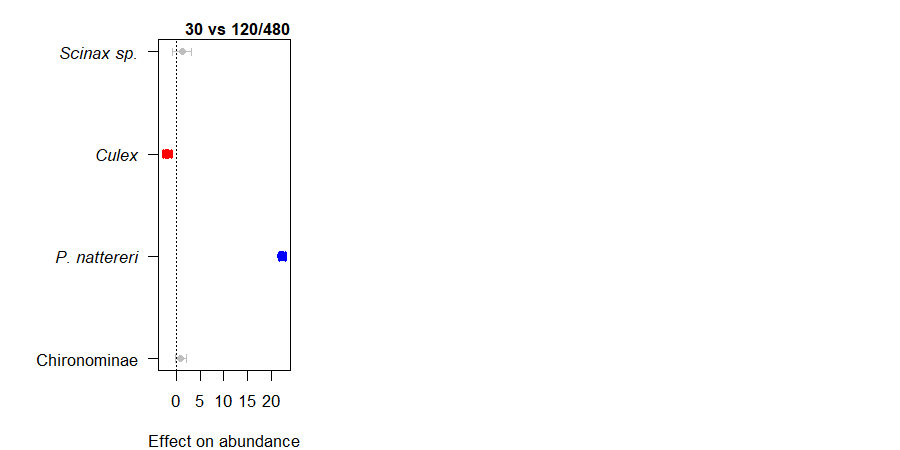
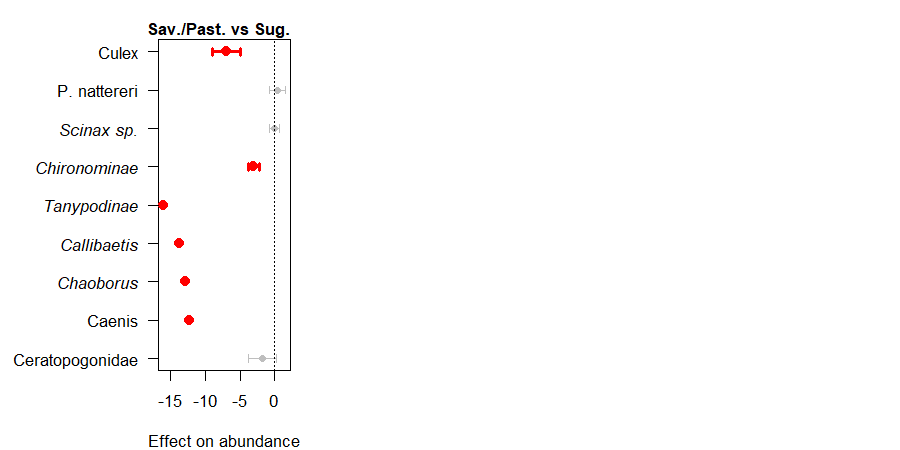
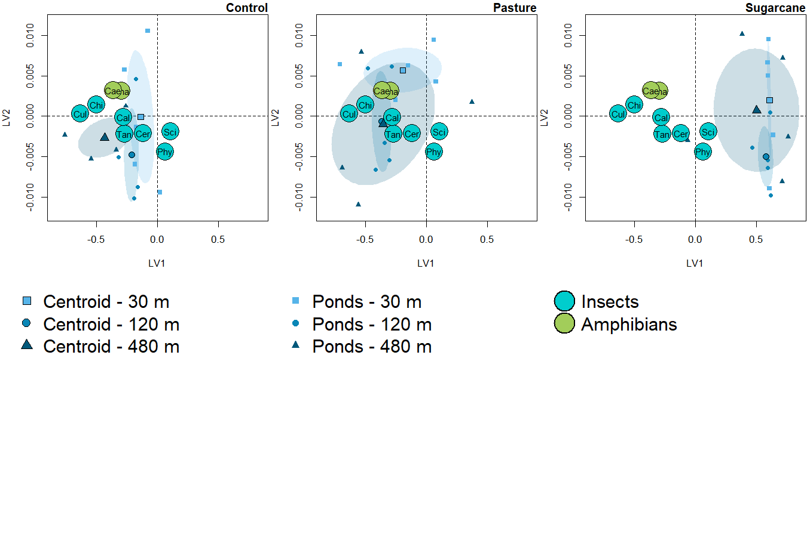
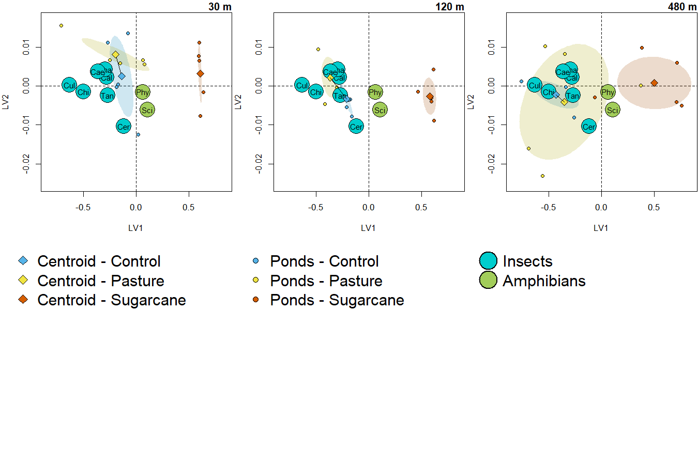
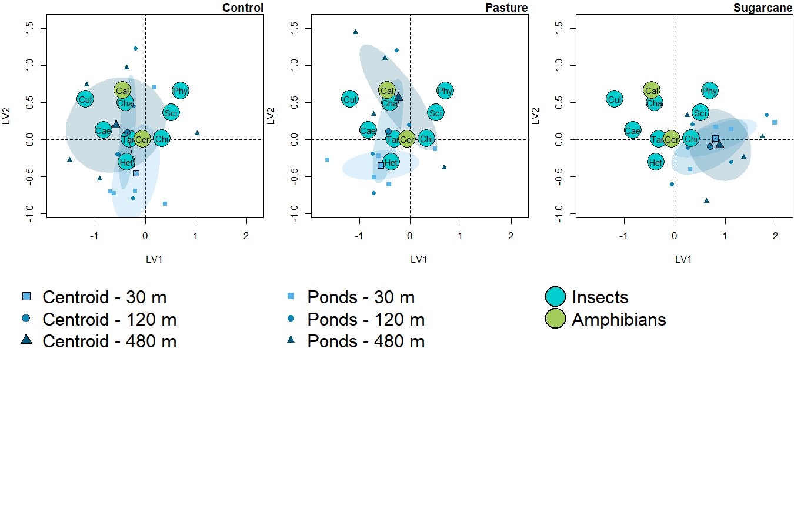
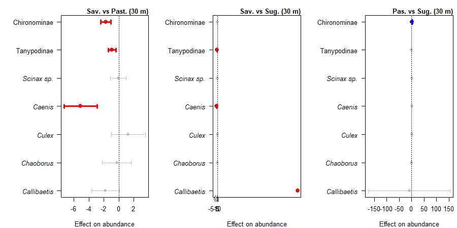
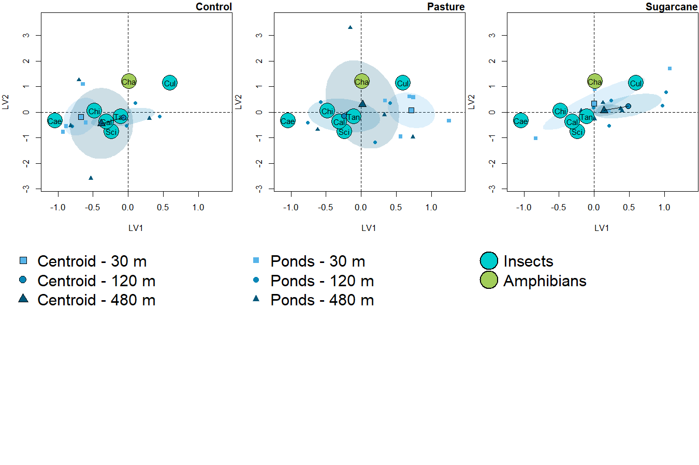

Community Structure - Herbivore and Detritivores
================
Rodolfo Pelinson
27/12/2022

``` r
library(vegan)
library(gllvm)
```

Before anything, here are three functions that will automate most of the
model selection procedures that we will be doing. The script would be
gigantic without them.

This first one is just to make a model selection table based on AICc for
gllvm models. All functions rely on the gllvm function from the `gllvm`
version 1.3.1 (it may need adjustments for other versions).

``` r
setwd("C:/Users/rodol/OneDrive/Trabalho/Papers/Analysis/IsolationAgrochemicals")
source("Auxiliary scripts/gllvm_AICc_tab.R")
```

This one is to run multiple gllvms with different number of latent
variables and perform model selection. Its useful to find the ideal
number of latent variables necessary to accurately account for
correlations (dependencies) in species co-occurrences not caused by our
treatments.

``` r
setwd("C:/Users/rodol/OneDrive/Trabalho/Papers/Analysis/IsolationAgrochemicals")
source("Auxiliary scripts/run_multiple_lv.R")
```

This is to automate running multiple gllvms and perform model selection

``` r
setwd("C:/Users/rodol/OneDrive/Trabalho/Papers/Analysis/IsolationAgrochemicals")
source("Auxiliary scripts/run_multiple_gllvm.R")
```

This is for getting scaled latent variables for plotting model based
ordinations. I took most of code from the plotting functions from the
`gllvm` package.

``` r
setwd("C:/Users/rodol/OneDrive/Trabalho/Papers/Analysis/IsolationAgrochemicals")
source("Auxiliary scripts/get_scaled_lvs.R")
```

# Predatory insects

Lets make tables with only herbivore and insectivores. Note that here we
excludes species that occur in less than 4 samples in each survey
because are less informative to community patterns and complicate
parameter estimation.

``` r
#cheking if the order of row in Trait_og and columns in com_orig match

data.frame(com = colnames(com), trait = Trait$genus)
```

    ##                      com                 trait
    ## 1                Berosus               Berosus
    ## 2                 Buenoa                Buenoa
    ## 3                 Caenis                Caenis
    ## 4            Callibaetis           Callibaetis
    ## 5        Ceratopogonidae       Ceratopogonidae
    ## 6              Chaoborus             Chaoborus
    ## 7           Chironominae          Chironominae
    ## 8              Copelatus             Copelatus
    ## 9                  Culex                 Culex
    ## 10         Erythrodiplax         Erythrodiplax
    ## 11            Heterelmis            Heterelmis
    ## 12            Microvelia            Microvelia
    ## 13              Orthemis              Orthemis
    ## 14               Pantala               Pantala
    ## 15 Physalaemos.nattereri Physalaemos nattereri
    ## 16               Rhantus               Rhantus
    ## 17            Scinax.sp.            Scinax sp.
    ## 18           Tanypodinae           Tanypodinae

``` r
com_herb_det <- com[,Trait$trophic == "consumer"]
com_herb_det_SS1 <- com_SS1[,Trait_SS1$trophic == "consumer"]
com_herb_det_SS2 <- com_SS2[,Trait_SS2$trophic == "consumer"]
com_herb_det_SS3 <- com_SS3[,Trait_SS3$trophic == "consumer"]
com_herb_det_SS4 <- com_SS4[,Trait_SS4$trophic == "consumer"]
```

## First Survey (20 day)

We always used a negative binomial distribution to model species
abundances.

``` r
SS1_predictors <- data.frame(treatments = treatments_SS1,
                             isolation = isolation_SS1,
                             isolation30120_480,
                             isolation30_120480)
```

Number of latent variables:

``` r
n_latent_tab_SS1 <- run_multiple_lv(formula = ~ treatments * isolation,
                                    num.lv = c(0,1,2,3),
                                    y = com_herb_det_SS1, X = SS1_predictors,
                                    family = "negative.binomial",
                                    method = "VA",
                                    n.init = 10, seed = 11:20, starting.val = 0)

n_latent_tab_SS1
```

    ##   model     AICc delta_AICc df nobs
    ## 1     0 759.1294    0.00000 40  180
    ## 2     1 772.8654   13.73596 44  180
    ## 3     2 783.7139   24.58444 47  180
    ## 4     3 791.2244   32.09493 49  180

It looks that zero latent variables is the way to go. This will repeat
itself for the next cases.

Model selection of effects:

``` r
model_herb_det_selection_SS1 <- run_multiple_gllvm(formulas = list(~ treatments,
                                                                    ~ isolation,
                                                                    ~ treatments + isolation,
                                                                    ~ treatments * isolation),
                                                    names = c("Treatments",
                                                              "Isolation",
                                                              "Isolation + Treatments",
                                                              "Isolation * Treatments"),
                                                    no_effect = TRUE,
                                                    num.lv = 0,
                                                    X = SS1_predictors,
                                                    y = com_herb_det_SS1,
                                                    family = "negative.binomial",
                                                    method = "VA",
                                                    n.init = 10, seed = 11:20, starting.val = 0)

model_herb_det_selection_SS1
```

    ##                    model     AICc delta_AICc df nobs
    ## 1              No Effect 741.9469   17.07903  8  180
    ## 2             Treatments 753.2960   28.42813 16  180
    ## 3              Isolation 724.8679    0.00000 16  180
    ## 4 Isolation + Treatments 738.1281   13.26021 24  180
    ## 5 Isolation * Treatments 759.1294   34.26158 40  180

It seems that isolation is important.

Let’s go for pairwise differences:

``` r
model_herb_det_selection_SS1_post_hoc_isolation <- run_multiple_gllvm(formulas = list(~ isolation,
                                                                                      ~ isolation30120_480,
                                                                                      ~ isolation30_120480),
                                                                      names = c("30 # 120 # 480",
                                                                                "(30 = 120) # 480",
                                                                                "30 # (120 = 480)"),
                                                                      no_effect = FALSE,
                                                                      num.lv = 0,
                                                                      X = SS1_predictors,
                                                                      y = com_herb_det_SS1,
                                                                      family = "negative.binomial",
                                                                      method = "VA",
                                                                      n.init = 10, seed = 11:20)

model_herb_det_selection_SS1_post_hoc_isolation
```

    ##              model     AICc delta_AICc df nobs
    ## 1   30 # 120 # 480 724.8679    4.66420 16  180
    ## 2 (30 = 120) # 480 737.0083   16.80462 12  180
    ## 3 30 # (120 = 480) 720.2037    0.00000 12  180

30m is different from 120 and 480m.

The code for plotting the ordinations is again pretty extensive, I will
then only show the first one as an example e call the others from
functions sourced from the ’Auxiliary scripts” folder.

``` r
SS1_predictors <- data.frame(treatments = treatments_SS1,
                             isolation = isolation_SS1)

sum_com_herb_det_SS1 <- sum_com_SS1[,Trait_SS1_sum$trophic == "consumer"]

col_SS1 <- rep("darkolivegreen3", ncol(sum_com_herb_det_SS1))
col_SS1[Trait_SS1$trait[Trait_SS1$trophic == "consumer"] == "insect_consumer" ] <- "cyan3"


fit_SS1_plot <- gllvm(sum_com_herb_det_SS1, 
                      formula = ~ 1,
                      family = "negative.binomial",
                      method = "VA",
                      n.init = 10, num.lv = 2, seed = 11:20, starting.val = "zero")


scaled_lvs <- get_scaled_lvs(fit_SS1_plot, alpha = 0.5)

#It was necessary to add a jitter to improve vizualization
set.seed(3)
scaled_lvs$species <- jitter(scaled_lvs$species, amount = 0.01)
set.seed(3)
scaled_lvs$sites <- jitter(scaled_lvs$sites, amount = 0.01)

scaled_lvs$new_species <- scaled_lvs$species/3

xmin <- min(c(scaled_lvs$sites[,1], scaled_lvs$new_species[,1]))*1.1
xmax <- max(c(scaled_lvs$sites[,1], scaled_lvs$new_species[,1]))*1.1
ymin <- min(c(scaled_lvs$sites[,2], scaled_lvs$new_species[,2]))*1.1
ymax <- max(c(scaled_lvs$sites[,2], scaled_lvs$new_species[,2]))*1.1


par(mar = c(4,4,1.25,.1), mfrow = c(2, 3))
plot(NA,xlim = c(xmin, xmax), ylim = c(ymin, ymax), ylab = "LV2", xlab = "LV1", axes = F)
axis(1 , gap.axis = -10)
axis(2 , gap.axis = -10)
abline(h=0,v=0, lty =2)

ordiellipse(scaled_lvs$sites[SS1_predictors$isolation == "30",],
            groups = SS1_predictors$treatments[SS1_predictors$isolation == "30"],
            draw = "polygon", border = FALSE,  col = c(col_control_120, col_pasture_120, col_sugarcane_120), kind = "sd", alpha = 50)

#ordiellipse(scaled_lvs$sites,
#            groups = SS1_predictors$treatments,
#            draw = "polygon", border = FALSE,  col = c(col_control_120, col_pasture_120, col_sugarcane_120), kind = "sd", alpha = 50)

points(scaled_lvs$sites[SS1_predictors$treatments == "control" & SS1_predictors$isolation == "30",], bg = col_control_30, pch = 21)
points(scaled_lvs$sites[SS1_predictors$treatments == "pasture" & SS1_predictors$isolation == "30",], bg = col_pasture_30, pch = 21)
points(scaled_lvs$sites[SS1_predictors$treatments == "sugar_cane" & SS1_predictors$isolation == "30",], bg = col_sugarcane_30, pch = 21)


centroid_control_30 <- colMeans(scaled_lvs$sites[SS1_predictors$treatments == "control" & SS1_predictors$isolation == "30",])
centroid_pasture_30 <- colMeans(scaled_lvs$sites[SS1_predictors$treatments == "pasture" & SS1_predictors$isolation == "30",])
centroid_sugarcane_30 <- colMeans(scaled_lvs$sites[SS1_predictors$treatments == "sugar_cane" & SS1_predictors$isolation == "30",])

#centroid_control_30 <- colMeans(scaled_lvs$sites[SS1_predictors$treatments == "control",])
#centroid_pasture_30 <- colMeans(scaled_lvs$sites[SS1_predictors$treatments == "pasture",])
#centroid_sugarcane_30 <- colMeans(scaled_lvs$sites[SS1_predictors$treatments == "sugar_cane",])

for(i in 1:nrow(scaled_lvs$new_species)){
  points(x = scaled_lvs$new_species[i,1], y = scaled_lvs$new_species[i,2], cex = 4, pch = 21, bg = col_SS1[i])
  text(x = scaled_lvs$new_species[i,1], y = scaled_lvs$new_species[i,2], labels = substr(rownames(scaled_lvs$species)[i], 1, 3), cex = 0.9)
}

points(centroid_control_30[1], centroid_control_30[2], bg = col_control_30, pch = 23, cex = 1.5)
points(centroid_pasture_30[1], centroid_pasture_30[2], bg = col_pasture_30, pch = 23, cex = 1.5)
points(centroid_sugarcane_30[1], centroid_sugarcane_30[2], bg = col_sugarcane_30, pch = 23, cex = 1.5)

lines(x = c(centroid_control_30[1], centroid_pasture_30[1]),
      y = c(centroid_control_30[2], centroid_pasture_30[2]))

lines(x = c(centroid_control_30[1], centroid_sugarcane_30[1]),
      y = c(centroid_control_30[2], centroid_sugarcane_30[2]))

lines(x = c(centroid_pasture_30[1], centroid_sugarcane_30[1]),
      y = c(centroid_pasture_30[2], centroid_sugarcane_30[2]))

box()

title(main = "30 m", adj = 1, line = 0.25)

plot_com_SS1_herb_treat_120()

plot_com_SS1_herb_treat_480()

par(mar = c(0,0,0,0),cex = 1.25)
plot(NA, xaxt = "n", yaxt = "n", xlim= c(0,100), ylim = c(0,100), bty = "n", ylab = "", xlab = "")
legend(x = 0, y = 100, pch = c(23, 23, 23), legend = c("Centroid - Control", "Centroid - Pasture", "Centroid - Sugarcane"), pt.bg   = c(col_control_30, col_pasture_30, col_sugarcane_30), bty = "n")

plot(NA, xaxt = "n", yaxt = "n", xlim= c(0,100), ylim = c(0,100), bty = "n", ylab = "", xlab = "")
legend(x = 0, y = 100, pch = c(21, 21, 21), legend = c("Ponds - Control", "Ponds - Pasture", "Ponds - Sugarcane"), pt.bg    = c(col_control_30, col_pasture_30, col_sugarcane_30), bty = "n", pt.cex    = 0.75)

plot(NA, xaxt = "n", yaxt = "n", xlim= c(0,100), ylim = c(0,100), bty = "n", ylab = "", xlab = "")
legend(x = 0, y = 100, pch = c(21, 21), legend = c("Insects", "Amphibians"), pt.bg  = c("cyan3","darkolivegreen3"), bty = "n", pt.cex   = 2.5, pt.lwd   = 1.5)
```


Now the same plots but for isolation:

``` r
par(mar = c(4,4,1.25,.1), mfrow = c(2, 3))

plot_com_SS1_herb_iso_control()

plot_com_SS1_herb_iso_pasture()

plot_com_SS1_herb_iso_sugarcane()

par(mar = c(0,0,0,0),cex = 1.25)
plot(NA, xaxt = "n", yaxt = "n", xlim= c(0,100), ylim = c(0,100), bty = "n", ylab = "", xlab = "")
legend(x = 0, y = 100, pch = c(22, 21, 24), legend = c("Centroid - 30 m", "Centroid - 120 m", "Centroid - 480 m"), pt.bg    = c(col_control_30, col_control_120, col_control_480), bty = "n")

plot(NA, xaxt = "n", yaxt = "n", xlim= c(0,100), ylim = c(0,100), bty = "n", ylab = "", xlab = "")
legend(x = 0, y = 100, pch = c(15, 16, 17), legend = c("Ponds - 30 m", "Ponds - 120 m", "Ponds - 480 m"), col   = c(col_control_30, col_control_120, col_control_480), bty = "n", pt.cex    = 0.75)

plot(NA, xaxt = "n", yaxt = "n", xlim= c(0,100), ylim = c(0,100), bty = "n", ylab = "", xlab = "")
legend(x = 0, y = 100, pch = c(21, 21), legend = c("Insects", "Amphibians"), pt.bg  = c("cyan3","darkolivegreen3"), bty = "n", pt.cex   = 2.5, pt.lwd   = 1.5)
```


Ploting species coefficients and their confidence intervals based on the
effects identified in the analysis. The script for extracting these
coefficients and the function for plotting is rather extensive, thus I
will source the code on a script in the Auxiliary Scripts folder. You
can check the original code there.

``` r
setwd("C:/Users/rodol/OneDrive/Trabalho/Papers/Analysis/IsolationAgrochemicals")
source("Auxiliary scripts/coefficients for herb_det.R")
source("Auxiliary scripts/My_coefplot.R")
```

These are the coefficients Coefficients for the difference of
communities at 30m VS those at 120 and 480m:

``` r
par(mar = c(4,8,2,.5), cex = 0.5, mfrow = c(1,3))

species_labels_SS1 <- sub(pattern = ".", replacement = " ", x =names(effect_SS1_30480), fixed = TRUE)
species_labels_SS1 <- sub(pattern = "Physalaemos", replacement = "P.", x =species_labels_SS1, fixed = TRUE)


My_coefplot(effect_SS1_30480,
            effect_SS1_30480_lower,
            effect_SS1_30480_upper,
            species_labels = species_labels_SS1,  xlab = "Effect on abundance", main = "30 vs 120/480",
            cex.axis = 1, cex.main = 1, font = c(3,3,3,1))
```


## Second Survey (40 day)

``` r
SS2_predictors <- data.frame(ID = ID_SS2_3_4,
                             treatments = treatments_SS2_3_4,
                             isolation = isolation_SS2_3_4,
                             isolation30_120480 = isolation30_120480_SS2_3_4,
                             isolation30120_480 = isolation30120_480_SS2_3_4,
                             treatments_contpast_sug = treatments_SS2_3_4_contpast_sug,
                             treatments_cont_pastsug = treatments_SS2_3_4_cont_pastsug,
                             treatments_contsug_past = treatments_SS2_3_4_contsug_past)
```

Number of latent variables:

``` r
n_latent_tab_SS2 <- run_multiple_lv(num.lv = c(0,1,2,3),
                                    formula = ~ treatments * isolation,
                                    row.eff = ~ (1|ID),
                                    y = com_herb_det_SS2, X = SS2_predictors,
                                    family = "negative.binomial",
                                    method = "VA",
                                    n.init = 10, seed = 11:20)

n_latent_tab_SS2
```

    ##   model     AICc delta_AICc  df nobs
    ## 1     0 3459.311    0.00000  91 1620
    ## 2     1 3479.650   20.33891 100 1620
    ## 3     2 3497.933   38.62252 108 1620
    ## 4     3 3514.091   54.78015 115 1620

It looks that zero latent variables is the way to go.

Model selection of effects:

``` r
model_herb_det_selection_SS2 <- run_multiple_gllvm(formulas = list(~ treatments,
                                                                    ~ isolation,
                                                                    ~ treatments + isolation,
                                                                    ~ treatments * isolation),
                                                    names = c("Treatments",
                                                              "Isolation",
                                                              "Isolation + Treatments",
                                                              "Isolation * Treatments"),
                                                    no_effect = TRUE,
                                                    num.lv = 0,
                                                    X = SS2_predictors,
                                                    X_row = data.frame(ID = ID_SS2_3_4),
                                                    y = com_herb_det_SS2,
                                                    row.eff = ~ (1|ID),
                                                    family = "negative.binomial",
                                                    method = "VA",
                                                    n.init = 10, seed = 11:20)

model_herb_det_selection_SS2
```

    ##                    model     AICc delta_AICc df nobs
    ## 1              No Effect 3590.279  150.16775 19 1620
    ## 2             Treatments 3477.169   37.05774 37 1620
    ## 3              Isolation 3542.616  102.50456 37 1620
    ## 4 Isolation + Treatments 3440.112    0.00000 55 1620
    ## 5 Isolation * Treatments 3459.311   19.19902 91 1620

It seems there are main effects of treatments and isolation.

Lets look at pairwise differences for treatments:

``` r
model_herb_det_selection_SS2_post_hoc_treatments <- run_multiple_gllvm(formulas = list(~ treatments + isolation,
                                                                                        ~ treatments_contpast_sug + isolation,
                                                                                        ~ treatments_cont_pastsug + isolation,
                                                                                        ~ treatments_contsug_past + isolation),
                                                                        names = c("control # pasture # sugarcane",
                                                                                  "(control = pasture) # sugarcane",
                                                                                  "control # (pasture = sugarcane)",
                                                                                  "(control = sugarcane) # pasture"),
                                                                        no_effect = FALSE,
                                                                        num.lv = 0,
                                                                        X = SS2_predictors,
                                                                        X_row = data.frame(ID = ID_SS2_3_4),
                                                                        y = com_herb_det_SS2,
                                                                        row.eff = ~ (1|ID),
                                                                        family = "negative.binomial",
                                                                        method = "VA",
                                                                        n.init = 10, seed = 11:20)
model_herb_det_selection_SS2_post_hoc_treatments
```

    ##                             model     AICc delta_AICc df nobs
    ## 1   control # pasture # sugarcane 3440.112   11.77224 55 1620
    ## 2 (control = pasture) # sugarcane 3428.339    0.00000 46 1620
    ## 3 control # (pasture = sugarcane) 3527.962   99.62287 46 1620
    ## 4 (control = sugarcane) # pasture 3540.169  111.82932 46 1620

So, communities in the sugarcane treatment are different from the
others.

Now isolation:

``` r
model_herb_det_selection_SS2_post_hoc_isolation <- run_multiple_gllvm(formulas = list(~ isolation + treatments_cont_pastsug,
                                                                                      ~ isolation30120_480 + treatments_cont_pastsug,
                                                                                      ~ isolation30_120480 + treatments_cont_pastsug),
                                                                      names = c("30 # 120 # 480",
                                                                                "(30 = 120) # 480",
                                                                                "30 # (120 = 480)"),
                                                                      no_effect = FALSE,
                                                                      num.lv = 0,
                                                                      X = SS2_predictors,
                                                                      X_row = data.frame(ID = ID_SS2_3_4),
                                                                      y = com_herb_det_SS2,
                                                                      row.eff = ~ (1|ID),
                                                                      family = "negative.binomial",
                                                                      method = "VA",
                                                                      n.init = 10, seed = 11:20)
model_herb_det_selection_SS2_post_hoc_isolation
```

    ##              model     AICc delta_AICc df nobs
    ## 1   30 # 120 # 480 3527.962    0.00000 46 1620
    ## 2 (30 = 120) # 480 3546.050   18.08730 37 1620
    ## 3 30 # (120 = 480) 3543.130   15.16771 37 1620

All levels of isolation are different.

Ploting it:

``` r
SS2_predictors <- data.frame(treatments = treatments_SS1,
                             isolation = isolation_SS1)

sum_com_herb_det_SS2 <- sum_com_SS2[,Trait_SS2_sum$trophic == "consumer"]

col_SS2 <- rep("darkolivegreen3", ncol(sum_com_herb_det_SS2))
col_SS2[Trait_SS2$trait[Trait_SS2$trophic == "consumer"] == "insect_consumer" ] <- "cyan3"

fit_SS2_plot <- gllvm(sum_com_herb_det_SS2,
                      formula = ~ 1,
                      family = "negative.binomial",
                      method = "VA",
                      n.init = 10, num.lv = 2, seed = 11:20)


scaled_lvs <- get_scaled_lvs(fit_SS2_plot, alpha = 0.5)

set.seed(2)
scaled_lvs$species <- jitter(scaled_lvs$species, amount = 0.01)
set.seed(2)
scaled_lvs$sites <- jitter(scaled_lvs$sites, amount = 0.01)

scaled_lvs$new_species <- scaled_lvs$species/3


xmin <- min(c(scaled_lvs$sites[,1], scaled_lvs$new_species[,1]))*1.1
xmax <- max(c(scaled_lvs$sites[,1], scaled_lvs$new_species[,1]))*1.1
ymin <- min(c(scaled_lvs$sites[,2], scaled_lvs$new_species[,2]))*1.1
ymax <- max(c(scaled_lvs$sites[,2], scaled_lvs$new_species[,2]))*1.1


par(mar = c(4,4,1.25,.1), mfrow = c(2, 3))

plot_com_SS2_herb_treat_30()

plot_com_SS2_herb_treat_120()

plot_com_SS2_herb_treat_480()

par(mar = c(0,0,0,0),cex = 1.25)
plot(NA, xaxt = "n", yaxt = "n", xlim= c(0,100), ylim = c(0,100), bty = "n", ylab = "", xlab = "")
legend(x = 0, y = 100, pch = c(23, 23, 23), legend = c("Centroid - Control", "Centroid - Pasture", "Centroid - Sugarcane"), pt.bg   = c(col_control_30, col_pasture_30, col_sugarcane_30), bty = "n")

plot(NA, xaxt = "n", yaxt = "n", xlim= c(0,100), ylim = c(0,100), bty = "n", ylab = "", xlab = "")
legend(x = 0, y = 100, pch = c(21, 21, 21), legend = c("Ponds - Control", "Ponds - Pasture", "Ponds - Sugarcane"), pt.bg    = c(col_control_30, col_pasture_30, col_sugarcane_30), bty = "n", pt.cex    = 0.75)

plot(NA, xaxt = "n", yaxt = "n", xlim= c(0,100), ylim = c(0,100), bty = "n", ylab = "", xlab = "")
legend(x = 0, y = 100, pch = c(21, 21), legend = c("Insects", "Amphibians"), pt.bg  = c("cyan3","darkolivegreen3"), bty = "n", pt.cex   = 2.5, pt.lwd   = 1.5)
```



Now the coefficients for the effects observed.

``` r
species_labels_SS2 <- sub(pattern = ".", replacement = " ", x =names(effect_SS2_30_120), fixed = TRUE)
species_labels_SS2 <- sub(pattern = "Physalaemos", replacement = "P.", x =species_labels_SS2, fixed = TRUE)

par(mar = c(4,8,2,.5), cex = 0.5, mfrow = c(1,3))


My_coefplot(mles = effect_SS2_control_sugar_cane,
            lower = effect_SS2_control_sugar_cane_lower,
            upper = effect_SS2_control_sugar_cane_upper,
            species_labels = species_labels_SS2,  xlab = "Effect on abundance", main = "Sav./Past. vs Sug.",
            cex.axis = 1, cex.main = 1, font = c(1,1,3,3,3,3,3))#, at.xaxis = c(0, -10, -20, -30, -40, -50),break.axis = c(-25,-38))
```



``` r
par(mar = c(4,4,1.25,.1), mfrow = c(2, 3))

plot_com_SS2_herb_iso_control()

plot_com_SS2_herb_iso_pasture()

plot_com_SS2_herb_iso_sugarcane()

par(mar = c(0,0,0,0),cex = 1.25)
plot(NA, xaxt = "n", yaxt = "n", xlim= c(0,100), ylim = c(0,100), bty = "n", ylab = "", xlab = "")
legend(x = 0, y = 100, pch = c(22, 21, 24), legend = c("Centroid - 30 m", "Centroid - 120 m", "Centroid - 480 m"), pt.bg    = c(col_control_30, col_control_120, col_control_480), bty = "n")

plot(NA, xaxt = "n", yaxt = "n", xlim= c(0,100), ylim = c(0,100), bty = "n", ylab = "", xlab = "")
legend(x = 0, y = 100, pch = c(15, 16, 17), legend = c("Ponds - 30 m", "Ponds - 120 m", "Ponds - 480 m"), col   = c(col_control_30, col_control_120, col_control_480), bty = "n", pt.cex    = 0.75)

plot(NA, xaxt = "n", yaxt = "n", xlim= c(0,100), ylim = c(0,100), bty = "n", ylab = "", xlab = "")
legend(x = 0, y = 100, pch = c(21, 21), legend = c("Insects", "Amphibians"), pt.bg  = c("cyan3","darkolivegreen3"), bty = "n", pt.cex   = 2.5, pt.lwd   = 1.5)
```



Now the coefficients for the effects observed.

``` r
species_labels_SS2 <- sub(pattern = ".", replacement = " ", x =names(effect_SS2_30_120), fixed = TRUE)
species_labels_SS2 <- sub(pattern = "Physalaemos", replacement = "P.", x =species_labels_SS2, fixed = TRUE)

par(mar = c(4,8,2,.5), mfrow = c(1,3), cex = 0.5)


My_coefplot(effect_SS2_30_120,
            effect_SS2_30_120_lower,
            effect_SS2_30_120_upper,
            species_labels = species_labels_SS2,  xlab = "Effect on abundance", main = "30 vs 120",
            cex.axis = 1, cex.main = 1, font = c(3,3,3,1,1,3,3,3,1))


My_coefplot(effect_SS2_120_480,
            effect_SS2_120_480_lower,
            effect_SS2_120_480_upper,
            species_labels = species_labels_SS2,  xlab = "Effect on abundance", main = "120 vs 480",
            cex.axis = 1, cex.main = 1, font = c(3,3,3,1,1,3,3,3,1))


My_coefplot(effect_SS2_30_480,
            effect_SS2_30_480_lower,
            effect_SS2_30_480_upper,
            species_labels = species_labels_SS2,  xlab = "Effect on abundance", main = "30 vs 480",
            cex.axis = 1, cex.main = 1, font = c(3,3,3,1,1,3,3,3,1))
```



## Third Survey (80 day)

``` r
SS3_predictors <- data.frame(ID = ID_SS2_3_4,
                             treatments = treatments_SS2_3_4,
                             isolation = isolation_SS2_3_4,
                             isolation30_120480 = isolation30_120480_SS2_3_4,
                             isolation30120_480 = isolation30120_480_SS2_3_4,
                             treatments_contpast_sug = treatments_SS2_3_4_contpast_sug,
                             treatments_cont_pastsug = treatments_SS2_3_4_cont_pastsug,
                             treatments_contsug_past = treatments_SS2_3_4_contsug_past)
```

Number of latent variables:

``` r
n_latent_tab_SS3 <- run_multiple_lv(num.lv = c(0,1,2,3),
                                    formula = ~ treatments * isolation,
                                    row.eff = ~ (1|ID),
                                    y = com_herb_det_SS3, X = SS3_predictors,
                                    family = "negative.binomial",
                                    method = "VA",
                                    n.init = 10, seed = 11:20)

n_latent_tab_SS3
```

    ##   model     AICc delta_AICc  df nobs
    ## 1     0 5990.175    0.00000 101 1800
    ## 2     1 6012.770   22.59568 111 1800
    ## 3     2 6032.305   42.13026 120 1800
    ## 4     3 6050.812   60.63763 128 1800

It looks that zero latent variables is the way to go.

Model selection of effects:

``` r
model_herb_det_selection_SS3 <- run_multiple_gllvm(formulas = list(~ treatments,
                                                                    ~ isolation,
                                                                    ~ treatments + isolation,
                                                                    ~ treatments * isolation),
                                                    names = c("Treatments",
                                                              "Isolation",
                                                              "Isolation + Treatments",
                                                              "Isolation * Treatments"),
                                                    no_effect = TRUE,
                                                    num.lv = 0,
                                                    X = SS3_predictors,
                                                    X_row = data.frame(ID = ID_SS2_3_4),
                                                    y = com_herb_det_SS3,
                                                    row.eff = ~ (1|ID),
                                                    family = "negative.binomial",
                                                    method = "VA",
                                                    n.init = 10, seed = 11:20)

model_herb_det_selection_SS3
```

    ##                    model     AICc delta_AICc  df nobs
    ## 1              No Effect 6147.149 156.973830  21 1800
    ## 2             Treatments 6021.149  30.974248  41 1800
    ## 3              Isolation 6112.839 122.664558  41 1800
    ## 4 Isolation + Treatments 5992.850   2.675272  61 1800
    ## 5 Isolation * Treatments 5990.175   0.000000 101 1800

It seems like there are interactive effects between isolation and
agrochemical treatments.

Now we look for differences between agrochemical treatments in each
isolation distance:

``` r
#Treatments 30m
model_herb_det_selection_SS3_post_hoc_treatments_30 <- run_multiple_gllvm(formulas = list(~ treatments,
                                                                                       ~ treatments_contpast_sug,
                                                                                       ~ treatments_cont_pastsug,
                                                                                       ~ treatments_contsug_past),
                                                                       names = c("control # pasture # sugarcane",
                                                                                 "(control = pasture) # sugarcane",
                                                                                 "control # (pasture = sugarcane)",
                                                                                 "(control = sugarcane) # pasture"),
                                                                       no_effect = TRUE,
                                                                       num.lv = 0,
                                                                       X = SS3_predictors[isolation_SS2_3_4 == "30",],
                                                                       X_row = data.frame(ID = ID_SS2_3_4[isolation_SS2_3_4 == "30"]),
                                                                       y = com_herb_det_SS3[isolation_SS2_3_4 == "30",],
                                                                       row.eff = ~ (1|ID),
                                                                       family = "negative.binomial",
                                                                       method = "VA",
                                                                       n.init = 10, seed = 11:20, control = list(reltol = 1e-10, TMB = TRUE, optimizer = "optim", max.iter = 2000,
                                                                                                                 maxit = 4000, trace = FALSE, optim.method = "L-BFGS-B"))


model_herb_det_selection_SS3_post_hoc_treatments_30
```

    ##                             model     AICc delta_AICc df nobs
    ## 1                       No Effect 1951.510  44.955409 21  600
    ## 2   control # pasture # sugarcane 1913.656   7.101578 41  600
    ## 3 (control = pasture) # sugarcane 1906.555   0.000000 31  600
    ## 4 control # (pasture = sugarcane) 1957.487  50.932299 31  600
    ## 5 (control = sugarcane) # pasture 1937.112  30.557721 31  600

``` r
#Treatments 120m
model_herb_det_selection_SS3_post_hoc_treatments_120 <- run_multiple_gllvm(formulas = list(~ treatments,
                                                                                          ~ treatments_contpast_sug,
                                                                                          ~ treatments_cont_pastsug,
                                                                                          ~ treatments_contsug_past),
                                                                          names = c("control # pasture # sugarcane",
                                                                                    "(control = pasture) # sugarcane",
                                                                                    "control # (pasture = sugarcane)",
                                                                                    "(control = sugarcane) # pasture"),
                                                                          no_effect = TRUE,
                                                                          num.lv = 0,
                                                                          X = SS3_predictors[isolation_SS2_3_4 == "120",],
                                                                          X_row = data.frame(ID = ID_SS2_3_4[isolation_SS2_3_4 == "120"]),
                                                                          y = com_herb_det_SS3[isolation_SS2_3_4 == "120",],
                                                                          row.eff = ~ (1|ID),
                                                                          family = "negative.binomial",
                                                                          method = "VA",
                                                                          n.init = 10, seed = 11:20, control = list(reltol = 1e-10, TMB = TRUE, optimizer = "optim", max.iter = 2000,
                                                                                                                    maxit = 4000, trace = FALSE, optim.method = "L-BFGS-B"))

model_herb_det_selection_SS3_post_hoc_treatments_120
```

    ##                             model     AICc delta_AICc df nobs
    ## 1                       No Effect 1897.016  34.663991 21  600
    ## 2   control # pasture # sugarcane 1869.146   6.793989 41  600
    ## 3 (control = pasture) # sugarcane 1862.352   0.000000 31  600
    ## 4 control # (pasture = sugarcane) 1894.886  32.534393 31  600
    ## 5 (control = sugarcane) # pasture 1896.491  34.139697 31  600

``` r
#Treatments 480m
model_herb_det_selection_SS3_post_hoc_treatments_480 <- run_multiple_gllvm(formulas = list(~ treatments,
                                                                                           ~ treatments_contpast_sug,
                                                                                           ~ treatments_cont_pastsug,
                                                                                           ~ treatments_contsug_past),
                                                                           names = c("control # pasture # sugarcane",
                                                                                     "(control = pasture) # sugarcane",
                                                                                     "control # (pasture = sugarcane)",
                                                                                     "(control = sugarcane) # pasture"),
                                                                           no_effect = TRUE,
                                                                           num.lv = 0,
                                                                           X = SS3_predictors[isolation_SS2_3_4 == "480",],
                                                                           X_row = data.frame(ID = ID_SS2_3_4[isolation_SS2_3_4 == "480"]),
                                                                           y = com_herb_det_SS3[isolation_SS2_3_4 == "480",],
                                                                           row.eff = ~ (1|ID),
                                                                           family = "negative.binomial",
                                                                           method = "VA",
                                                                           n.init = 10, seed = 11:20, control = list(reltol = 1e-10, TMB = TRUE, optimizer = "optim", max.iter = 2000,
                                                                                                                     maxit = 4000, trace = FALSE, optim.method = "L-BFGS-B"))

model_herb_det_selection_SS3_post_hoc_treatments_480
```

    ##                             model     AICc delta_AICc df nobs
    ## 1                       No Effect 2280.451  51.823783 21  600
    ## 2   control # pasture # sugarcane 2232.330   3.703718 41  600
    ## 3 (control = pasture) # sugarcane 2228.627   0.000000 31  600
    ## 4 control # (pasture = sugarcane) 2268.610  39.983464 31  600
    ## 5 (control = sugarcane) # pasture 2288.317  59.690031 31  600

In all cases, sugarcane ponds were different from control and pasture,
but probably in different ways. It will be important to look at plots of
species coefficients to assess these differences.

Now we look for differences between different isolation treatments in
each agrochemical treatment:

``` r
#Isolation controle
model_herb_det_selection_SS3_post_hoc_isolation_control <- run_multiple_gllvm(formulas = list(~ isolation,
                                                                                          ~ isolation30_120480,
                                                                                          ~ isolation30120_480),
                                                                          names = c("30 # 120 # 480",
                                                                                    "30 # (120 = 480)",
                                                                                    "(30 = 120) # 480"),
                                                                          no_effect = TRUE,
                                                                          num.lv = 0,
                                                                          X = SS3_predictors[treatments_SS2_3_4 == "control",],
                                                                          X_row = data.frame(ID = ID_SS2_3_4[treatments_SS2_3_4 == "control"]),
                                                                          y = com_herb_det_SS3[treatments_SS2_3_4 == "control",],
                                                                          row.eff = ~ (1|ID),
                                                                          family = "negative.binomial",
                                                                          method = "VA",
                                                                          n.init = 10, seed = 11:20, control = list(reltol = 1e-10, TMB = TRUE, optimizer = "optim", max.iter = 2000,
                                                                                                                    maxit = 4000, trace = FALSE, optim.method = "L-BFGS-B"))

model_herb_det_selection_SS3_post_hoc_isolation_control
```

    ##              model     AICc delta_AICc df nobs
    ## 1        No Effect 2081.034  13.794914 21  600
    ## 2   30 # 120 # 480 2069.597   2.358617 41  600
    ## 3 30 # (120 = 480) 2072.320   5.081233 31  600
    ## 4 (30 = 120) # 480 2067.239   0.000000 31  600

``` r
#Isolation pasture
model_herb_det_selection_SS3_post_hoc_isolation_pasture <- run_multiple_gllvm(formulas = list(~ isolation,
                                                                                              ~ isolation30_120480,
                                                                                              ~ isolation30120_480),
                                                                              names = c("30 # 120 # 480",
                                                                                        "30 # (120 = 480)",
                                                                                        "(30 = 120) # 480"),
                                                                              no_effect = TRUE,
                                                                              num.lv = 0,
                                                                              X = SS3_predictors[treatments_SS2_3_4 == "pasture",],
                                                                              X_row = data.frame(ID = ID_SS2_3_4[treatments_SS2_3_4 == "pasture"]),
                                                                              y = com_herb_det_SS3[treatments_SS2_3_4 == "pasture",],
                                                                              row.eff = ~ (1|ID),
                                                                              family = "negative.binomial",
                                                                              method = "VA",
                                                                              n.init = 10, seed = 11:20, pasture = list(reltol = 1e-10, TMB = TRUE, optimizer = "optim", max.iter = 2000,
                                                                                                                        maxit = 4000, trace = FALSE, optim.method = "L-BFGS-B"))

model_herb_det_selection_SS3_post_hoc_isolation_pasture
```

    ##              model     AICc delta_AICc df nobs
    ## 1        No Effect 2227.539  15.846050 21  600
    ## 2   30 # 120 # 480 2211.693   0.000000 41  600
    ## 3 30 # (120 = 480) 2221.319   9.626472 31  600
    ## 4 (30 = 120) # 480 2219.465   7.772897 31  600

``` r
#Isolation sugarcane
model_herb_det_selection_SS3_post_hoc_isolation_sugarcane <- run_multiple_gllvm(formulas = list(~ isolation,
                                                                                              ~ isolation30_120480,
                                                                                              ~ isolation30120_480),
                                                                              names = c("30 # 120 # 480",
                                                                                        "30 # (120 = 480)",
                                                                                        "(30 = 120) # 480"),
                                                                              no_effect = TRUE,
                                                                              num.lv = 0,
                                                                              X = SS3_predictors[treatments_SS2_3_4 == "sugar_cane",],
                                                                              X_row = data.frame(ID = ID_SS2_3_4[treatments_SS2_3_4 == "sugar_cane"]),
                                                                              y = com_herb_det_SS3[treatments_SS2_3_4 == "sugar_cane",],
                                                                              row.eff = ~ (1|ID),
                                                                              family = "negative.binomial",
                                                                              method = "VA",
                                                                              n.init = 10, seed = 11:20, sugarcane = list(reltol = 1e-10, TMB = TRUE, optimizer = "optim", max.iter = 2000,
                                                                                                                        maxit = 4000, trace = FALSE, optim.method = "L-BFGS-B"))

model_herb_det_selection_SS3_post_hoc_isolation_sugarcane
```

    ##              model     AICc delta_AICc df nobs
    ## 1        No Effect 1710.701   8.362771 21  600
    ## 2   30 # 120 # 480 1716.411  14.073337 41  600
    ## 3 30 # (120 = 480) 1720.837  18.499336 31  600
    ## 4 (30 = 120) # 480 1702.338   0.000000 31  600

For control ponds, 480m is different from the 30 and 120m. For pasture
ponds, all levels of isolation are different. For sugarcane ponds, 480m
is different from the 30 and 120m.

Ploting it:

``` r
SS3_predictors <- data.frame(treatments = treatments_SS1,
                             isolation = isolation_SS1)

sum_com_herb_det_SS3 <- sum_com_SS3[,Trait_SS3_sum$trophic == "consumer"]

col_SS3 <- rep("darkolivegreen3", ncol(sum_com_herb_det_SS3))
col_SS3[Trait_SS3$trait[Trait_SS3$trophic == "consumer"] == "insect_consumer" ] <- "cyan3"


fit_SS3_plot <- gllvm(sum_com_herb_det_SS3,
                      formula = ~ 1,
                      family = "negative.binomial",
                      method = "VA",
                      n.init = 10, num.lv = 2, seed = 11:20)


scaled_lvs <- get_scaled_lvs(fit_SS3_plot, alpha = 0.5)

scaled_lvs$new_species <- scaled_lvs$species/3

xmin <- min(c(scaled_lvs$sites[,1], scaled_lvs$new_species[,1]))*1.1
xmax <- max(c(scaled_lvs$sites[,1], scaled_lvs$new_species[,1]))*1.1
ymin <- min(c(scaled_lvs$sites[,2], scaled_lvs$new_species[,2]))*1.1
ymax <- max(c(scaled_lvs$sites[,2], scaled_lvs$new_species[,2]))*1.1


par(mar = c(4,4,1.25,.1), mfrow = c(2, 3))

plot_com_SS3_herb_treat_30()

plot_com_SS3_herb_treat_120()

plot_com_SS3_herb_treat_480()

par(mar = c(0,0,0,0),cex = 1.25)
plot(NA, xaxt = "n", yaxt = "n", xlim= c(0,100), ylim = c(0,100), bty = "n", ylab = "", xlab = "")
legend(x = 0, y = 100, pch = c(23, 23, 23), legend = c("Centroid - Control", "Centroid - Pasture", "Centroid - Sugarcane"), pt.bg   = c(col_control_30, col_pasture_30, col_sugarcane_30), bty = "n")

plot(NA, xaxt = "n", yaxt = "n", xlim= c(0,100), ylim = c(0,100), bty = "n", ylab = "", xlab = "")
legend(x = 0, y = 100, pch = c(21, 21, 21), legend = c("Ponds - Control", "Ponds - Pasture", "Ponds - Sugarcane"), pt.bg    = c(col_control_30, col_pasture_30, col_sugarcane_30), bty = "n", pt.cex    = 0.75)

plot(NA, xaxt = "n", yaxt = "n", xlim= c(0,100), ylim = c(0,100), bty = "n", ylab = "", xlab = "")
legend(x = 0, y = 100, pch = c(21, 21), legend = c("Insects", "Amphibians"), pt.bg  = c("cyan3","darkolivegreen3"), bty = "n", pt.cex   = 2.5, pt.lwd   = 1.5)
```


Now coefficients

``` r
species_labels_SS3 <- sub(pattern = ".", replacement = " ", x =names(effect_SS3_30_120_480_control), fixed = TRUE)
species_labels_SS3 <- sub(pattern = "Physalaemos", replacement = "P.", x =species_labels_SS3, fixed = TRUE)


par(mar = c(4,8,2,.5), mfrow = c(1,3), cex = 0.5)


My_coefplot(mles = effect_SS3_30_control_sugar_cane,
            lower = effect_SS3_30_control_sugar_cane_lower,
            upper = effect_SS3_30_control_sugar_cane_upper,
            species_labels = species_labels_SS3,  xlab = "Effect on abundance", main = "Sav./Past. vs Sug. (30 m)",
            cex.axis = 1, cex.main = 1, font = c(1,3,3,1,3,3,3,3,1,3), at.xaxis = c(10,0,-10, -20,-30, -40, -130),break.axis = c(-40,-120))


My_coefplot(mles = effect_SS3_120_control_sugar_cane,
            lower = effect_SS3_120_control_sugar_cane_lower,
            upper = effect_SS3_120_control_sugar_cane_upper,
            species_labels = species_labels_SS3,  xlab = "Effect on abundance", main = "Sav./Past. vs Sug. (120 m)",
            cex.axis = 1, cex.main = 1, font = c(1,3,3,1,3,3,3,3,1,3), at.xaxis = c(0,-7, -14,-21, -28))


My_coefplot(mles = effect_SS3_480_control_sugar_cane,
            lower = effect_SS3_480_control_sugar_cane_lower,
            upper = effect_SS3_480_control_sugar_cane_upper,
            species_labels = species_labels_SS3,  xlab = "Effect on abundance", main = "Sav./Past. vs Sug. (480 m)",
            cex.axis = 1, cex.main = 1, font = c(1,3,3,1,3,3,3,3,1,3))#, at.xaxis = c(10,0,-10, -20,-30, -40, -130),break.axis = c(-40,-480))
```


``` r
par(mar = c(4,4,1.25,.1), mfrow = c(2, 3))

plot_com_SS3_herb_iso_control()

plot_com_SS3_herb_iso_pasture()

plot_com_SS3_herb_iso_sugarcane()

par(mar = c(0,0,0,0),cex = 1.25)
plot(NA, xaxt = "n", yaxt = "n", xlim= c(0,100), ylim = c(0,100), bty = "n", ylab = "", xlab = "")
legend(x = 0, y = 100, pch = c(22, 21, 24), legend = c("Centroid - 30 m", "Centroid - 120 m", "Centroid - 480 m"), pt.bg    = c(col_control_30, col_control_120, col_control_480), bty = "n")

plot(NA, xaxt = "n", yaxt = "n", xlim= c(0,100), ylim = c(0,100), bty = "n", ylab = "", xlab = "")
legend(x = 0, y = 100, pch = c(15, 16, 17), legend = c("Ponds - 30 m", "Ponds - 120 m", "Ponds - 480 m"), col   = c(col_control_30, col_control_120, col_control_480), bty = "n", pt.cex    = 0.75)

plot(NA, xaxt = "n", yaxt = "n", xlim= c(0,100), ylim = c(0,100), bty = "n", ylab = "", xlab = "")
legend(x = 0, y = 100, pch = c(21, 21), legend = c("Insects", "Amphibians"), pt.bg  = c("cyan3","darkolivegreen3"), bty = "n", pt.cex   = 2.5, pt.lwd   = 1.5)
```



Now coefficients

``` r
par(mar = c(4,8,2,.5), mfrow = c(1,3), cex = 0.5)

#Control
My_coefplot(mles = effect_SS3_30_120_480_control,
            lower = effect_SS3_30_120_480_control_lower,
            upper = effect_SS3_30_120_480_control_upper,
            species_labels = species_labels_SS3,  xlab = "Effect on abundance", main = "30/120 vs 480 (Control)",
            cex.axis = 1, cex.main = 1, font = c(1,3,3,1,3,3,3,3,1,3), at.xaxis = c(4, 2, 0, -2, -3, -4, -123),
            break.axis = c(-3,-122))


par(mar = c(4,8,2,.5), mfrow = c(1,3), cex = 0.5)
```


``` r
#Pasture
My_coefplot(mles = effect_SS3_pasture_30_120,
            lower = effect_SS3_pasture_30_120_lower,
            upper = effect_SS3_pasture_30_120_upper,
            species_labels = species_labels_SS3,  xlab = "Effect on abundance", main = "30 vs 120 (Pasture)",
            cex.axis = 1, cex.main = 1, font = c(1,3,3,1,3,3,3,3,1,3), at.xaxis = c(0, -50, -100, -150, -200, -400, -450),
            break.axis = c(-130,-390))


My_coefplot(mles = effect_SS3_pasture_30_480,
            lower = effect_SS3_pasture_30_480_lower,
            upper = effect_SS3_pasture_30_480_upper,
            species_labels = species_labels_SS3,  xlab = "Effect on abundance", main = "30 vs 480 (Pasture)",
            cex.axis = 1, cex.main = 1, font = c(1,3,3,1,3,3,3,3,1,3), at.xaxis = c(4,2,0,-2,-4,-6, -516),
            break.axis = c(-5,-514))


My_coefplot(mles = effect_SS3_pasture_120_480,
            lower = effect_SS3_pasture_120_480_lower,
            upper = effect_SS3_pasture_120_480_upper,
            species_labels = species_labels_SS3,  xlab = "Effect on abundance", main = "120 vs 480 (Pasture)",
            cex.axis = 1, cex.main = 1, font = c(1,3,3,1,3,3,3,3,1,3))#, at.xaxis = c(4,2,0,-2,-4,-6, -516), break.axis = c(-5,-514))
```


``` r
#Sugarcane
par(mar = c(4,8,2,.5), mfrow = c(1,3), cex = 0.5)

My_coefplot(mles = effect_SS3_30_120_480_sugar_cane,
            lower = effect_SS3_30_120_480_sugar_cane_lower,
            upper = effect_SS3_30_120_480_sugar_cane_upper,
            species_labels = species_labels_SS3,  xlab = "Effect on abundance", main = "30/120 vs 480 (Sugarcane)",
            cex.axis = 1, cex.main = 1, font = c(1,3,3,1,3,3,3,3,1,3), at.xaxis = c(0, -10, -20, -30, -40, -50),break.axis = c(-25,-38))
```


## Fourth Survey (160 day)

``` r
SS4_predictors <- data.frame(ID = as.character(ID_SS2_3_4),
                             treatments = treatments_SS2_3_4,
                             isolation = isolation_SS2_3_4,
                             isolation30_120480 = isolation30_120480_SS2_3_4,
                             isolation30120_480 = isolation30120_480_SS2_3_4,
                             treatments_contpast_sug = treatments_SS2_3_4_contpast_sug,
                             treatments_cont_pastsug = treatments_SS2_3_4_cont_pastsug,
                             treatments_contsug_past = treatments_SS2_3_4_contsug_past)
```

Number of latent variables:

``` r
n_latent_tab_SS4 <- run_multiple_lv(num.lv = c(0,1,2,3),
                                    formula = ~ treatments * isolation,
                                    row.eff = ~ (1|ID),
                                    y = com_herb_det_SS4, X = SS4_predictors,
                                    family = "negative.binomial",
                                    method = "VA",
                                    n.init = 10, seed = 11:20)

n_latent_tab_SS4
```

    ##   model     AICc delta_AICc df nobs
    ## 1     0 4583.193    0.00000 71 1260
    ## 2     1 4599.022   15.82923 78 1260
    ## 3     2 4612.740   29.54720 84 1260
    ## 4     3 4624.279   41.08631 89 1260

It looks that zero latent variables is the way to go.

Model selection of effects:

``` r
model_herb_det_selection_SS4 <- run_multiple_gllvm(formulas = list(~ treatments,
                                                                   ~ isolation,
                                                                   ~ treatments + isolation,
                                                                   ~ treatments * isolation),
                                                   names = c("Treatments",
                                                             "Isolation",
                                                             "Isolation + Treatments",
                                                             "Isolation * Treatments"),
                                                   no_effect = TRUE,
                                                   num.lv = 0,
                                                   X = SS4_predictors,
                                                   X_row = data.frame(ID = ID_SS2_3_4),
                                                   y = com_herb_det_SS4,
                                                   row.eff = ~ (1|ID),
                                                   family = "negative.binomial",
                                                   method = "VA",
                                                   n.init = 10, seed = 11:20)

model_herb_det_selection_SS4
```

    ##                    model     AICc delta_AICc df nobs
    ## 1              No Effect 4631.047  47.854593 15 1260
    ## 2             Treatments 4608.898  25.704879 29 1260
    ## 3              Isolation 4599.931  16.738328 29 1260
    ## 4 Isolation + Treatments 4585.070   1.877098 43 1260
    ## 5 Isolation * Treatments 4583.193   0.000000 71 1260

Ok. Here the model that includes the interaction between isolation is
the most plausible model (dAIC = 0). But the one that includes only main
effects is considered similarly plausible by the rule of thumb of dAIC
\> 2. Technically, It seems like the model that includes the interaction
is about 6.5 times more plausible (exponential of 1.88) than the one
that does not. Therefore here we will consider the model that includes
the interaction the most plausible model.

Now we look for differences between agrochemical treatments in each
isolation distance:

``` r
#Treatments 30m
model_herb_det_selection_SS4_post_hoc_treatments_30 <- run_multiple_gllvm(formulas = list(~ treatments,
                                                                                          ~ treatments_contpast_sug,
                                                                                          ~ treatments_cont_pastsug,
                                                                                          ~ treatments_contsug_past),
                                                                          names = c("control # pasture # sugarcane",
                                                                                    "(control = pasture) # sugarcane",
                                                                                    "control # (pasture = sugarcane)",
                                                                                    "(control = sugarcane) # pasture"),
                                                                          no_effect = TRUE,
                                                                          num.lv = 0,
                                                                          X = SS4_predictors[isolation_SS2_3_4 == "30",],
                                                                          X_row = data.frame(ID = ID_SS2_3_4[isolation_SS2_3_4 == "30"]),
                                                                          y = com_herb_det_SS4[isolation_SS2_3_4 == "30",],
                                                                          row.eff = ~ (1|ID),
                                                                          family = "negative.binomial",
                                                                          method = "VA",
                                                                          n.init = 10, seed = 11:20, control = list(reltol = 1e-10, TMB = TRUE, optimizer = "optim", max.iter = 2000,
                                                                                                                    maxit = 4000, trace = FALSE, optim.method = "L-BFGS-B"))

model_herb_det_selection_SS4_post_hoc_treatments_30
```

    ##                             model     AICc delta_AICc df nobs
    ## 1                       No Effect 1667.071  35.550637 15  420
    ## 2   control # pasture # sugarcane 1631.520   0.000000 29  420
    ## 3 (control = pasture) # sugarcane 1656.118  24.597978 22  420
    ## 4 control # (pasture = sugarcane) 1636.724   5.204493 22  420
    ## 5 (control = sugarcane) # pasture 1654.978  23.458505 22  420

``` r
#Treatments 120m
model_herb_det_selection_SS4_post_hoc_treatments_120 <- run_multiple_gllvm(formulas = list(~ treatments,
                                                                                           ~ treatments_contpast_sug,
                                                                                           ~ treatments_cont_pastsug,
                                                                                           ~ treatments_contsug_past),
                                                                           names = c("control # pasture # sugarcane",
                                                                                     "(control = pasture) # sugarcane",
                                                                                     "control # (pasture = sugarcane)",
                                                                                     "(control = sugarcane) # pasture"),
                                                                           no_effect = TRUE,
                                                                           num.lv = 0,
                                                                           X = SS4_predictors[isolation_SS2_3_4 == "120",],
                                                                           X_row = data.frame(ID = ID_SS2_3_4[isolation_SS2_3_4 == "120"]),
                                                                           y = com_herb_det_SS4[isolation_SS2_3_4 == "120",],
                                                                           row.eff = ~ (1|ID),
                                                                           family = "negative.binomial",
                                                                           method = "VA",
                                                                           n.init = 10, seed = 11:20, control = list(reltol = 1e-10, TMB = TRUE, optimizer = "optim", max.iter = 2000,
                                                                                                                     maxit = 4000, trace = FALSE, optim.method = "L-BFGS-B"))

model_herb_det_selection_SS4_post_hoc_treatments_120
```

    ##                             model     AICc delta_AICc df nobs
    ## 1                       No Effect 1433.296   1.899944 15  420
    ## 2   control # pasture # sugarcane 1441.569  10.173223 29  420
    ## 3 (control = pasture) # sugarcane 1431.396   0.000000 22  420
    ## 4 control # (pasture = sugarcane) 1446.640  15.243822 22  420
    ## 5 (control = sugarcane) # pasture 1437.437   6.041187 22  420

``` r
#Treatments 480m
model_herb_det_selection_SS4_post_hoc_treatments_480 <- run_multiple_gllvm(formulas = list(~ treatments,
                                                                                           ~ treatments_contpast_sug,
                                                                                           ~ treatments_cont_pastsug,
                                                                                           ~ treatments_contsug_past),
                                                                           names = c("control # pasture # sugarcane",
                                                                                     "(control = pasture) # sugarcane",
                                                                                     "control # (pasture = sugarcane)",
                                                                                     "(control = sugarcane) # pasture"),
                                                                           no_effect = TRUE,
                                                                           num.lv = 0,
                                                                           X = SS4_predictors[isolation_SS2_3_4 == "480",],
                                                                           X_row = data.frame(ID = ID_SS2_3_4[isolation_SS2_3_4 == "480"]),
                                                                           y = com_herb_det_SS4[isolation_SS2_3_4 == "480",],
                                                                           row.eff = ~ (1|ID),
                                                                           family = "negative.binomial",
                                                                           method = "VA",
                                                                           n.init = 10, seed = 11:20, control = list(reltol = 1e-10, TMB = TRUE, optimizer = "optim", max.iter = 2000,
                                                                                                                     maxit = 4000, trace = FALSE, optim.method = "L-BFGS-B"))

model_herb_det_selection_SS4_post_hoc_treatments_480
```

    ##                             model     AICc delta_AICc df nobs
    ## 1                       No Effect 1524.003   0.000000 15  420
    ## 2   control # pasture # sugarcane 1532.933   8.930610 29  420
    ## 3 (control = pasture) # sugarcane 1526.134   2.131746 22  420
    ## 4 control # (pasture = sugarcane) 1528.020   4.017062 22  420
    ## 5 (control = sugarcane) # pasture 1529.879   5.876827 22  420

In 30m. All treatments are different In 120m. Sugarcane is different
from the others In 480m. There is no difference among treatments.

Now we look for differences between different isolation treatments in
each agrochemical treatment:

``` r
#Isolation controle
#Isolation controle
model_herb_det_selection_SS4_post_hoc_isolation_control <- run_multiple_gllvm(formulas = list(~ isolation,
                                                                                              ~ isolation30_120480,
                                                                                              ~ isolation30120_480),
                                                                              names = c("30 # 120 # 480",
                                                                                        "30 # (120 = 480)",
                                                                                        "(30 = 120) # 480"),
                                                                              no_effect = TRUE,
                                                                              num.lv = 0,
                                                                              X = SS4_predictors[treatments_SS2_3_4 == "control",],
                                                                              X_row = data.frame(ID = ID_SS2_3_4[treatments_SS2_3_4 == "control"]),
                                                                              y = com_herb_det_SS4[treatments_SS2_3_4 == "control",],
                                                                              row.eff = ~ (1|ID),
                                                                              family = "negative.binomial",
                                                                              method = "VA",
                                                                              n.init = 10, seed = 11:20, control = list(reltol = 1e-10, TMB = TRUE, optimizer = "optim", max.iter = 2000,
                                                                                                                        maxit = 4000, trace = FALSE, optim.method = "L-BFGS-B"))

model_herb_det_selection_SS4_post_hoc_isolation_control
```

    ##              model     AICc delta_AICc df nobs
    ## 1        No Effect 1748.339  21.062088 15  420
    ## 2   30 # 120 # 480 1728.790   1.512598 29  420
    ## 3 30 # (120 = 480) 1727.277   0.000000 22  420
    ## 4 (30 = 120) # 480 1731.978   4.700485 22  420

``` r
#Isolation pasture
model_herb_det_selection_SS4_post_hoc_isolation_pasture <- run_multiple_gllvm(formulas = list(~ isolation,
                                                                                              ~ isolation30_120480,
                                                                                              ~ isolation30120_480),
                                                                              names = c("30 # 120 # 480",
                                                                                        "30 # (120 = 480)",
                                                                                        "(30 = 120) # 480"),
                                                                              no_effect = TRUE,
                                                                              num.lv = 0,
                                                                              X = SS4_predictors[treatments_SS2_3_4 == "pasture",],
                                                                              X_row = data.frame(ID = ID_SS2_3_4[treatments_SS2_3_4 == "pasture"]),
                                                                              y = com_herb_det_SS4[treatments_SS2_3_4 == "pasture",],
                                                                              row.eff = ~ (1|ID),
                                                                              family = "negative.binomial",
                                                                              method = "VA",
                                                                              n.init = 10, seed = 11:20, pasture = list(reltol = 1e-10, TMB = TRUE, optimizer = "optim", max.iter = 2000,
                                                                                                                        maxit = 4000, trace = FALSE, optim.method = "L-BFGS-B"))

model_herb_det_selection_SS4_post_hoc_isolation_pasture
```

    ##              model     AICc delta_AICc df nobs
    ## 1        No Effect 1499.704  11.962122 15  420
    ## 2   30 # 120 # 480 1487.742   0.000000 29  420
    ## 3 30 # (120 = 480) 1490.484   2.742259 22  420
    ## 4 (30 = 120) # 480 1498.133  10.391088 22  420

``` r
#Isolation sugarcane
model_herb_det_selection_SS4_post_hoc_isolation_sugarcane <- run_multiple_gllvm(formulas = list(~ isolation,
                                                                                                ~ isolation30_120480,
                                                                                                ~ isolation30120_480),
                                                                                names = c("30 # 120 # 480",
                                                                                          "30 # (120 = 480)",
                                                                                          "(30 = 120) # 480"),
                                                                                no_effect = TRUE,
                                                                                num.lv = 0,
                                                                                X = SS4_predictors[treatments_SS2_3_4 == "sugar_cane",],
                                                                                X_row = data.frame(ID = ID_SS2_3_4[treatments_SS2_3_4 == "sugar_cane"]),
                                                                                y = com_herb_det_SS4[treatments_SS2_3_4 == "sugar_cane",],
                                                                                row.eff = ~ (1|ID),
                                                                                family = "negative.binomial",
                                                                                method = "VA",
                                                                                n.init = 10, seed = 11:20, sugarcane = list(reltol = 1e-10, TMB = TRUE, optimizer = "optim", max.iter = 2000,
                                                                                                                            maxit = 4000, trace = FALSE, optim.method = "L-BFGS-B"))
```

    ## Standard errors for parameters could not be calculated, due to singular fit.

``` r
model_herb_det_selection_SS4_post_hoc_isolation_sugarcane
```

    ##              model     AICc delta_AICc df nobs
    ## 1        No Effect 1377.819   6.935388 15  420
    ## 2   30 # 120 # 480 1384.387  13.503634 29  420
    ## 3 30 # (120 = 480) 1370.883   0.000000 22  420
    ## 4 (30 = 120) # 480 1385.811  14.927693 22  420

For control ponds, 30m is different from 120 and 480m. For pasture
ponds, all levels of isolation are different. For sugarcane ponds, 480m
is different from the 30 and 120m.

Ploting it:

``` r
SS4_predictors <- data.frame(treatments = treatments_SS1,
                             isolation = isolation_SS1)

sum_com_herb_det_SS4 <- sum_com_SS4[,Trait_SS4_sum$trophic == "consumer"]

col_SS4 <- rep("darkolivegreen3", ncol(sum_com_herb_det_SS4))
col_SS4[Trait_SS4$trait[Trait_SS4$trophic == "consumer"] == "insect_consumer" ] <- "cyan3"


fit_SS4_plot <- gllvm(sum_com_herb_det_SS4,
                      formula = ~ 1,
                      family = "negative.binomial",
                      method = "VA",
                      n.init = 10, num.lv = 2, seed = 11:20)


scaled_lvs <- get_scaled_lvs(fit_SS4_plot, alpha = 0.5)


scaled_lvs$new_species <- scaled_lvs$species/3


xmin <- min(c(scaled_lvs$sites[,1], scaled_lvs$new_species[,1]))*1.1
xmax <- max(c(scaled_lvs$sites[,1], scaled_lvs$new_species[,1]))*1.1
ymin <- min(c(scaled_lvs$sites[,2], scaled_lvs$new_species[,2]))*1.1
ymax <- max(c(scaled_lvs$sites[,2], scaled_lvs$new_species[,2]))*1.1

par(mar = c(4,4,1.25,.1), mfrow = c(2, 3))

plot_com_SS4_herb_treat_30()

plot_com_SS4_herb_treat_120()

plot_com_SS4_herb_treat_480()

par(mar = c(0,0,0,0),cex = 1.25)
plot(NA, xaxt = "n", yaxt = "n", xlim= c(0,100), ylim = c(0,100), bty = "n", ylab = "", xlab = "")
legend(x = 0, y = 100, pch = c(23, 23, 23), legend = c("Centroid - Control", "Centroid - Pasture", "Centroid - Sugarcane"), pt.bg   = c(col_control_30, col_pasture_30, col_sugarcane_30), bty = "n")

plot(NA, xaxt = "n", yaxt = "n", xlim= c(0,100), ylim = c(0,100), bty = "n", ylab = "", xlab = "")
legend(x = 0, y = 100, pch = c(21, 21, 21), legend = c("Ponds - Control", "Ponds - Pasture", "Ponds - Sugarcane"), pt.bg    = c(col_control_30, col_pasture_30, col_sugarcane_30), bty = "n", pt.cex    = 0.75)

plot(NA, xaxt = "n", yaxt = "n", xlim= c(0,100), ylim = c(0,100), bty = "n", ylab = "", xlab = "")
legend(x = 0, y = 100, pch = c(21, 21), legend = c("Insects", "Amphibians"), pt.bg  = c("cyan3","darkolivegreen3"), bty = "n", pt.cex   = 2.5, pt.lwd   = 1.5)
```


Plotting coefficients:

``` r
species_labels_SS4 <- sub(pattern = ".", replacement = " ", x =names(effect_SS4_30_120_480_control), fixed = TRUE)
species_labels_SS4 <- sub(pattern = "Physalaemos", replacement = "P.", x =species_labels_SS4, fixed = TRUE)

#30
par(mar = c(4,8,2,.5), mfrow = c(1,3), cex = 0.5)

My_coefplot(mles = effect_SS4_30_control_pasture,
            lower = effect_SS4_30_control_pasture_lower,
            upper = effect_SS4_30_control_pasture_upper,
            species_labels = species_labels_SS4,  xlab = "Effect on abundance", main = "Sav. vs Past. (30 m)",
            cex.axis = 1, cex.main = 1, font = c(1,1,3,3,3,3,3))#, at.xaxis = c(10,0,-10, -20,-30, -40, -130),break.axis = c(-40,-480))


My_coefplot(mles = effect_SS4_30_control_sugar_cane,
            lower = effect_SS4_30_control_sugar_cane_lower,
            upper = effect_SS4_30_control_sugar_cane_upper,
            species_labels = species_labels_SS4,  xlab = "Effect on abundance", main = "Sav. vs Sug. (30 m)",
            cex.axis = 1, cex.main = 1, font = c(1,1,3,3,3,3,3), at.xaxis = c(5,0,-5,-10, -510),break.axis = c(-10,-505))


My_coefplot(mles = effect_SS4_30_pasture_sugar_cane,
            lower = effect_SS4_30_pasture_sugar_cane_lower,
            upper = effect_SS4_30_pasture_sugar_cane_upper,
            species_labels = species_labels_SS4,  xlab = "Effect on abundance", main = "Pas. vs Sug. (30 m)",
            cex.axis = 1, cex.main = 1, font = c(1,1,3,3,3,3,3))#, at.xaxis = c(5,0,-5,-10, -510),break.axis = c(-10,-505))
```



``` r
#120
par(mar = c(4,8,2,.5), mfrow = c(1,3), cex = 0.5)

My_coefplot(mles = effect_SS4_120_control_sugar_cane,
            lower = effect_SS4_120_control_sugar_cane_lower,
            upper = effect_SS4_120_control_sugar_cane_upper,
            species_labels = species_labels_SS4,  xlab = "Effect on abundance", main = "Sav./Past. vs Sug. (120 m)",
            cex.axis = 1, cex.main = 1, font = c(1,1,3,3,3,3,3), at.xaxis = c(0,-7,-14, -21, - 28))
```


``` r
par(mar = c(4,4,1.25,.1), mfrow = c(2, 3))

plot_com_SS4_herb_iso_control()

plot_com_SS4_herb_iso_pasture()

plot_com_SS4_herb_iso_sugarcane()

par(mar = c(0,0,0,0),cex = 1.25)
plot(NA, xaxt = "n", yaxt = "n", xlim= c(0,100), ylim = c(0,100), bty = "n", ylab = "", xlab = "")
legend(x = 0, y = 100, pch = c(22, 21, 24), legend = c("Centroid - 30 m", "Centroid - 120 m", "Centroid - 480 m"), pt.bg    = c(col_control_30, col_control_120, col_control_480), bty = "n")

plot(NA, xaxt = "n", yaxt = "n", xlim= c(0,100), ylim = c(0,100), bty = "n", ylab = "", xlab = "")
legend(x = 0, y = 100, pch = c(15, 16, 17), legend = c("Ponds - 30 m", "Ponds - 120 m", "Ponds - 480 m"), col   = c(col_control_30, col_control_120, col_control_480), bty = "n", pt.cex    = 0.75)

plot(NA, xaxt = "n", yaxt = "n", xlim= c(0,100), ylim = c(0,100), bty = "n", ylab = "", xlab = "")
legend(x = 0, y = 100, pch = c(21, 21), legend = c("Insects", "Amphibians"), pt.bg  = c("cyan3","darkolivegreen3"), bty = "n", pt.cex   = 2.5, pt.lwd   = 1.5)
```



Plotting coefficients:

``` r
#Control
par(mar = c(4,8,2,.5), mfrow = c(1,3), cex = 0.5)

My_coefplot(mles = effect_SS4_30_120_480_control,
            lower = effect_SS4_30_120_480_control_lower,
            upper = effect_SS4_30_120_480_control_upper,
            species_labels = species_labels_SS4,  xlab = "Effect on abundance", main = "30 vs 120/480 (Control)",
            cex.axis = 1, cex.main = 1, font = c(1,1,3,3,3,3,3))#, at.xaxis = c(4, 2, 0, -2, -3, -4, -123),
# break.axis = c(-3,-122))

#Pasture
par(mar = c(4,8,2,.5), mfrow = c(1,3), cex = 0.5)
```


``` r
My_coefplot(mles = effect_SS4_pasture_30_120,
            lower = effect_SS4_pasture_30_120_lower,
            upper = effect_SS4_pasture_30_120_upper,
            species_labels = species_labels_SS4,  xlab = "Effect on abundance", main = "30 vs 120 (Pasture)",
            cex.axis = 1, cex.main = 1, font = c(1,1,3,3,3,3,3), at.xaxis = c(6, 3, 0, -3, -6, -24, -27), break.axis = c(-7,-25))


My_coefplot(mles = effect_SS4_pasture_30_480,
            lower = effect_SS4_pasture_30_480_lower,
            upper = effect_SS4_pasture_30_480_upper,
            species_labels = species_labels_SS4,  xlab = "Effect on abundance", main = "30 vs 480 (Pasture)",
            cex.axis = 1, cex.main = 1, font = c(1,1,3,3,3,3,3))#, at.xaxis = c(4,2,0,-2,-4,-6, -516),  break.axis = c(-5,-514))


My_coefplot(mles = effect_SS4_pasture_120_480,
            lower = effect_SS4_pasture_120_480_lower,
            upper = effect_SS4_pasture_120_480_upper,
            species_labels = species_labels_SS4,  xlab = "Effect on abundance", main = "120 vs 480 (Pasture)",
            cex.axis = 1, cex.main = 1, font = c(1,1,3,3,3,3,3), at.xaxis = c(15,10,5,0,-5,-10, -150), break.axis = c(-10,-145))
```


``` r
#Sugarcane
par(mar = c(4,8,2,.5), mfrow = c(1,3), cex = 0.5)

My_coefplot(mles = effect_SS4_30_120_480_sugar_cane,
            lower = effect_SS4_30_120_480_sugar_cane_lower,
            upper = effect_SS4_30_120_480_sugar_cane_upper,
            species_labels = species_labels_SS4,  xlab = "Effect on abundance", main = "30 vs 120/480 (Sugarcane)",
            cex.axis = 1, cex.main = 1, font = c(1,1,3,3,3,3,3))#, at.xaxis = c(0, -10, -20, -30, -40, -50),break.axis = c(-25,-38))
```


