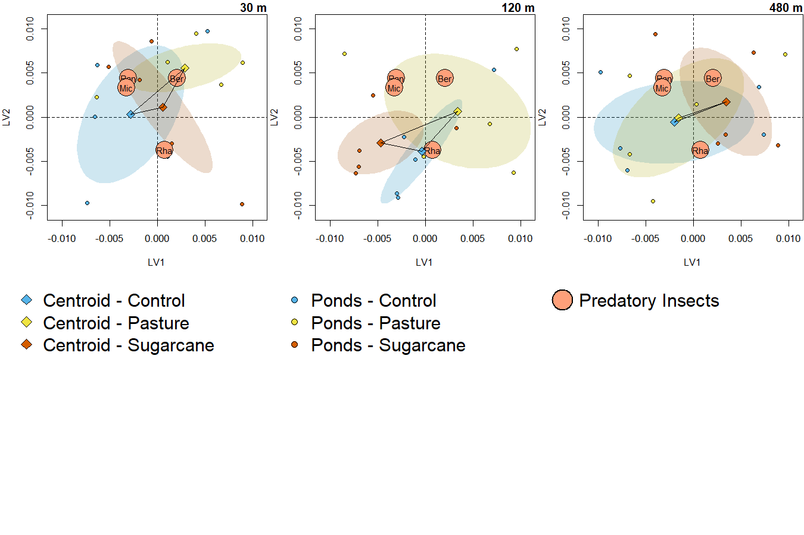
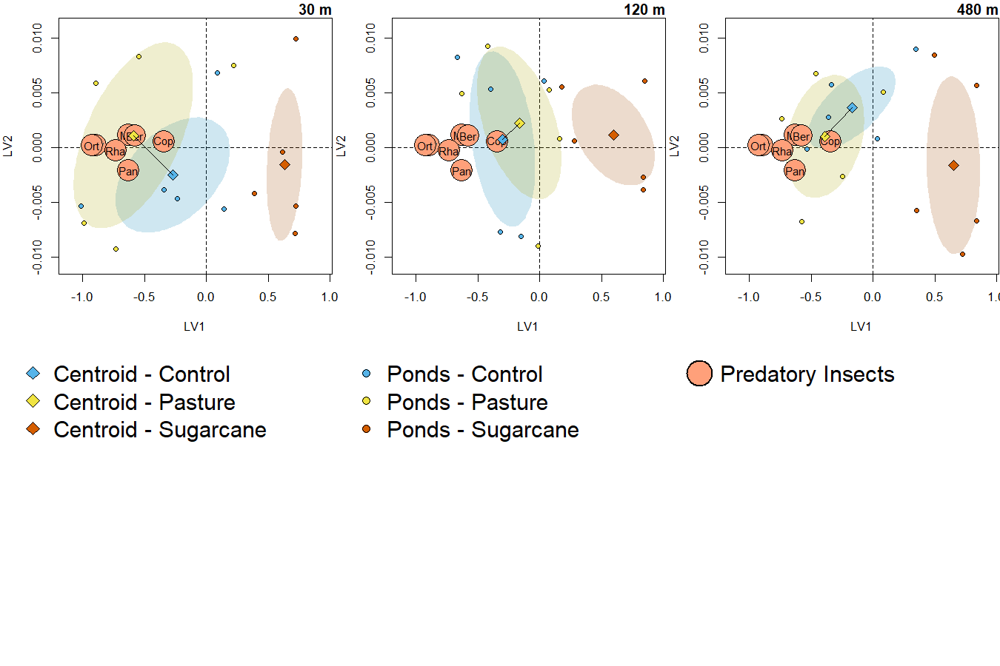
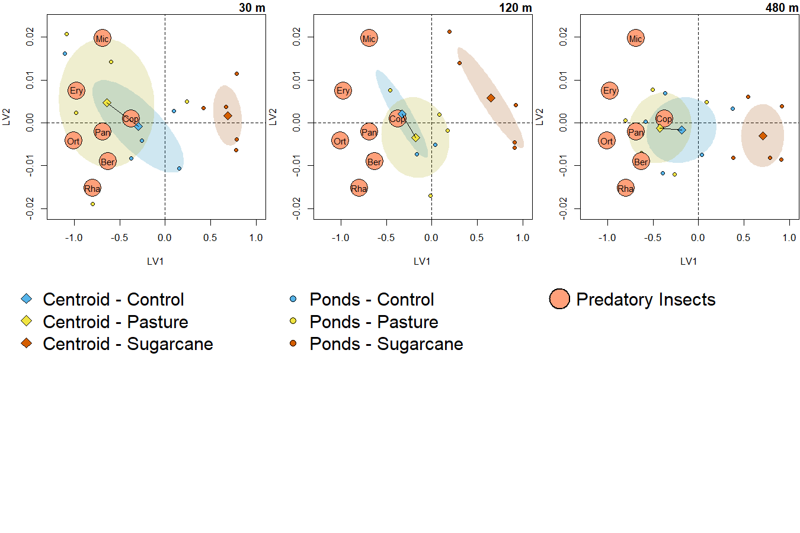
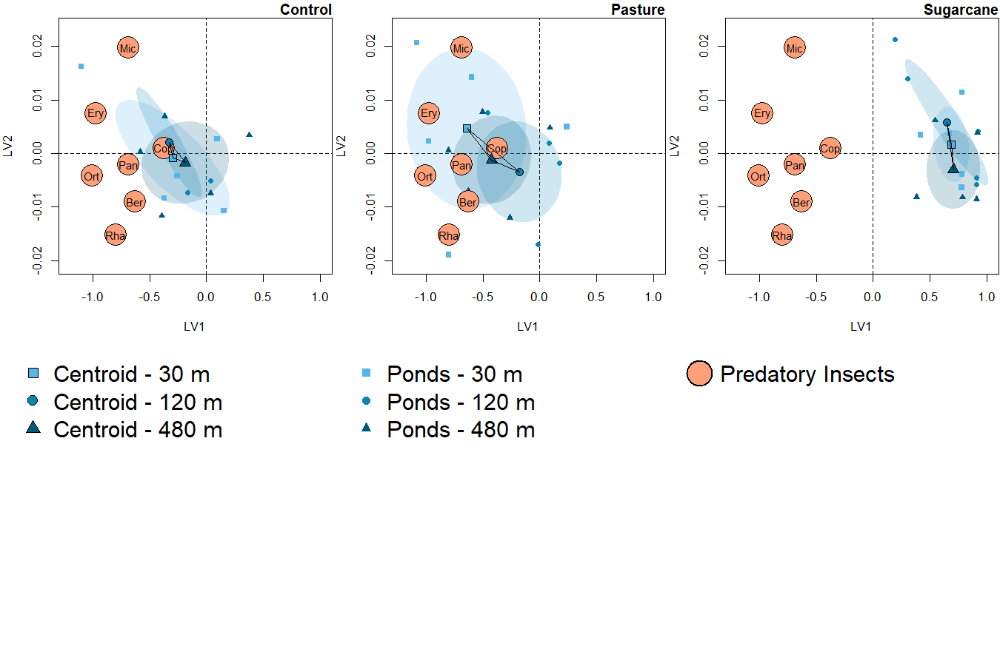
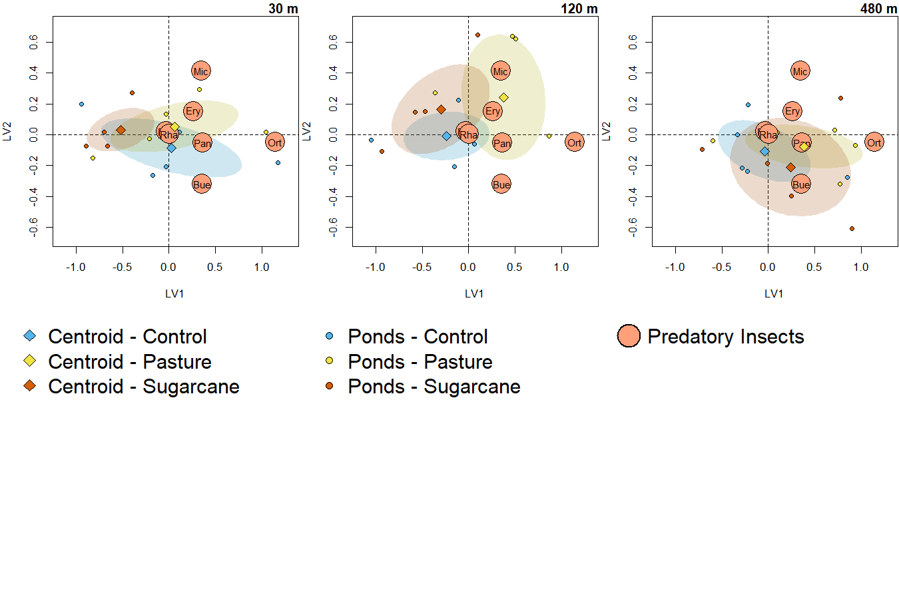
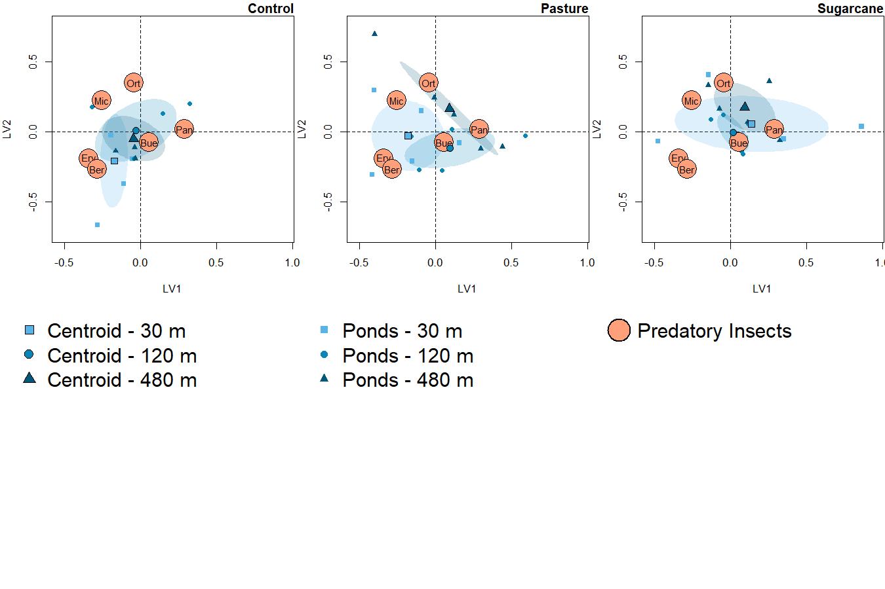

Community Structure - Predatory Insects
================
Rodolfo Pelinson
27/12/2022

``` r
library(vegan)
library(gllvm)
```

Before anything, here are three functions that will automate most of the
model selection procedures that we will be doing. The script would be
gigantic without them.

This first one is just to make a model selection table based on AICc for
gllvm models. All functions rely on the gllvm function from the `gllvm`
version 1.3.1 (it may need adjustments for other versions).

``` r
setwd("C:/Users/rodol/OneDrive/Trabalho/Papers/Analysis/IsolationAgrochemicals")
source("Auxiliary scripts/gllvm_AICc_tab.R")
```

This one is to run multiple gllvms with different number of latent
variables and perform model selection. Its useful to find the ideal
number of latent variables necessary to accurately account for
correlations (dependencies) in species co-occurrences not caused by our
treatments.

``` r
setwd("C:/Users/rodol/OneDrive/Trabalho/Papers/Analysis/IsolationAgrochemicals")
source("Auxiliary scripts/run_multiple_lv.R")
```

This is to automate running multiple gllvms and perform model selection

``` r
setwd("C:/Users/rodol/OneDrive/Trabalho/Papers/Analysis/IsolationAgrochemicals")
source("Auxiliary scripts/run_multiple_gllvm.R")
```

This is for getting scaled latent variables for plotting model based
ordinations. I took most of code from the plotting functions from the
`gllvm` package.

``` r
setwd("C:/Users/rodol/OneDrive/Trabalho/Papers/Analysis/IsolationAgrochemicals")
source("Auxiliary scripts/get_scaled_lvs.R")
```

# Predatory insects

Lets make tables with only predatory insects. Note that here we excludes
species that occur in less than 4 samples in each survey because are
less informative to community patterns and complicate parameter
estimation.

``` r
#cheking if the order of row in Trait_og and columns in com_orig match

data.frame(com = colnames(com), trait = Trait$genus)
```

    ##                      com                 trait
    ## 1                Berosus               Berosus
    ## 2                 Buenoa                Buenoa
    ## 3                 Caenis                Caenis
    ## 4            Callibaetis           Callibaetis
    ## 5        Ceratopogonidae       Ceratopogonidae
    ## 6              Chaoborus             Chaoborus
    ## 7           Chironominae          Chironominae
    ## 8              Copelatus             Copelatus
    ## 9                  Culex                 Culex
    ## 10         Erythrodiplax         Erythrodiplax
    ## 11            Heterelmis            Heterelmis
    ## 12            Microvelia            Microvelia
    ## 13              Orthemis              Orthemis
    ## 14               Pantala               Pantala
    ## 15 Physalaemos.nattereri Physalaemos nattereri
    ## 16               Rhantus               Rhantus
    ## 17            Scinax.sp.            Scinax sp.
    ## 18           Tanypodinae           Tanypodinae

``` r
com_predators <- com[,Trait$trophic == "predator"]
com_predators_SS1 <- com_SS1[,Trait_SS1$trophic == "predator"]
com_predators_SS2 <- com_SS2[,Trait_SS2$trophic == "predator"]
com_predators_SS3 <- com_SS3[,Trait_SS3$trophic == "predator"]
com_predators_SS4 <- com_SS4[,Trait_SS4$trophic == "predator"]
```

## First Survey (20 day)

We always used a negative binomial distribution to model species
abundances.

``` r
SS1_predictors <- data.frame(treatments = treatments_SS1,
                             isolation = isolation_SS1)
```

Number of latent variables:

``` r
n_latent_tab_SS1 <- run_multiple_lv(formula = ~ treatments * isolation,
                                   num.lv = c(0,1,2,3),
                                   y = com_predators_SS1, X = SS1_predictors,
                                   family = "negative.binomial",
                                   method = "VA",
                                   n.init = 10, seed = 11:20, starting.val = 0)

n_latent_tab_SS1
```

    ##   model     AICc delta_AICc df nobs
    ## 1     0 498.8127    0.00000 40  180
    ## 2     1 512.5487   13.73602 44  180
    ## 3     2 523.3974   24.58470 47  180
    ## 4     3 530.9079   32.09517 49  180

It looks that zero latent variables is the way to go. This will repeat
itself for the next cases.

Model selection of effects:

``` r
model_predators_selection_SS1 <- run_multiple_gllvm(formulas = list(~ treatments,
                                   ~ isolation,
                                   ~ treatments + isolation,
                                   ~ treatments * isolation),
                   names = c("Treatments",
                             "Isolation",
                             "Isolation + Treatments",
                             "Isolation * Treatments"),
                   no_effect = TRUE,
                   num.lv = 0,
                   X = SS1_predictors,
                   y = com_predators_SS1,
                   family = "negative.binomial",
                   method = "VA",
                   n.init = 10, seed = 11:20, starting.val = 0)

model_predators_selection_SS1
```

    ##                    model     AICc delta_AICc df nobs
    ## 1              No Effect 442.4666   0.000000  8  180
    ## 2             Treatments 450.0960   7.629371 16  180
    ## 3              Isolation 447.9068   5.440168 16  180
    ## 4 Isolation + Treatments 456.8692  14.402625 24  180
    ## 5 Isolation * Treatments 498.8127  56.346117 40  180

It seems there was no effect on community structure for the first
survey.

The code for plotting the ordinations is again pretty extensive, I will
then only show the first one as an example e call the others from
functions sourced from the ’Auxiliary scripts” folder.

``` r
SS1_predictors <- data.frame(treatments = treatments_SS1,
                             isolation = isolation_SS1)

sum_com_predators_SS1 <- sum_com_SS1[,Trait_SS1_sum$trophic == "predator"]

col_SS1 <- rep("lightsalmon1", ncol(sum_com_predators_SS1))


fit_SS1_plot <- gllvm(sum_com_predators_SS1, #X = data.frame(ID = SS1_predictors[,1]),
                      formula = ~ 1,
                      family = "negative.binomial",
                      method = "VA",
                      #row.eff = ~ (1|ID),
                      n.init = 10, num.lv = 2, seed = 11:20, starting.val = "zero")


scaled_lvs <- get_scaled_lvs(fit_SS1_plot, alpha = 0.5)

set.seed(2)
scaled_lvs$species <- jitter(scaled_lvs$species, amount = 0.01)
set.seed(2)
scaled_lvs$sites <- jitter(scaled_lvs$sites, amount = 0.01)

scaled_lvs$new_species <- scaled_lvs$species/2


xmin <- min(c(scaled_lvs$sites[,1], scaled_lvs$new_species[,1]))*1.1
xmax <- max(c(scaled_lvs$sites[,1], scaled_lvs$new_species[,1]))*1.1
ymin <- min(c(scaled_lvs$sites[,2], scaled_lvs$new_species[,2]))*1.1
ymax <- max(c(scaled_lvs$sites[,2], scaled_lvs$new_species[,2]))*1.1


par(mar = c(4,4,1.25,.1), mfrow = c(2, 3))

  plot(NA,xlim = c(xmin, xmax), ylim = c(ymin, ymax), ylab = "LV2", xlab = "LV1", axes = F)
  axis(1 , gap.axis = -10)
  axis(2 , gap.axis = -10)
  abline(h=0,v=0, lty =2)
  
  ordiellipse(scaled_lvs$sites[SS1_predictors$isolation == "30",],
              groups = SS1_predictors$treatments[SS1_predictors$isolation == "30"],
              draw = "polygon", border = FALSE,  col = c(col_control_120, col_pasture_120, col_sugarcane_120), kind = "sd", alpha = 50)
  
  #ordiellipse(scaled_lvs$sites,
  #            groups = SS1_predictors$treatments,
  #            draw = "polygon", border = FALSE,  col = c(col_control_120, col_pasture_120, col_sugarcane_120), kind = "sd", alpha = 50)
  
  points(scaled_lvs$sites[SS1_predictors$treatments == "control" & SS1_predictors$isolation == "30",], bg = col_control_30, pch = 21)
  points(scaled_lvs$sites[SS1_predictors$treatments == "pasture" & SS1_predictors$isolation == "30",], bg = col_pasture_30, pch = 21)
  points(scaled_lvs$sites[SS1_predictors$treatments == "sugar_cane" & SS1_predictors$isolation == "30",], bg = col_sugarcane_30, pch = 21)
  
  
  centroid_control_30 <- colMeans(scaled_lvs$sites[SS1_predictors$treatments == "control" & SS1_predictors$isolation == "30",])
  centroid_pasture_30 <- colMeans(scaled_lvs$sites[SS1_predictors$treatments == "pasture" & SS1_predictors$isolation == "30",])
  centroid_sugarcane_30 <- colMeans(scaled_lvs$sites[SS1_predictors$treatments == "sugar_cane" & SS1_predictors$isolation == "30",])
  
  #centroid_control_30 <- colMeans(scaled_lvs$sites[SS1_predictors$treatments == "control",])
  #centroid_pasture_30 <- colMeans(scaled_lvs$sites[SS1_predictors$treatments == "pasture",])
  #centroid_sugarcane_30 <- colMeans(scaled_lvs$sites[SS1_predictors$treatments == "sugar_cane",])
  
  
  #lines(x = c(centroid_control_30[1], centroid_sugarcane_30[1]),
  #      y = c(centroid_control_30[2], centroid_sugarcane_30[2]))
  
  #lines(x = c(centroid_pasture_30[1], centroid_sugarcane_30[1]),
  #      y = c(centroid_pasture_30[2], centroid_sugarcane_30[2]))
  
  
  
  for(i in 1:nrow(scaled_lvs$new_species)){
    points(x = scaled_lvs$new_species[i,1], y = scaled_lvs$new_species[i,2], cex = 4, pch = 21, bg = col_SS1[i])
    text(x = scaled_lvs$new_species[i,1], y = scaled_lvs$new_species[i,2], labels = substr(rownames(scaled_lvs$species)[i], 1, 3), cex = 0.9)
  }
  
  points(centroid_control_30[1], centroid_control_30[2], bg = col_control_30, pch = 23, cex = 1.5)
  points(centroid_pasture_30[1], centroid_pasture_30[2], bg = col_pasture_30, pch = 23, cex = 1.5)
  points(centroid_sugarcane_30[1], centroid_sugarcane_30[2], bg = col_sugarcane_30, pch = 23, cex = 1.5)
  
  lines(x = c(centroid_control_30[1], centroid_pasture_30[1]),
        y = c(centroid_control_30[2], centroid_pasture_30[2]))
  
  lines(x = c(centroid_pasture_30[1], centroid_sugarcane_30[1]),
        y = c(centroid_pasture_30[2], centroid_sugarcane_30[2]))
  
  lines(x = c(centroid_control_30[1], centroid_sugarcane_30[1]),
        y = c(centroid_control_30[2], centroid_sugarcane_30[2]))
  
  
  
  title(main = "30 m", adj = 1, line = 0.25)
  
  box()

plot_com_SS1_pred_treat_120()

plot_com_SS1_pred_treat_480()

par(mar = c(0,0,0,0),cex = 1.25)
plot(NA, xaxt = "n", yaxt = "n", xlim= c(0,100), ylim = c(0,100), bty = "n", ylab = "", xlab = "")
legend(x = 0, y = 100, pch = c(23, 23, 23), legend = c("Centroid - Control", "Centroid - Pasture", "Centroid - Sugarcane"), pt.bg   = c(col_control_30, col_pasture_30, col_sugarcane_30), bty = "n")

plot(NA, xaxt = "n", yaxt = "n", xlim= c(0,100), ylim = c(0,100), bty = "n", ylab = "", xlab = "")
legend(x = 0, y = 100, pch = c(21, 21, 21), legend = c("Ponds - Control", "Ponds - Pasture", "Ponds - Sugarcane"), pt.bg    = c(col_control_30, col_pasture_30, col_sugarcane_30), bty = "n", pt.cex    = 0.75)

plot(NA, xaxt = "n", yaxt = "n", xlim= c(0,100), ylim = c(0,100), bty = "n", ylab = "", xlab = "")
legend(x = 0, y = 100, pch = c(21), legend = c("Predatory Insects"), pt.bg  = c("lightsalmon1"), bty = "n", pt.cex  = 2.5, pt.lwd   = 1.5)
```



``` r
par(mar = c(4,4,1.25,.1), mfrow = c(2, 3))

plot_com_SS1_pred_iso_control()

plot_com_SS1_pred_iso_pasture()

plot_com_SS1_pred_iso_sugarcane()

par(mar = c(0,0,0,0),cex = 1.25)
plot(NA, xaxt = "n", yaxt = "n", xlim= c(0,100), ylim = c(0,100), bty = "n", ylab = "", xlab = "")
legend(x = 0, y = 100, pch = c(22, 21, 24), legend = c("Centroid - 30 m", "Centroid - 120 m", "Centroid - 480 m"), pt.bg    = c(col_control_30, col_control_120, col_control_480), bty = "n")

plot(NA, xaxt = "n", yaxt = "n", xlim= c(0,100), ylim = c(0,100), bty = "n", ylab = "", xlab = "")
legend(x = 0, y = 100, pch = c(15, 16, 17), legend = c("Ponds - 30 m", "Ponds - 120 m", "Ponds - 480 m"), col   = c(col_control_30, col_control_120, col_control_480), bty = "n", pt.cex    = 0.75)

plot(NA, xaxt = "n", yaxt = "n", xlim= c(0,100), ylim = c(0,100), bty = "n", ylab = "", xlab = "")
legend(x = 0, y = 100, pch = c(21), legend = c("Predatory Insects"), pt.bg  = c("lightsalmon1"), bty = "n", pt.cex  = 2.5, pt.lwd   = 1.5)
```


## Second Survey (40 day)

``` r
SS2_predictors <- data.frame(ID = ID_SS2_3_4,
                             treatments = treatments_SS2_3_4,
                             isolation = isolation_SS2_3_4,
                             isolation30_120480 = isolation30_120480_SS2_3_4,
                             isolation30120_480 = isolation30120_480_SS2_3_4,
                             treatments_contpast_sug = treatments_SS2_3_4_contpast_sug,
                             treatments_cont_pastsug = treatments_SS2_3_4_cont_pastsug,
                             treatments_contsug_past = treatments_SS2_3_4_contsug_past)
```

Number of latent variables:

``` r
n_latent_tab_SS2 <- run_multiple_lv(num.lv = c(0,1,2,3),
                                formula = ~ treatments * isolation,
                                row.eff = ~ (1|ID),
                                y = com_predators_SS2, X = SS2_predictors,
                                family = "negative.binomial",
                                method = "VA",
                                n.init = 10, seed = 11:20)

n_latent_tab_SS2
```

    ##   model     AICc delta_AICc df nobs
    ## 1     0 1762.972    0.00000 71 1260
    ## 2     1 1778.801   15.82921 78 1260
    ## 3     2 1792.519   29.54718 84 1260
    ## 4     3 1804.058   41.08629 89 1260

It looks that zero latent variables is the way to go.

Model selection of effects:

``` r
model_predators_selection_SS2 <- run_multiple_gllvm(formulas = list(~ treatments,
                                                                                        ~ isolation,
                                                                                        ~ treatments + isolation,
                                                                                        ~ treatments * isolation),
                                                                        names = c("Treatments",
                                                                                  "Isolation",
                                                                                  "Isolation + Treatments",
                                                                                  "Isolation * Treatments"),
                                                                        no_effect = TRUE,
                                                                        num.lv = 0,
                                                                        X = SS2_predictors,
                                                                        X_row = data.frame(ID = ID_SS2_3_4),
                                                                        y = com_predators_SS2,
                                                                        row.eff = ~ (1|ID),
                                                                        family = "negative.binomial",
                                                                        method = "VA",
                                                                        n.init = 10, seed = 11:20)

model_predators_selection_SS2
```

    ##                    model     AICc delta_AICc df nobs
    ## 1              No Effect 1761.332  41.485829 15 1260
    ## 2             Treatments 1719.846   0.000000 29 1260
    ## 3              Isolation 1771.902  52.055715 29 1260
    ## 4 Isolation + Treatments 1729.203   9.357182 43 1260
    ## 5 Isolation * Treatments 1762.972  43.125688 71 1260

It seems there is an effect of treatments.

Lets look at pairwise differences:

``` r
model_predators_selection_SS2_post_hoc_treatments <- run_multiple_gllvm(formulas = list(~ treatments,
                                                                    ~ treatments_contpast_sug,
                                                                    ~ treatments_cont_pastsug,
                                                                    ~ treatments_contsug_past),
                                                    names = c("control # pasture # sugarcane",
                                                              "(control = pasture) # sugarcane",
                                                              "control # (pasture = sugarcane)",
                                                              "(control = sugarcane) # pasture"),
                                                    no_effect = FALSE,
                                                    num.lv = 0,
                                                    X = SS2_predictors,
                                                    X_row = data.frame(ID = ID_SS2_3_4),
                                                    y = com_predators_SS2,
                                                    row.eff = ~ (1|ID),
                                                    family = "negative.binomial",
                                                    method = "VA",
                                                    n.init = 10, seed = 11:20)
model_predators_selection_SS2_post_hoc_treatments
```

    ##                             model     AICc delta_AICc df nobs
    ## 1   control # pasture # sugarcane 1719.846   4.394239 29 1260
    ## 2 (control = pasture) # sugarcane 1715.452   0.000000 22 1260
    ## 3 control # (pasture = sugarcane) 1760.202  44.749861 22 1260
    ## 4 (control = sugarcane) # pasture 1756.941  41.489205 22 1260

So, communities in the sugarcane treatment are different from the
others.

Ploting it:

``` r
SS2_predictors <- data.frame(treatments = treatments_SS1,
                             isolation = isolation_SS1)

sum_com_predators_SS2 <- sum_com_SS2[,Trait_SS2_sum$trophic == "predator"]

col_SS2 <- rep("lightsalmon1", ncol(sum_com_predators_SS2))


fit_SS2_plot <- gllvm(sum_com_predators_SS2, #X = data.frame(ID = ID_SS2_3_4),
                      formula = ~ 1,
                      family = "negative.binomial",
                      method = "VA",
                      #row.eff = ~ (1|ID),
                      n.init = 10, num.lv = 2, seed = 11:20)


scaled_lvs <- get_scaled_lvs(fit_SS2_plot, alpha = 0.5)

set.seed(3)
scaled_lvs$species <- jitter(scaled_lvs$species, amount = 0.01)
set.seed(3)
scaled_lvs$sites <- jitter(scaled_lvs$sites, amount = 0.01)

scaled_lvs$new_species <- scaled_lvs$species/2


#LV1 <- tapply(scaled_lvs$sites[,1], INDEX = ID_SS2_3_4, median)
#LV2 <- tapply(scaled_lvs$sites[,2], INDEX = ID_SS2_3_4, median)

#scaled_lvs$sites <- data.frame(LV1,LV2)


xmin <- min(c(scaled_lvs$sites[,1], scaled_lvs$new_species[,1]))*1.1
xmax <- max(c(scaled_lvs$sites[,1], scaled_lvs$new_species[,1]))*1.1
ymin <- min(c(scaled_lvs$sites[,2], scaled_lvs$new_species[,2]))*1.1
ymax <- max(c(scaled_lvs$sites[,2], scaled_lvs$new_species[,2]))*1.1


par(mar = c(4,4,1.25,.1), mfrow = c(2, 3))

plot_com_SS2_pred_treat_30()

plot_com_SS2_pred_treat_120()

plot_com_SS2_pred_treat_480()

par(mar = c(0,0,0,0),cex = 1.25)
plot(NA, xaxt = "n", yaxt = "n", xlim= c(0,100), ylim = c(0,100), bty = "n", ylab = "", xlab = "")
legend(x = 0, y = 100, pch = c(23, 23, 23), legend = c("Centroid - Control", "Centroid - Pasture", "Centroid - Sugarcane"), pt.bg   = c(col_control_30, col_pasture_30, col_sugarcane_30), bty = "n")

plot(NA, xaxt = "n", yaxt = "n", xlim= c(0,100), ylim = c(0,100), bty = "n", ylab = "", xlab = "")
legend(x = 0, y = 100, pch = c(21, 21, 21), legend = c("Ponds - Control", "Ponds - Pasture", "Ponds - Sugarcane"), pt.bg    = c(col_control_30, col_pasture_30, col_sugarcane_30), bty = "n", pt.cex    = 0.75)

plot(NA, xaxt = "n", yaxt = "n", xlim= c(0,100), ylim = c(0,100), bty = "n", ylab = "", xlab = "")
legend(x = 0, y = 100, pch = c(21), legend = c("Predatory Insects"), pt.bg  = c("lightsalmon1"), bty = "n", pt.cex  = 2.5, pt.lwd   = 1.5)
```



Ploting species coefficients and their confidence intervals based on the
effects identified in the analysis. The script for extracting these
coefficients and the function for plotting is rather extensive, thus I
will source the code on a script in the Auxiliary Scripts folder. You
can check the original code there.

``` r
setwd("C:/Users/rodol/OneDrive/Trabalho/Papers/Analysis/IsolationAgrochemicals")
source("Auxiliary scripts/coefficients for predators.R")
source("Auxiliary scripts/My_coefplot.R")
```

These are the coefficients Coefficients for the difference of sugarcane
communities from the others.

``` r
par(mar = c(4,8,2,.5), cex = 0.5, mfrow = c(1,3))

species_labels_SS2 <- sub(pattern = ".", replacement = " ", x =names(effect_SS2_control_sugar_cane), fixed = TRUE)

My_coefplot(mles = effect_SS2_control_sugar_cane,
            lower = effect_SS2_control_sugar_cane_lower,
            upper = effect_SS2_control_sugar_cane_upper,
            species_labels = species_labels_SS2,  xlab = "Effect on abundance", main = "Savanna/Pasture vs Sugarcane",
            cex.axis = 1, cex.main = 1, font = 3, at.xaxis = c(2,0,-2,-4, -14, -16),break.axis = c(-6,-12))
```


Ordinations focusing on isolation

``` r
par(mar = c(4,4,1.25,.1), mfrow = c(2, 3))

plot_com_SS2_pred_iso_control()

plot_com_SS2_pred_iso_pasture()

plot_com_SS2_pred_iso_sugarcane()

par(mar = c(0,0,0,0),cex = 1.25)
plot(NA, xaxt = "n", yaxt = "n", xlim= c(0,100), ylim = c(0,100), bty = "n", ylab = "", xlab = "")
legend(x = 0, y = 100, pch = c(22, 21, 24), legend = c("Centroid - 30 m", "Centroid - 120 m", "Centroid - 480 m"), pt.bg    = c(col_control_30, col_control_120, col_control_480), bty = "n")

plot(NA, xaxt = "n", yaxt = "n", xlim= c(0,100), ylim = c(0,100), bty = "n", ylab = "", xlab = "")
legend(x = 0, y = 100, pch = c(15, 16, 17), legend = c("Ponds - 30 m", "Ponds - 120 m", "Ponds - 480 m"), col   = c(col_control_30, col_control_120, col_control_480), bty = "n", pt.cex    = 0.75)

plot(NA, xaxt = "n", yaxt = "n", xlim= c(0,100), ylim = c(0,100), bty = "n", ylab = "", xlab = "")
legend(x = 0, y = 100, pch = c(21), legend = c("Predatory Insects"), pt.bg  = c("lightsalmon1"), bty = "n", pt.cex  = 2.5, pt.lwd   = 1.5)
```



## Third Survey (80 day)

``` r
SS3_predictors <- data.frame(ID = ID_SS2_3_4,
                             treatments = treatments_SS2_3_4,
                             isolation = isolation_SS2_3_4,
                             isolation30_120480 = isolation30_120480_SS2_3_4,
                             isolation30120_480 = isolation30120_480_SS2_3_4,
                             treatments_contpast_sug = treatments_SS2_3_4_contpast_sug,
                             treatments_cont_pastsug = treatments_SS2_3_4_cont_pastsug,
                             treatments_contsug_past = treatments_SS2_3_4_contsug_past)
```

Number of latent variables:

``` r
n_latent_tab_SS3 <- run_multiple_lv(num.lv = c(0,1,2,3),
                                    formula = ~ treatments * isolation,
                                    row.eff = ~ (1|ID),
                                    y = com_predators_SS3, X = SS3_predictors,
                                    family = "negative.binomial",
                                    method = "VA",
                                    n.init = 10, seed = 11:20)

n_latent_tab_SS3
```

    ##   model     AICc delta_AICc df nobs
    ## 1     0 3317.771    0.00000 71 1260
    ## 2     1 3332.137   14.36644 78 1260
    ## 3     2 3346.303   28.53197 84 1260
    ## 4     3 3357.395   39.62353 89 1260

It looks that zero latent variables is the way to go.

Model selection of effects:

``` r
model_predators_selection_SS3 <- run_multiple_gllvm(formulas = list(~ treatments,
                                                                    ~ isolation,
                                                                    ~ treatments + isolation,
                                                                    ~ treatments * isolation),
                                                    names = c("Treatments",
                                                              "Isolation",
                                                              "Isolation + Treatments",
                                                              "Isolation * Treatments"),
                                                    no_effect = TRUE,
                                                    num.lv = 0,
                                                    X = SS3_predictors,
                                                    X_row = data.frame(ID = ID_SS2_3_4),
                                                    y = com_predators_SS3,
                                                    row.eff = ~ (1|ID),
                                                    family = "negative.binomial",
                                                    method = "VA",
                                                    n.init = 10, seed = 11:20)

model_predators_selection_SS3
```

    ##                    model     AICc delta_AICc df nobs
    ## 1              No Effect 3419.553  130.47324 15 1260
    ## 2             Treatments 3313.546   24.46642 29 1260
    ## 3              Isolation 3397.888  108.80859 29 1260
    ## 4 Isolation + Treatments 3289.079    0.00000 43 1260
    ## 5 Isolation * Treatments 3317.771   28.69171 71 1260

It seems like there are main effects of treatments and isolation.

Lets look at pairwise differences of treatments:

``` r
model_predators_selection_SS3_post_hoc_treatments <- run_multiple_gllvm(formulas = list(~ treatments + isolation,
                                                                                        ~ treatments_contpast_sug + isolation,
                                                                                        ~ treatments_cont_pastsug + isolation,
                                                                                        ~ treatments_contsug_past + isolation),
                                                                        names = c("control # pasture # sugarcane",
                                                                                  "(control = pasture) # sugarcane",
                                                                                  "control # (pasture = sugarcane)",
                                                                                  "(control = sugarcane) # pasture"),
                                                                        no_effect = FALSE,
                                                                        num.lv = 0,
                                                                        X = SS3_predictors,
                                                                        X_row = data.frame(ID = ID_SS2_3_4),
                                                                        y = com_predators_SS3,
                                                                        row.eff = ~ (1|ID),
                                                                        family = "negative.binomial",
                                                                        method = "VA",
                                                                        n.init = 10, seed = 11:20)
model_predators_selection_SS3_post_hoc_treatments
```

    ##                             model     AICc delta_AICc df nobs
    ## 1   control # pasture # sugarcane 3289.079    0.00000 43 1260
    ## 2 (control = pasture) # sugarcane 3304.074   14.99513 36 1260
    ## 3 control # (pasture = sugarcane) 3370.469   81.38980 36 1260
    ## 4 (control = sugarcane) # pasture 3377.069   87.99002 36 1260

It seems that all treatments are different from each other.

Now, pairwise differences of isolation:

``` r
model_predators_selection_SS3_post_hoc_isolation <- run_multiple_gllvm(formulas = list(~ isolation + treatments,
                                                                                        ~ isolation30120_480 + treatments,
                                                                                        ~ isolation30_120480 + treatments),
                                                                        names = c("30 # 120 # 480",
                                                                                  "(30 = 120) # 480",
                                                                                  "30 # (120 = 480)"),
                                                                        no_effect = FALSE,
                                                                        num.lv = 0,
                                                                        X = SS3_predictors,
                                                                        X_row = data.frame(ID = ID_SS2_3_4),
                                                                        y = com_predators_SS3,
                                                                        row.eff = ~ (1|ID),
                                                                        family = "negative.binomial",
                                                                        method = "VA",
                                                                        n.init = 10, seed = 11:20)
model_predators_selection_SS3_post_hoc_isolation
```

    ##              model     AICc delta_AICc df nobs
    ## 1   30 # 120 # 480 3289.079   8.888628 43 1260
    ## 2 (30 = 120) # 480 3280.191   0.000000 36 1260
    ## 3 30 # (120 = 480) 3318.193  38.002784 36 1260

480m is different from 30 and 120m.

Ploting it:

``` r
SS3_predictors <- data.frame(treatments = treatments_SS1,
                             isolation = isolation_SS1)

sum_com_predators_SS3 <- sum_com_SS3[,Trait_SS3_sum$trophic == "predator"]

col_SS3 <- rep("lightsalmon1", ncol(sum_com_predators_SS3))


fit_SS3_plot <- gllvm(sum_com_predators_SS3, #X = data.frame(ID = ID_SS2_3_4),
                      formula = ~ 1,
                      family = "negative.binomial",
                      method = "VA",
                      #row.eff = ~ (1|ID),
                      n.init = 10, num.lv = 2, seed = 11:20)


scaled_lvs <- get_scaled_lvs(fit_SS3_plot, alpha = 0.5)

set.seed(4)
scaled_lvs$species <- jitter(scaled_lvs$species, amount = 0.01)
set.seed(3)
scaled_lvs$sites <- jitter(scaled_lvs$sites, amount = 0.01)

scaled_lvs$new_species <- scaled_lvs$species/3


#LV1 <- tapply(scaled_lvs$sites[,1], INDEX = ID_SS2_3_4, median)
#LV2 <- tapply(scaled_lvs$sites[,2], INDEX = ID_SS2_3_4, median)

#scaled_lvs$sites <- data.frame(LV1,LV2)


xmin <- min(c(scaled_lvs$sites[,1], scaled_lvs$new_species[,1]))*1.1
xmax <- max(c(scaled_lvs$sites[,1], scaled_lvs$new_species[,1]))*1.1
ymin <- min(c(scaled_lvs$sites[,2], scaled_lvs$new_species[,2]))*1.1
ymax <- max(c(scaled_lvs$sites[,2], scaled_lvs$new_species[,2]))*1.1


par(mar = c(4,4,1.25,.1), mfrow = c(2, 3))

plot_com_SS3_pred_treat_30()

plot_com_SS3_pred_treat_120()

plot_com_SS3_pred_treat_480()

par(mar = c(0,0,0,0),cex = 1.25)
plot(NA, xaxt = "n", yaxt = "n", xlim= c(0,100), ylim = c(0,100), bty = "n", ylab = "", xlab = "")
legend(x = 0, y = 100, pch = c(23, 23, 23), legend = c("Centroid - Control", "Centroid - Pasture", "Centroid - Sugarcane"), pt.bg   = c(col_control_30, col_pasture_30, col_sugarcane_30), bty = "n")

plot(NA, xaxt = "n", yaxt = "n", xlim= c(0,100), ylim = c(0,100), bty = "n", ylab = "", xlab = "")
legend(x = 0, y = 100, pch = c(21, 21, 21), legend = c("Ponds - Control", "Ponds - Pasture", "Ponds - Sugarcane"), pt.bg    = c(col_control_30, col_pasture_30, col_sugarcane_30), bty = "n", pt.cex    = 0.75)

plot(NA, xaxt = "n", yaxt = "n", xlim= c(0,100), ylim = c(0,100), bty = "n", ylab = "", xlab = "")
legend(x = 0, y = 100, pch = c(21), legend = c("Predatory Insects"), pt.bg  = c("lightsalmon1"), bty = "n", pt.cex  = 2.5, pt.lwd   = 1.5)
```



Now the coefficients

``` r
par(mar = c(4,8,2,.5), cex = 0.5, mfrow = c(1,3))

species_labels_SS3 <- sub(pattern = ".", replacement = " ", x =names(effect_SS3_control_sugar_cane), fixed = TRUE)

My_coefplot(mles = effect_SS3_control_pasture,
            lower = effect_SS3_control_pasture_lower,
            upper = effect_SS3_control_pasture_upper,
            species_labels = species_labels_SS3,  xlab = "Effect on abundance", main = "Savanna vs Pasture",
            cex.axis = 1, cex.main = 1, font = 3, at.xaxis = c(6,4,2,0,-2,-4, -450, -476),break.axis = c(-6,-474))


My_coefplot(mles = effect_SS3_control_sugar_cane,
            lower = effect_SS3_control_sugar_cane_lower,
            upper = effect_SS3_control_sugar_cane_upper,
            species_labels = species_labels_SS3,  xlab = "Effect on abundance", main = "Savanna vs Sugarcane",
            cex.axis = 1, cex.main = 1, font = 3)#, at.xaxis = c(6, 4,2,0,-2,-4, -450, -476),break.axis = c(-6,-474))


My_coefplot(mles = effect_SS3_pasture_sugar_cane,
            lower = effect_SS3_pasture_sugar_cane_lower,
            upper = effect_SS3_pasture_sugar_cane_upper,
            species_labels = species_labels_SS3,  xlab = "Effect on abundance", main = "Pasture vs Sugarcane",
            cex.axis = 1, cex.main = 1, font = 3)#, at.xaxis = c(6, 4,2,0,-2,-4, -450, -476),break.axis = c(-6,-474))
```


``` r
par(mar = c(4,4,1.25,.1), mfrow = c(2, 3))

plot_com_SS3_pred_iso_control()

plot_com_SS3_pred_iso_pasture()

plot_com_SS3_pred_iso_sugarcane()

par(mar = c(0,0,0,0),cex = 1.25)
plot(NA, xaxt = "n", yaxt = "n", xlim= c(0,100), ylim = c(0,100), bty = "n", ylab = "", xlab = "")
legend(x = 0, y = 100, pch = c(22, 21, 24), legend = c("Centroid - 30 m", "Centroid - 120 m", "Centroid - 480 m"), pt.bg    = c(col_control_30, col_control_120, col_control_480), bty = "n")

plot(NA, xaxt = "n", yaxt = "n", xlim= c(0,100), ylim = c(0,100), bty = "n", ylab = "", xlab = "")
legend(x = 0, y = 100, pch = c(15, 16, 17), legend = c("Ponds - 30 m", "Ponds - 120 m", "Ponds - 480 m"), col   = c(col_control_30, col_control_120, col_control_480), bty = "n", pt.cex    = 0.75)

plot(NA, xaxt = "n", yaxt = "n", xlim= c(0,100), ylim = c(0,100), bty = "n", ylab = "", xlab = "")
legend(x = 0, y = 100, pch = c(21), legend = c("Predatory Insects"), pt.bg  = c("lightsalmon1"), bty = "n", pt.cex  = 2.5, pt.lwd   = 1.5)
```


``` r
par(mar = c(4,8,2,.5), cex = 0.5, mfrow = c(1,3))


My_coefplot(mles = effect_SS3_30_120_480,
            lower = effect_SS3_30_120_480_lower,
            upper = effect_SS3_30_120_480_upper,
            species_labels = species_labels_SS3,  xlab = "Effect on abundance", main = "30/120 vs 480",
            cex.axis = 1, cex.main = 1, font = 3)#, at.xaxis = c(6, 4,2,0,-2,-4, -450, -476),break.axis = c(-6,-474))
```



## Fourth Survey (160 day)

``` r
SS4_predictors <- data.frame(ID = ID_SS2_3_4,
                             treatments = treatments_SS2_3_4,
                             isolation = isolation_SS2_3_4,
                             isolation30_120480 = isolation30_120480_SS2_3_4,
                             isolation30120_480 = isolation30120_480_SS2_3_4,
                             treatments_contpast_sug = treatments_SS2_3_4_contpast_sug,
                             treatments_cont_pastsug = treatments_SS2_3_4_cont_pastsug,
                             treatments_contsug_past = treatments_SS2_3_4_contsug_past)
```

Number of latent variables:

``` r
n_latent_tab_SS4 <- run_multiple_lv(num.lv = c(0,1,2,3),
                                    formula = ~ treatments * isolation,
                                    row.eff = ~ (1|ID),
                                    y = com_predators_SS4, X = SS4_predictors,
                                    family = "negative.binomial",
                                    method = "VA",
                                    n.init = 10, seed = 11:20)

n_latent_tab_SS4
```

    ##   model     AICc delta_AICc df nobs
    ## 1     0 3115.011    0.00000 61 1080
    ## 2     1 3128.585   13.57370 67 1080
    ## 3     2 3140.019   25.00867 72 1080
    ## 4     3 3149.250   34.23874 76 1080

It looks that zero latent variables is the way to go.

Model selection of effects:

``` r
model_predators_selection_SS4 <- run_multiple_gllvm(formulas = list(~ treatments,
                                                                    ~ isolation,
                                                                    ~ treatments + isolation,
                                                                    ~ treatments * isolation),
                                                    names = c("Treatments",
                                                              "Isolation",
                                                              "Isolation + Treatments",
                                                              "Isolation * Treatments"),
                                                    no_effect = TRUE,
                                                    num.lv = 0,
                                                    X = SS4_predictors,
                                                    X_row = data.frame(ID = ID_SS2_3_4),
                                                    y = com_predators_SS4,
                                                    row.eff = ~ (1|ID),
                                                    family = "negative.binomial",
                                                    method = "VA",
                                                    n.init = 10, seed = 11:20)

model_predators_selection_SS4
```

    ##                    model     AICc delta_AICc df nobs
    ## 1              No Effect 3124.320  28.126356 13 1080
    ## 2             Treatments 3119.504  23.310786 25 1080
    ## 3              Isolation 3103.177   6.983416 25 1080
    ## 4 Isolation + Treatments 3096.194   0.000000 37 1080
    ## 5 Isolation * Treatments 3115.011  18.817292 61 1080

It seems like there are main effects of treatments and isolation.

Lets look at pairwise differences of treatments:

``` r
model_predators_selection_SS4_post_hoc_treatments <- run_multiple_gllvm(formulas = list(~ treatments + isolation,
                                                                                        ~ treatments_contpast_sug + isolation,
                                                                                        ~ treatments_cont_pastsug + isolation,
                                                                                        ~ treatments_contsug_past + isolation),
                                                                        names = c("control # pasture # sugarcane",
                                                                                  "(control = pasture) # sugarcane",
                                                                                  "control # (pasture = sugarcane)",
                                                                                  "(control = sugarcane) # pasture"),
                                                                        no_effect = FALSE,
                                                                        num.lv = 0,
                                                                        X = SS4_predictors,
                                                                        X_row = data.frame(ID = ID_SS2_3_4),
                                                                        y = com_predators_SS4,
                                                                        row.eff = ~ (1|ID),
                                                                        family = "negative.binomial",
                                                                        method = "VA",
                                                                        n.init = 10, seed = 11:20)
model_predators_selection_SS4_post_hoc_treatments
```

    ##                             model     AICc delta_AICc df nobs
    ## 1   control # pasture # sugarcane 3096.194  2.4084365 37 1080
    ## 2 (control = pasture) # sugarcane 3093.941  0.1554457 31 1080
    ## 3 control # (pasture = sugarcane) 3093.785  0.0000000 31 1080
    ## 4 (control = sugarcane) # pasture 3114.188 20.4032369 31 1080

It seems that we only have enough evidence so say that sugarcane
communities are different from control.

Now, pairwise differences of isolation:

``` r
model_predators_selection_SS4_post_hoc_isolation <- run_multiple_gllvm(formulas = list(~ isolation + treatments_cont_pastsug,
                                                                                       ~ isolation30120_480 + treatments_cont_pastsug,
                                                                                       ~ isolation30_120480 + treatments_cont_pastsug),
                                                                       names = c("30 # 120 # 480",
                                                                                 "(30 = 120) # 480",
                                                                                 "30 # (120 = 480)"),
                                                                       no_effect = FALSE,
                                                                       num.lv = 0,
                                                                       X = SS4_predictors,
                                                                       X_row = data.frame(ID = ID_SS2_3_4),
                                                                       y = com_predators_SS4,
                                                                       row.eff = ~ (1|ID),
                                                                       family = "negative.binomial",
                                                                       method = "VA",
                                                                       n.init = 10, seed = 11:20)
model_predators_selection_SS4_post_hoc_isolation
```

    ##              model     AICc delta_AICc df nobs
    ## 1   30 # 120 # 480 3093.785   0.000000 31 1080
    ## 2 (30 = 120) # 480 3100.147   6.362299 25 1080
    ## 3 30 # (120 = 480) 3105.170  11.384978 25 1080

All levels are different.

Ploting it:

``` r
SS4_predictors <- data.frame(treatments = treatments_SS1,
                             isolation = isolation_SS1)

sum_com_predators_SS4 <- sum_com_SS4[,Trait_SS4_sum$trophic == "predator"]

col_SS4 <- rep("lightsalmon1", ncol(sum_com_predators_SS4))


fit_SS4_plot <- gllvm(sum_com_predators_SS4, #X = data.frame(ID = ID_SS2_3_4),
                      formula = ~ 1,
                      family = "negative.binomial",
                      method = "VA",
                      #row.eff = ~ (1|ID),
                      n.init = 10, num.lv = 2, seed = 11:20)


scaled_lvs <- get_scaled_lvs(fit_SS4_plot, alpha = 0.5)

set.seed(3)
scaled_lvs$species <- jitter(scaled_lvs$species, amount = 0.01)
set.seed(3)
scaled_lvs$sites <- jitter(scaled_lvs$sites, amount = 0.01)

scaled_lvs$new_species <- scaled_lvs$species/3


#LV1 <- tapply(scaled_lvs$sites[,1], INDEX = ID_SS2_3_4, median)
#LV2 <- tapply(scaled_lvs$sites[,2], INDEX = ID_SS2_3_4, median)

#scaled_lvs$sites <- data.frame(LV1,LV2)


xmin <- min(c(scaled_lvs$sites[,1], scaled_lvs$new_species[,1]))*1.1
xmax <- max(c(scaled_lvs$sites[,1], scaled_lvs$new_species[,1]))*1.1
ymin <- min(c(scaled_lvs$sites[,2], scaled_lvs$new_species[,2]))*1.1
ymax <- max(c(scaled_lvs$sites[,2], scaled_lvs$new_species[,2]))*1.1


par(mar = c(4,4,1.25,.1), mfrow = c(2, 3))

plot_com_SS4_pred_treat_30()

plot_com_SS4_pred_treat_120()

plot_com_SS4_pred_treat_480()

par(mar = c(0,0,0,0),cex = 1.25)
plot(NA, xaxt = "n", yaxt = "n", xlim= c(0,100), ylim = c(0,100), bty = "n", ylab = "", xlab = "")
legend(x = 0, y = 100, pch = c(23, 23, 23), legend = c("Centroid - Control", "Centroid - Pasture", "Centroid - Sugarcane"), pt.bg   = c(col_control_30, col_pasture_30, col_sugarcane_30), bty = "n")

plot(NA, xaxt = "n", yaxt = "n", xlim= c(0,100), ylim = c(0,100), bty = "n", ylab = "", xlab = "")
legend(x = 0, y = 100, pch = c(21, 21, 21), legend = c("Ponds - Control", "Ponds - Pasture", "Ponds - Sugarcane"), pt.bg    = c(col_control_30, col_pasture_30, col_sugarcane_30), bty = "n", pt.cex    = 0.75)

plot(NA, xaxt = "n", yaxt = "n", xlim= c(0,100), ylim = c(0,100), bty = "n", ylab = "", xlab = "")
legend(x = 0, y = 100, pch = c(21), legend = c("Predatory Insects"), pt.bg  = c("lightsalmon1"), bty = "n", pt.cex  = 2.5, pt.lwd   = 1.5)
```


``` r
par(mar = c(4,8,2,.5), cex = 0.5, mfrow = c(1,3))

species_labels_SS4 <- sub(pattern = ".", replacement = " ", x =names(effect_SS4_control_sugar_cane), fixed = TRUE)

My_coefplot(mles = effect_SS4_control_sugar_cane,
            lower = effect_SS4_control_sugar_cane_lower,
            upper = effect_SS4_control_sugar_cane_upper,
            species_labels = species_labels_SS4,  xlab = "Effect on abundance", main = "Savanna vs Sugarcane",
            cex.axis = 1, cex.main = 1, font = 3)#, at.xaxis = c(6, 4,2,0,-2,-4, -450, -476),break.axis = c(-6,-474))
```


``` r
par(mar = c(4,4,1.25,.1), mfrow = c(2, 3))

plot_com_SS4_pred_iso_control()

plot_com_SS4_pred_iso_pasture()

plot_com_SS4_pred_iso_sugarcane()

par(mar = c(0,0,0,0),cex = 1.25)
plot(NA, xaxt = "n", yaxt = "n", xlim= c(0,100), ylim = c(0,100), bty = "n", ylab = "", xlab = "")
legend(x = 0, y = 100, pch = c(22, 21, 24), legend = c("Centroid - 30 m", "Centroid - 120 m", "Centroid - 480 m"), pt.bg    = c(col_control_30, col_control_120, col_control_480), bty = "n")

plot(NA, xaxt = "n", yaxt = "n", xlim= c(0,100), ylim = c(0,100), bty = "n", ylab = "", xlab = "")
legend(x = 0, y = 100, pch = c(15, 16, 17), legend = c("Ponds - 30 m", "Ponds - 120 m", "Ponds - 480 m"), col   = c(col_control_30, col_control_120, col_control_480), bty = "n", pt.cex    = 0.75)

plot(NA, xaxt = "n", yaxt = "n", xlim= c(0,100), ylim = c(0,100), bty = "n", ylab = "", xlab = "")
legend(x = 0, y = 100, pch = c(21), legend = c("Predatory Insects"), pt.bg  = c("lightsalmon1"), bty = "n", pt.cex  = 2.5, pt.lwd   = 1.5)
```



``` r
par(mar = c(4,8,2,.5), cex = 0.5, mfrow = c(1,3))

My_coefplot(mles = effect_SS4_30_120,
            lower = effect_SS4_30_120_lower,
            upper = effect_SS4_30_120_upper,
            species_labels = species_labels_SS4,  xlab = "Effect on abundance", main = "30 vs 120",
            cex.axis = 1, cex.main = 1, font = 3)#, at.xaxis = c(6, 4,2,0,-2,-4, -450, -476),break.axis = c(-6,-474))


My_coefplot(mles = effect_SS4_30_480,
            lower = effect_SS4_30_480_lower,
            upper = effect_SS4_30_480_upper,
            species_labels = species_labels_SS4,  xlab = "Effect on abundance", main = "30 vs 480",
            cex.axis = 1, cex.main = 1, font = 3)#, at.xaxis = c(6, 4,2,0,-2,-4, -450, -476),break.axis = c(-6,-474))


My_coefplot(mles = effect_SS4_120_480,
            lower = effect_SS4_120_480_lower,
            upper = effect_SS4_120_480_upper,
            species_labels = species_labels_SS4,  xlab = "Effect on abundance", main = "120 vs 480",
            cex.axis = 1, cex.main = 1, font = 3)#, at.xaxis = c(6, 4,2,0,-2,-4, -450, -476),break.axis = c(-6,-474))
```


