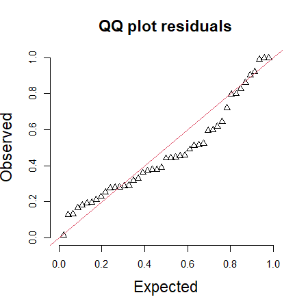
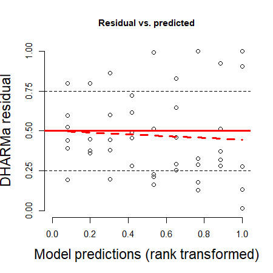
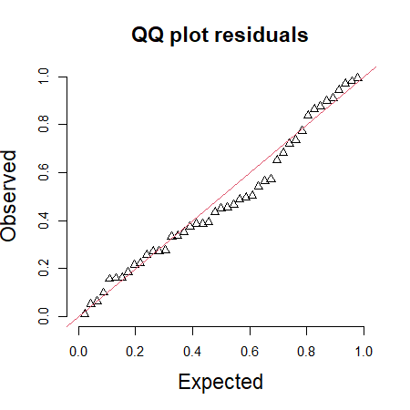
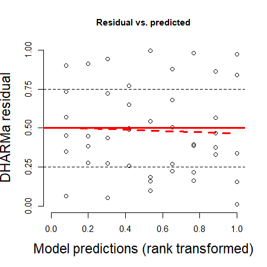
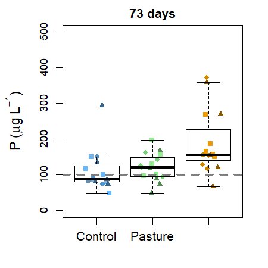
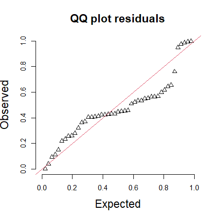
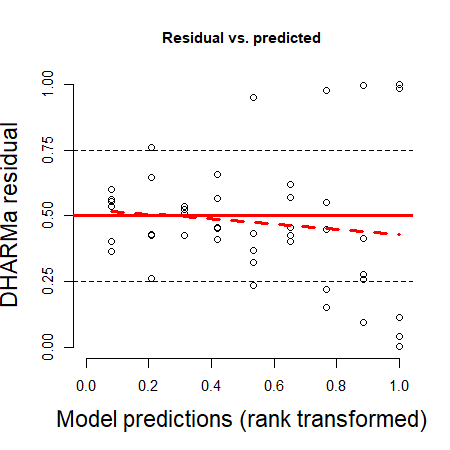
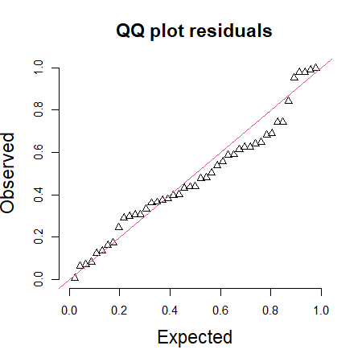
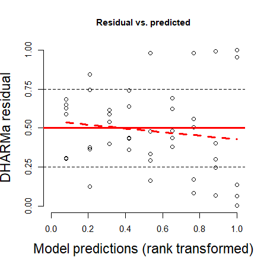
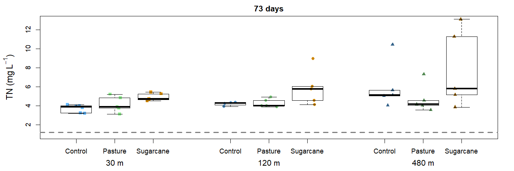

Nutrients
================
Rodolfo Pelinson
03/01/2023

``` r
library(glmmTMB)
library(car)
library(emmeans)
library(DHARMa)
library(bbmle)
library(AICcmodavg)
```

``` r
nutrients$treatment <- factor(nutrients$treatment, levels = c("control","pasture","sugarcane"))
nutrients$isolation <- factor(as.character(nutrients$isolation), levels = c("30","120","480"))
nutrients$treatments_cont_pastsug <- treatments_cont_pastsug
nutrients$treatments_contpast_sug <- treatments_contpast_sug
nutrients$treatments_contsug_past <- treatments_contsug_past
nutrients$isolation30_120480 <- isolation30_120480
nutrients$isolation30120_480 <- isolation30120_480
```

# Phosphorus

First the analysis of total phosphorus concentration in surface water 73
days after the beginning of nutrient addition in pasture and sugarcane
ponds.

``` r
par(cex = 0.6)


mod_P_third_GAUSSIAN <- glmmTMB(P_ug_L ~ treatment * isolation, data = nutrients, family = "gaussian")

simulationResiduals_mod_P_third_GAUSSIAN <- simulateResiduals(fittedModel = mod_P_third_GAUSSIAN, plot = F, seed = 3, n = 1000)
plotQQunif(simulationResiduals_mod_P_third_GAUSSIAN, testUniformity = F, testOutliers = F, testDispersion = F, cex.lab = 1.5, cex.main = 1.5)
```



``` r
plotResiduals(simulationResiduals_mod_P_third_GAUSSIAN,  quantreg = F, cex.lab = 1.5, cex.main = 1.5)
```



``` r
mod_P_third_GAMMA <- glmmTMB(P_ug_L ~ treatment * isolation, data = nutrients, family = Gamma(link = "log"))

simulationResiduals_mod_P_third_GAMMA <- simulateResiduals(fittedModel = mod_P_third_GAMMA, plot = F, seed = 3, n = 1000)
plotQQunif(simulationResiduals_mod_P_third_GAMMA, testUniformity = F, testOutliers = F, testDispersion = F, cex.lab = 1.5, cex.main = 1.5)
```



``` r
plotResiduals(simulationResiduals_mod_P_third_GAMMA,  quantreg = F, cex.lab = 1.5, cex.main = 1.5)
```



``` r
bbmle::AICctab(mod_P_third_GAUSSIAN, mod_P_third_GAMMA)
```

    ##                      dAICc df
    ## mod_P_third_GAMMA     0.0  10
    ## mod_P_third_GAUSSIAN 20.7  10

``` r
mod_P_no_effect <- glmmTMB(P_ug_L ~ 1, data = nutrients, family = Gamma(link = "log"))
mod_P_treatment <- glmmTMB(P_ug_L ~ treatment, data = nutrients, family = Gamma(link = "log"))
mod_P_isolation <- glmmTMB(P_ug_L ~ isolation, data = nutrients, family = Gamma(link = "log"))
mod_P_treatment_isolation <- glmmTMB(P_ug_L ~ treatment + isolation, data = nutrients, family = Gamma(link = "log"))
mod_P_treatment_I_isolation <- glmmTMB(P_ug_L ~ treatment * isolation, data = nutrients, family = Gamma(link = "log"))

aictab(list(mod_P_no_effect,
            mod_P_treatment,
            mod_P_isolation,
            mod_P_treatment_isolation,
            mod_P_treatment_I_isolation), modnames = c("No Effect",
                                                       "Treatments",
                                                       "Isolation",
                                                       "Isolation + Treatments",
                                                       "Isolamento * Treatments"), sort = FALSE)
```

    ## 
    ## Model selection based on AICc:
    ## 
    ##                          K   AICc Delta_AICc AICcWt      LL
    ## No Effect                2 500.42       9.18   0.01 -248.07
    ## Treatments               4 491.23       0.00   0.92 -241.12
    ## Isolation                4 505.08      13.84   0.00 -248.04
    ## Isolation + Treatments   6 496.37       5.14   0.07 -241.08
    ## Isolamento * Treatments 10 504.54      13.30   0.00 -239.03

``` r
mod_P_treatment <- glmmTMB(P_ug_L ~ isolation + treatment, family = Gamma(link = "log"), data = nutrients)
mod_P_treatments_cont_pastsug <- glmmTMB(P_ug_L ~ isolation + treatments_cont_pastsug, family = Gamma(link = "log"), data = nutrients)
mod_P_treatments_contpast_sug <- glmmTMB(P_ug_L ~ isolation + treatments_contpast_sug, family = Gamma(link = "log"), data = nutrients)
mod_P_treatments_contsug_past <- glmmTMB(P_ug_L ~ isolation + treatments_contsug_past, family = Gamma(link = "log"), data = nutrients)


aictab(list(mod_P_treatment,
            mod_P_treatments_contpast_sug,
            mod_P_treatments_cont_pastsug,
            mod_P_treatments_contsug_past), modnames = c("Savanna # Pasture # Sugarcane",
                                                       "(Savanna = Pasture) # Sugarcane",
                                                       "Savanna # (Pasture = Sugarcane)",
                                                       "(Savanna = Sugarcane) # Pasture"))
```

    ## 
    ## Model selection based on AICc:
    ## 
    ##                                 K   AICc Delta_AICc AICcWt Cum.Wt      LL
    ## (Savanna = Pasture) # Sugarcane 5 494.21       0.00   0.73   0.73 -241.34
    ## Savanna # Pasture # Sugarcane   6 496.37       2.16   0.25   0.98 -241.08
    ## Savanna # (Pasture = Sugarcane) 5 501.85       7.63   0.02   1.00 -245.15
    ## (Savanna = Sugarcane) # Pasture 5 505.67      11.46   0.00   1.00 -247.07

Looks like the phosphorus concentration in sugarcane ponds is higher
than in pasture and control ponds.

Plotting it. The grey hatched line is the threshold concentration for
hypertrophic lakes.

``` r
tratment_by_isolation <- interaction(nutrients$treatment, nutrients$isolation)

par(mar = c(4,5,2,2), cex = 0.7)
boxplot(P_ug_L ~ treatment, data = nutrients,
        ylab = expression(paste("P (", mu, "g ", L^-1,")")),
        xlab = "", cex.lab = 1.3,
        col = "transparent", main = "73 days", xaxt="n", yaxt = "n", outline = F, ylim = c(0,500))
axis(2, cex.axis = 1, gap.axis = -1)

mylevels <- levels(tratment_by_isolation)
levelProportions <- summary(tratment_by_isolation)/length(tratment_by_isolation)
col <- c("steelblue1", "palegreen2","orange2","steelblue3","palegreen3","orange3","steelblue4", "palegreen4","orange4")
pch <- c(15,15,15,16,16,16,17,17,17)

for(i in 1:length(mylevels)){

  x<- c(1,2,3, 1,2,3, 1,2,3)[i]

  thislevel <- mylevels[i]
  thisvalues <- nutrients$P_ug_L[tratment_by_isolation==thislevel]

  # take the x-axis indices and add a jitter, proportional to the N in each level
  myjitter <- jitter(rep(x, length(thisvalues)), amount=levelProportions[i]/0.5)
  points(myjitter, thisvalues, pch=pch[i], col=col[i] , cex = 1, lwd = 3)
}

boxplot(P_ug_L ~ treatment, data = nutrients,
        col = "transparent", xaxt="n", yaxt = "n", outline = F, add = TRUE)


axis(1, at = 1:3, labels = F, tick = T, line = 0)
axis(1, at = 1:3, labels = c("Control","Pasture", "Sugarcane"), tick = F, line = 0, cex.axis = 1.2)
abline(h = 100, lty = 2, lwd = 2, col = "grey50")
```



# Nitrogen

Now, the analysis of total nitrogen concentration in surface water 73
days after the beginning of nutrient addition in pasture and sugarcane
ponds.

``` r
par(cex = 0.6)

mod_TN_third_GAUSSIAN <- glmmTMB(TN_mg_L ~ treatment * isolation, data = nutrients, family = "gaussian")

simulationResiduals_mod_TN_third_GAUSSIAN <- simulateResiduals(fittedModel = mod_TN_third_GAUSSIAN, plot = F, seed = 3, n = 1000)
plotQQunif(simulationResiduals_mod_TN_third_GAUSSIAN, testUniformity = F, testOutliers = F, testDispersion = F, cex.lab = 1.5, cex.main = 1.5)
```



``` r
plotResiduals(simulationResiduals_mod_TN_third_GAUSSIAN,  quantreg = F, cex.lab = 1.5, cex.main = 1.5)
```



``` r
mod_TN_third_GAMMA <- glmmTMB(TN_mg_L ~ treatment * isolation, data = nutrients, family = Gamma(link = "log"))

simulationResiduals_mod_TN_third_GAMMA <- simulateResiduals(fittedModel = mod_TN_third_GAMMA, plot = F, seed = 3, n = 1000)
plotQQunif(simulationResiduals_mod_TN_third_GAMMA, testUniformity = F, testOutliers = F, testDispersion = F, cex.lab = 1.5, cex.main = 1.5)
```



``` r
plotResiduals(simulationResiduals_mod_TN_third_GAMMA,  quantreg = F, cex.lab = 1.5, cex.main = 1.5)
```



``` r
bbmle::AICctab(mod_TN_third_GAUSSIAN, mod_TN_third_GAMMA)
```

    ##                       dAICc df
    ## mod_TN_third_GAMMA     0.0  10
    ## mod_TN_third_GAUSSIAN 29.4  10

``` r
mod_N_no_effect <- glmmTMB(TN_mg_L ~ 1, data = nutrients, family = Gamma(link = "log"))
mod_N_treatment <- glmmTMB(TN_mg_L ~ treatment, data = nutrients, family = Gamma(link = "log"))
mod_N_isolation <- glmmTMB(TN_mg_L ~ isolation, data = nutrients, family = Gamma(link = "log"))
mod_N_treatment_isolation <- glmmTMB(TN_mg_L ~ treatment + isolation, data = nutrients, family = Gamma(link = "log"))
mod_N_treatment_I_isolation <- glmmTMB(TN_mg_L ~ treatment * isolation, data = nutrients, family = Gamma(link = "log"))

aictab(list(mod_N_no_effect,
            mod_N_treatment,
            mod_N_isolation,
            mod_N_treatment_isolation,
            mod_N_treatment_I_isolation), modnames = c("No Effect",
                                                       "Treatments",
                                                       "Isolation",
                                                       "Isolation + Treatments",
                                                       "Isolamento * Treatments"), sort = FALSE)
```

    ## 
    ## Model selection based on AICc:
    ## 
    ##                          K   AICc Delta_AICc AICcWt     LL
    ## No Effect                2 175.88      15.38   0.00 -85.80
    ## Treatments               4 169.65       9.15   0.01 -80.32
    ## Isolation                4 168.55       8.04   0.02 -79.77
    ## Isolation + Treatments   6 160.50       0.00   0.96 -73.15
    ## Isolamento * Treatments 10 169.27       8.77   0.01 -71.40

``` r
mod_N_treatment <- glmmTMB(TN_mg_L ~ isolation + treatment, family = Gamma(link = "log"), data = nutrients)
mod_N_treatments_cont_pastsug <- glmmTMB(TN_mg_L ~ isolation + treatments_cont_pastsug, family = Gamma(link = "log"), data = nutrients)
mod_N_treatments_contpast_sug <- glmmTMB(TN_mg_L ~ isolation + treatments_contpast_sug, family = Gamma(link = "log"), data = nutrients)
mod_N_treatments_contsug_past <- glmmTMB(TN_mg_L ~ isolation + treatments_contsug_past, family = Gamma(link = "log"), data = nutrients)


aictab(list(mod_N_treatment,
            mod_N_treatments_contpast_sug,
            mod_N_treatments_cont_pastsug,
            mod_N_treatments_contsug_past), modnames = c("Savanna # Pasture # Sugarcane",
                                                       "(Savanna = Pasture) # Sugarcane",
                                                       "Savanna # (Pasture = Sugarcane)",
                                                       "(Savanna = Sugarcane) # Pasture"))
```

    ## 
    ## Model selection based on AICc:
    ## 
    ##                                 K   AICc Delta_AICc AICcWt Cum.Wt     LL
    ## (Savanna = Pasture) # Sugarcane 5 157.99       0.00   0.77   0.77 -73.22
    ## Savanna # Pasture # Sugarcane   6 160.50       2.51   0.22   0.99 -73.15
    ## (Savanna = Sugarcane) # Pasture 5 166.66       8.67   0.01   1.00 -77.56
    ## Savanna # (Pasture = Sugarcane) 5 168.80      10.81   0.00   1.00 -78.63

``` r
mod_N_isolation <- glmmTMB(TN_mg_L ~ isolation + treatment, family = Gamma(link = "log"), data = nutrients)
mod_N_isolation_30_120480 <- glmmTMB(TN_mg_L ~ treatment + isolation30_120480, family = Gamma(link = "log"), data = nutrients)
mod_N_isolation_30120_480 <- glmmTMB(TN_mg_L ~ treatment + isolation30120_480, family = Gamma(link = "log"), data = nutrients)


aictab(list(mod_N_isolation,
            mod_N_isolation_30120_480,
            mod_N_isolation_30_120480), modnames = c("30 # 120 # 480",
                                                       "(30 = 120) # 480",
                                                       "30 # (120 = 480)"))
```

    ## 
    ## Model selection based on AICc:
    ## 
    ##                  K   AICc Delta_AICc AICcWt Cum.Wt     LL
    ## (30 = 120) # 480 5 159.27       0.00   0.64   0.64 -73.86
    ## 30 # 120 # 480   6 160.50       1.24   0.34   0.98 -73.15
    ## 30 # (120 = 480) 5 166.15       6.88   0.02   1.00 -77.30

Looks like the nitrogen concentration in sugarcane ponds is higher than
in pasture and control ponds. Also, it is higher 480m than in 30 and
120m.

Plotting it. The grey hatched line is the threshold concentration for
hypertrophic lakes.

``` r
tratment_by_isolation <- interaction(nutrients$treatment, nutrients$isolation)


par(mar = c(4,5,2,2), cex = 0.7)
boxplot(TN_mg_L ~ treatment*isolation, data = nutrients,
        ylab = expression(paste("TN (mg ", L^-1,")")),
        xlab = "", cex.lab = 1.3,
        col = "transparent", main = "73 days", xaxt="n", yaxt = "n", outline = F, ylim = c(1,13), at = c(1,2,3 ,5,6,7, 9,10,11))
axis(2, cex.axis = 1, gap.axis = -1)

mylevels <- levels(tratment_by_isolation)
levelProportions <- summary(tratment_by_isolation)/length(tratment_by_isolation)
col <- c("steelblue1", "palegreen2","orange2","steelblue3","palegreen3","orange3","steelblue4", "palegreen4","orange4")
pch <- c(15,15,15,16,16,16,17,17,17)

for(i in 1:length(mylevels)){

  x<- c(1,2,3 ,5,6,7, 9,10,11)[i]

  thislevel <- mylevels[i]
  thisvalues <- nutrients$TN_mg_L[tratment_by_isolation==thislevel]

  # take the x-axis indices and add a jitter, proportional to the N in each level
  myjitter <- jitter(rep(x, length(thisvalues)), amount=levelProportions[i]/0.5)
  points(myjitter, thisvalues, pch=pch[i], col=col[i] , cex = 1, lwd = 3)
}

boxplot(TN_mg_L ~ treatment*isolation, data = nutrients,
        col = "transparent", xaxt="n", yaxt = "n", outline = F, add = TRUE, at = c(1,2,3 ,5,6,7, 9,10,11))


axis(1, at = c(1,2,3 ,5,6,7, 9,10,11), labels = F, tick = T, line = 0)
axis(1, at = c(1,2,3 ,5,6,7, 9,10,11), labels = rep(c("Control","Pasture", "Sugarcane"),3), tick = F, line = 0, cex.axis = 1, gap.axis = -1)
axis(1, at = c(2,6,10), labels = c("30 m","120 m", "480 m"), tick = F, line = 1.5, cex.axis = 1.2)

abline(h = 1.2, lty = 2, lwd = 2, col = "grey50")
```


