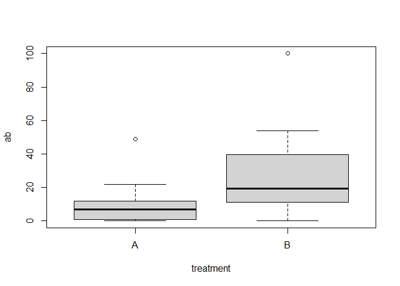
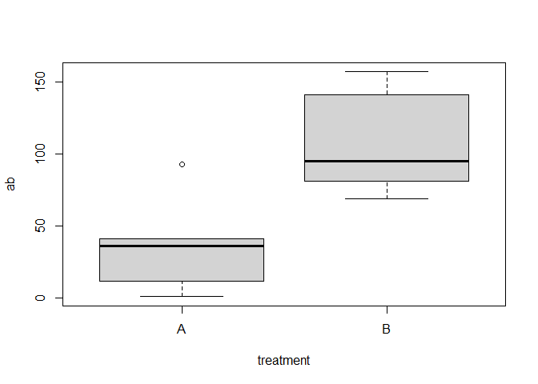

Effect of pooling samples together
================
Rodolfo Pelinson
2023-05-19

This is a simulation of the abundance of one species occurring in 5
ponds assined to treatments A and B. Each of those ponds were sampled
four times.

``` r
#Number of replicates
n_replicates <- 5

#Number of samples in each replicate
n_samples <- 4

#Simulating data
ponds <- 1:(n_replicates*2)
treatments <- c(rep("A",n_replicates) , rep("B",n_replicates))
```

The mean abundance on each sample of the treatment”A” will be 10
individuals, whereas samples from treatment “B” will have 14 more
individuals on average. But, because we expect variability the mean
abundance of each pond, we will draw the mean abundance of each pond
from a negative binomial distribution with mean = 10 for ponds from
treatment “A”, and 24 for ponds from treatment “B”.

``` r
set.seed(4)

#Mean abundance in treatment A (or the intercept)
mean_abundance <- 10

#Difference of mean abundance in treatment B to treatment A (or the effect size)
diff_mean_abundance <- 14

#Simulating the means in each replicate
mu <- c(rnbinom(n = n_replicates, size = 2, mu = mean_abundance),
        rnbinom(n = n_replicates, size = 2, mu = mean_abundance + diff_mean_abundance))
```

These are the mean abundances:

``` r
data.frame(ponds, treatments, mean_ab = mu)
```

    ##    ponds treatments mean_ab
    ## 1      1          A       7
    ## 2      2          A       5
    ## 3      3          A      11
    ## 4      4          A       1
    ## 5      5          A      32
    ## 6      6          B      27
    ## 7      7          B      23
    ## 8      8          B      19
    ## 9      9          B      38
    ## 10    10          B      23

Now because we have four samples in each pond, we will draw the
abundance in each sample from the mean of each pond also from a negative
binomial distribution.

``` r
#Simulating data from each sample
ab <- list()
ID <- list()
treatment <- list()
sample <- list()
for(i in 1:length(ponds)){
  ab[[i]] <- rnbinom(n = n_samples, mu = mu[i], size = 2)
  ID[[i]] <- rep(ponds[i],n_samples)
  treatment[[i]] <- rep(treatments[i],n_samples)
  sample[[i]] <- c(1:4)
}
```

This is how our data looks like:

``` r
data <- data.frame(ID = unlist(ID), sample = unlist(sample),treatment = unlist(treatment), ab = unlist(ab))
data
```

    ##    ID sample treatment  ab
    ## 1   1      1         A  16
    ## 2   1      2         A   7
    ## 3   1      3         A  11
    ## 4   1      4         A   7
    ## 5   2      1         A   1
    ## 6   2      2         A   0
    ## 7   2      3         A   5
    ## 8   2      4         A   6
    ## 9   3      1         A   9
    ## 10  3      2         A  11
    ## 11  3      3         A   3
    ## 12  3      4         A  13
    ## 13  4      1         A   0
    ## 14  4      2         A   0
    ## 15  4      3         A   0
    ## 16  4      4         A   1
    ## 17  5      1         A  14
    ## 18  5      2         A   8
    ## 19  5      3         A  22
    ## 20  5      4         A  49
    ## 21  6      1         B  18
    ## 22  6      2         B  21
    ## 23  6      3         B  18
    ## 24  6      4         B  12
    ## 25  7      1         B  10
    ## 26  7      2         B  54
    ## 27  7      3         B   0
    ## 28  7      4         B  31
    ## 29  8      1         B  31
    ## 30  8      2         B 100
    ## 31  8      3         B   4
    ## 32  8      4         B  22
    ## 33  9      1         B  17
    ## 34  9      2         B  23
    ## 35  9      3         B  53
    ## 36  9      4         B  48
    ## 37 10      1         B   8
    ## 38 10      2         B  51
    ## 39 10      3         B  13
    ## 40 10      4         B   9

This is how it looks like if we add up all samples from each pond:

``` r
data_pooled <- data.frame(ID = unlist(lapply(ID, unique)),
                          treatment = unlist(lapply(treatment, unique)),
                          ab = unlist(lapply(ab, sum)))
data_pooled
```

    ##    ID treatment  ab
    ## 1   1         A  41
    ## 2   2         A  12
    ## 3   3         A  36
    ## 4   4         A   1
    ## 5   5         A  93
    ## 6   6         B  69
    ## 7   7         B  95
    ## 8   8         B 157
    ## 9   9         B 141
    ## 10 10         B  81

Now, lets analise this dataset using a mixed modelling approach, where
each sample is an observation and using pond ID as a random effect.

``` r
library(glmmTMB)
```

    ## Warning: package 'glmmTMB' was built under R version 4.2.3

    ## Warning in checkMatrixPackageVersion(): Package version inconsistency detected.
    ## TMB was built with Matrix version 1.5.4
    ## Current Matrix version is 1.5.1
    ## Please re-install 'TMB' from source using install.packages('TMB', type = 'source') or ask CRAN for a binary version of 'TMB' matching CRAN's 'Matrix' package

``` r
mod_mixed0 <- glmmTMB(ab ~ 1 + (1|ID), family = "nbinom2", data = data)
mod_mixed1 <- glmmTMB(ab ~ treatment + (1|ID), family = "nbinom2", data = data)
```

Now we can do model selection based on AICc

``` r
library(AICcmodavg)
aictab(list(mod_mixed0, mod_mixed1), modnames = c("No_effect","Effect"))
```

    ## 
    ## Model selection based on AICc:
    ## 
    ##           K   AICc Delta_AICc AICcWt Cum.Wt      LL
    ## Effect    4 308.91       0.00   0.84   0.84 -149.88
    ## No_effect 3 312.24       3.33   0.16   1.00 -152.79

It seems like we have evidence enough to say that there is a difference
between treatmentw “A” and “B”.

We can also make Likelihood ratio tests and plot it:

``` r
anova(mod_mixed0, mod_mixed1)
```

    ## Data: data
    ## Models:
    ## mod_mixed0: ab ~ 1 + (1 | ID), zi=~0, disp=~1
    ## mod_mixed1: ab ~ treatment + (1 | ID), zi=~0, disp=~1
    ##            Df    AIC    BIC  logLik deviance  Chisq Chi Df Pr(>Chisq)  
    ## mod_mixed0  3 311.57 316.64 -152.79   305.57                           
    ## mod_mixed1  4 307.77 314.52 -149.88   299.77 5.8057      1    0.01597 *
    ## ---
    ## Signif. codes:  0 '***' 0.001 '**' 0.01 '*' 0.05 '.' 0.1 ' ' 1

``` r
boxplot(ab ~ treatment , data = data)
```

<!-- -->

LRT points towards the same direction.

But what about the dataset where we pooled samples together?

``` r
mod0 <- glmmTMB(ab ~ 1 , family = "nbinom2", data = data_pooled)
mod1 <- glmmTMB(ab ~ treatment , family = "nbinom2", data = data_pooled)

aictab(list(mod0, mod1), modnames = c("No_effect","Effect"))
```

    ## 
    ## Model selection based on AICc:
    ## 
    ##           K   AICc Delta_AICc AICcWt Cum.Wt     LL
    ## No_effect 2 111.42       0.00   0.55   0.55 -52.85
    ## Effect    3 111.85       0.43   0.45   1.00 -50.93

``` r
anova(mod0, mod1)
```

    ## Data: data_pooled
    ## Models:
    ## mod0: ab ~ 1, zi=~0, disp=~1
    ## mod1: ab ~ treatment, zi=~0, disp=~1
    ##      Df    AIC    BIC  logLik deviance  Chisq Chi Df Pr(>Chisq)  
    ## mod0  2 109.71 110.31 -52.854   105.71                           
    ## mod1  3 107.85 108.76 -50.926   101.85 3.8561      1    0.04957 *
    ## ---
    ## Signif. codes:  0 '***' 0.001 '**' 0.01 '*' 0.05 '.' 0.1 ' ' 1

``` r
boxplot(ab ~ treatment , data = data_pooled)
```

<!-- -->

Even though our boxplot looks beautiful, we don’t have enough evidence
to say that both treatments have different abundances according to model
selection, and the effect is only marginally significant using LRT.

We can repeat this process many times and see the % of times we would
find evidence of the effect of treatments using model selectio and LRT:

``` r
set.seed(1)

aic_pooled <- list()
aic_mixed <- list()
anova_pooled <- list()
anova_mixed <- list()

for(j in 1:1000){
  #Simulating the means in each replicate
mu <- c(rnbinom(n = n_replicates, size = 2, mu = mean_abundance),
        rnbinom(n = n_replicates, size = 2, mu = mean_abundance + diff_mean_abundance))

#Simulating data from each sample
ab <- list()
ID <- list()
treatment <- list()
sample <- list()
for(i in 1:length(ponds)){
  ab[[i]] <- rnbinom(n = n_samples, mu = mu[i], size = 2)
  ID[[i]] <- rep(ponds[i],n_samples)
  treatment[[i]] <- rep(treatments[i],n_samples)
  sample[[i]] <- c(1:4)
}

data <- data.frame(ID = unlist(ID), sample = unlist(sample),treatment = unlist(treatment), ab = unlist(ab))

data_pooled <- data.frame(ID = unlist(lapply(ID, unique)),
                          treatment = unlist(lapply(treatment, unique)),
                          ab = unlist(lapply(ab, sum)))

mod0 <- glmmTMB(ab ~ 1 , family = "nbinom2", data = data_pooled)
mod1 <- glmmTMB(ab ~ treatment , family = "nbinom2", data = data_pooled)
anova_pooled[[j]] <- anova(mod0, mod1)$`Pr(>Chisq)`[2]
aictab_pooled <- aictab(list(mod0, mod1), modnames = c("No_effect","Effect"))
if(aictab_pooled$Modnames[1] == "Effect" & aictab_pooled$Delta_AICc[2] >= 2){aic_pooled[[j]] <- "Evidence of Effect"}else{aic_pooled[[j]] <- "No Evidence"}


mod_mixed0 <- glmmTMB(ab ~ 1 + (1|ID), family = "nbinom2", data = data)
mod_mixed1 <- glmmTMB(ab ~ treatment + (1|ID), family = "nbinom2", data = data)
anova_mixed[[j]] <- anova(mod_mixed0, mod_mixed1)$`Pr(>Chisq)`[2]
aictab_mixed <- aictab(list(mod_mixed0, mod_mixed1), modnames = c("No_effect","Effect"))
if(aictab_mixed$Modnames[1] == "Effect" & aictab_mixed$Delta_AICc[2] >= 2){aic_mixed[[j]] <- "Evidence of Effect"}else{aic_mixed[[j]] <- "No Evidence"}

}
```

Lets see how many times we have evidence of effect of treatment
according to model selection.

Using mixed models

``` r
length(aic_mixed[aic_mixed == "Evidence of Effect"])/length(aic_mixed)
```

    ## [1] 0.319

Pooling samples together

``` r
length(aic_pooled[aic_pooled == "Evidence of Effect"])/length(aic_pooled)
```

    ## [1] 0.204

Now evidence from LRT:

Using mixed models:

``` r
length(anova_mixed[anova_mixed >= 0.05])/length(anova_mixed)
```

    ## [1] 0.619

Pooling samples together:

``` r
length(anova_pooled[anova_pooled >= 0.05])/length(anova_pooled)
```

    ## [1] 0.605

#### Conclusion

Values are not strongly different, but still, mixed models seem to be
able to find evidence for the effect of treatment “B” more times than
when we pool samples together.
