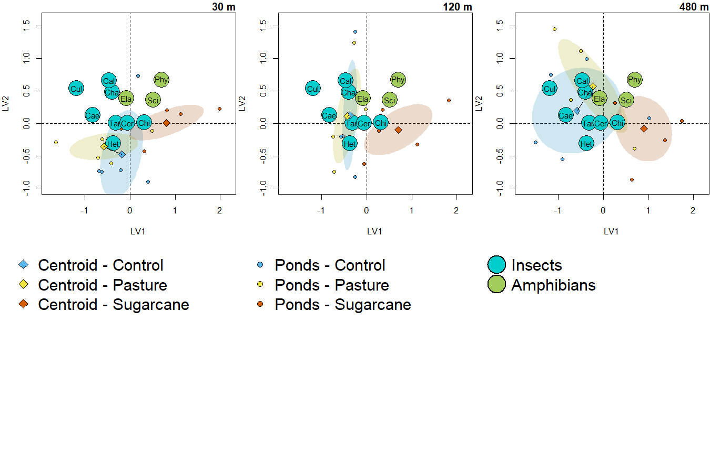
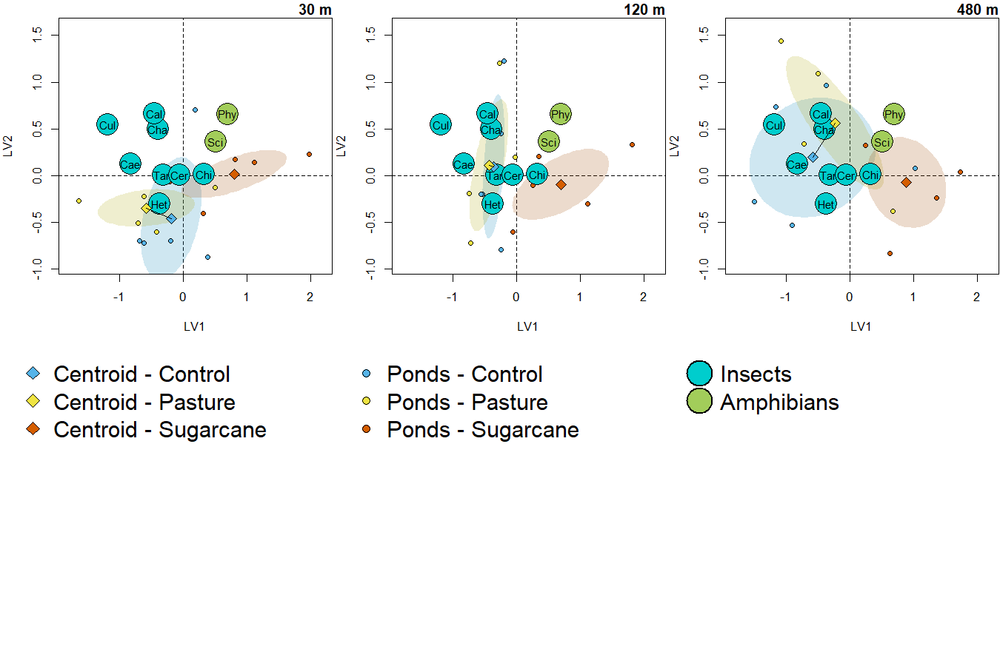

Exclusion of rare species
================
Rodolfo Pelinson
13/05/2023

Before anything, lets load all auxiliary scripts and data necessary

``` r
library(vegan)
library(gllvm)
```

This is an example of the analyses of the effects of isolation and
agrochemical treatments on herbivores and detritivores in the third
survey of the experiment. I am repeating the analysis including and
excluding species with three or less presences across all 180 samples. I
chose this survey and herbivores and detritivores because this is where
we observe the most significant changes in results when we keep all
species.

``` r
com_herb_det_SS3 <- com_SS3_orig[,Trait_SS3_orig$trophic == "consumer"]

SS3_predictors <- data.frame(ID = ID_SS2_3_4,
                             treatments = treatments_SS2_3_4,
                             isolation = isolation_SS2_3_4)
```

How many species do we have?

``` r
ncol(com_herb_det_SS3)
```

    ## [1] 11

What if we exclude species with three or less presences across all 180
samples.

``` r
com_herb_det_SS3_pa <- decostand(com_herb_det_SS3, method = "pa")
ncol(com_herb_det_SS3[,colSums(com_herb_det_SS3_pa)>3])
```

    ## [1] 10

It seems we exclude only one species from the original community. Lets
see which species

``` r
colSums(com_herb_det_SS3_pa) #number of occurrences
```

    ##                Caenis           Callibaetis       Ceratopogonidae 
    ##                    52                    29                    17 
    ##             Chaoborus          Chironominae                 Culex 
    ##                    51                   174                    51 
    ##    Elachistocleis.sp.            Heterelmis Physalaemos.nattereri 
    ##                     1                    13                    76 
    ##            Scinax.sp.           Tanypodinae 
    ##                   135                   124

``` r
colSums(com_herb_det_SS3) #total abundances
```

    ##                Caenis           Callibaetis       Ceratopogonidae 
    ##                   151                    60                    23 
    ##             Chaoborus          Chironominae                 Culex 
    ##                   154                  8574                   306 
    ##    Elachistocleis.sp.            Heterelmis Physalaemos.nattereri 
    ##                     1                    14                   725 
    ##            Scinax.sp.           Tanypodinae 
    ##                  1589                   529

It seems only Elachistocleis sp. Was excluded. It occurred in only one
sample of the 180 samples. Lets see which sample:

``` r
SS3_predictors[which(com_herb_det_SS3_pa$Elachistocleis.sp. > 0),]
```

    ##      ID treatments isolation
    ## 154 B04    control       120

It seems it was in pond B04, which is at 120 m of isolation and is a
control for agrochemical addition.

## Keeping all species

Lets plot and analyse data including this species:

How many latent variables do we need?

``` r
n_latent_tab_SS3 <- run_multiple_lv(num.lv = c(1,2,3),
                                    formula = ~ treatments * isolation,
                                    row.eff = ~ (1|ID),
                                    y = com_herb_det_SS3, X = SS3_predictors,
                                    family = "negative.binomial",
                                    method = "VA",
                                    n.init = 10, seed = 11:20)

n_latent_tab_SS3$AICc_tab
```

    ##   model     AICc delta_AICc  df nobs
    ## 1     1 6044.697    0.00000 122 1980
    ## 2     2 6066.524   21.82672 132 1980
    ## 3     3 6087.318   42.62076 141 1980

It looks that zero latent variables is the way to go.

Model selection of effects:

``` r
model_herb_det_selection_SS3 <- run_multiple_gllvm(formulas = list(~ treatments,
                                                                    ~ isolation,
                                                                    ~ treatments + isolation,
                                                                    ~ treatments * isolation),
                                                    names = c("Treatments",
                                                              "Isolation",
                                                              "Isolation + Treatments",
                                                              "Isolation * Treatments"),
                                                    no_effect = TRUE,
                                                    num.lv = 0,
                                                    X = SS3_predictors,
                                                    X_row = data.frame(ID = ID_SS2_3_4),
                                                    y = com_herb_det_SS3,
                                                    row.eff = ~ (1|ID),
                                                    family = "negative.binomial",
                                                    method = "VA",
                                                    n.init = 5, seed = 1:5)

model_herb_det_selection_SS3$AICc_tab
```

    ##                    model     AICc delta_AICc  df nobs
    ## 1              No Effect 6163.431 149.520640  23 1980
    ## 2             Treatments 6039.591  25.681339  45 1980
    ## 3              Isolation 6131.290 117.380338  45 1980
    ## 4 Isolation + Treatments 6013.910   0.000000  67 1980
    ## 5 Isolation * Treatments 6019.846   5.936097 111 1980

It seems like there are only additive effects of isolation and
agrochemical treatments.

Ploting the ordinations:

``` r
SS3_predictors <- data.frame(treatments = treatments_SS1,
                             isolation = isolation_SS1)

sum_com_herb_det_SS3 <- sum_com_orig_SS3[,Trait_SS3_sum_orig$trophic == "consumer"]

col_SS3 <- rep("darkolivegreen3", ncol(sum_com_herb_det_SS3))
col_SS3[Trait_SS3_sum_orig$trait[Trait_SS3_sum_orig$trophic == "consumer"] == "insect_consumer" ] <- "cyan3"


fit_SS3_plot <- gllvm(sum_com_herb_det_SS3,
                      formula = ~ 1,
                      family = "negative.binomial",
                      method = "VA",
                      n.init = 10, num.lv = 2, seed = 11:20)


scaled_lvs <- get_scaled_lvs(fit_SS3_plot, alpha = 0.5)

scaled_lvs$new_species <- scaled_lvs$species/3

xmin <- min(c(scaled_lvs$sites[,1], scaled_lvs$new_species[,1]))*1.1
xmax <- max(c(scaled_lvs$sites[,1], scaled_lvs$new_species[,1]))*1.1
ymin <- min(c(scaled_lvs$sites[,2], scaled_lvs$new_species[,2]))*1.1
ymax <- max(c(scaled_lvs$sites[,2], scaled_lvs$new_species[,2]))*1.1


par(mar = c(4,4,1.25,.1), mfrow = c(2, 3))

plot_com_SS3_herb_treat_30()

plot_com_SS3_herb_treat_120()

plot_com_SS3_herb_treat_480()

par(mar = c(0,0,0,0),cex = 1.25)
plot(NA, xaxt = "n", yaxt = "n", xlim= c(0,100), ylim = c(0,100), bty = "n", ylab = "", xlab = "")
legend(x = 0, y = 100, pch = c(23, 23, 23), legend = c("Centroid - Control", "Centroid - Pasture", "Centroid - Sugarcane"), pt.bg   = c(col_control_30, col_pasture_30, col_sugarcane_30), bty = "n")

plot(NA, xaxt = "n", yaxt = "n", xlim= c(0,100), ylim = c(0,100), bty = "n", ylab = "", xlab = "")
legend(x = 0, y = 100, pch = c(21, 21, 21), legend = c("Ponds - Control", "Ponds - Pasture", "Ponds - Sugarcane"), pt.bg    = c(col_control_30, col_pasture_30, col_sugarcane_30), bty = "n", pt.cex    = 0.75)

plot(NA, xaxt = "n", yaxt = "n", xlim= c(0,100), ylim = c(0,100), bty = "n", ylab = "", xlab = "")
legend(x = 0, y = 100, pch = c(21, 21), legend = c("Insects", "Amphibians"), pt.bg  = c("cyan3","darkolivegreen3"), bty = "n", pt.cex   = 2.5, pt.lwd   = 1.5)
```



## Now lets repeat everything excluding Elachistocleis sp.

``` r
com_herb_det_SS3_pa <- decostand(com_herb_det_SS3, method = "pa")
ncol(com_herb_det_SS3[,colSums(com_herb_det_SS3_pa)>3])
```

    ## [1] 10

``` r
com_herb_det_SS3 <- com_herb_det_SS3[,colSums(com_herb_det_SS3_pa)>3]

SS3_predictors <- data.frame(ID = ID_SS2_3_4,
                             treatments = treatments_SS2_3_4,
                             isolation = isolation_SS2_3_4)
```

How many latent variables do we need?

``` r
n_latent_tab_SS3 <- run_multiple_lv(num.lv = c(0,1,2,3),
                                    formula = ~ treatments * isolation,
                                    row.eff = ~ (1|ID),
                                    y = com_herb_det_SS3, X = SS3_predictors,
                                    family = "negative.binomial",
                                    method = "VA",
                                    n.init = 10, seed = 11:20)

n_latent_tab_SS3$AICc_tab
```

    ##   model     AICc delta_AICc  df nobs
    ## 1     0 5990.175    0.00000 101 1800
    ## 2     1 6012.770   22.59568 111 1800
    ## 3     2 6032.305   42.13026 120 1800
    ## 4     3 6050.812   60.63763 128 1800

It looks that zero latent variables is still the way to go.

Model selection of effects:

``` r
model_herb_det_selection_SS3_excluding <- run_multiple_gllvm(formulas = list(~ treatments,
                                                                    ~ isolation,
                                                                    ~ treatments + isolation,
                                                                    ~ treatments * isolation),
                                                    names = c("Treatments",
                                                              "Isolation",
                                                              "Isolation + Treatments",
                                                              "Isolation * Treatments"),
                                                    no_effect = TRUE,
                                                    num.lv = 0,
                                                    X = SS3_predictors,
                                                    X_row = data.frame(ID = ID_SS2_3_4),
                                                    y = com_herb_det_SS3,
                                                    row.eff = ~ (1|ID),
                                                    family = "negative.binomial",
                                                    method = "VA",
                                                    n.init = 5, seed = 1:5)

model_herb_det_selection_SS3_excluding$AICc_tab
```

    ##                    model     AICc delta_AICc  df nobs
    ## 1              No Effect 6147.149 156.973830  21 1800
    ## 2             Treatments 6021.149  30.974248  41 1800
    ## 3              Isolation 6112.839 122.664558  41 1800
    ## 4 Isolation + Treatments 5992.850   2.675272  61 1800
    ## 5 Isolation * Treatments 5990.175   0.000000 101 1800

Now it looks like we have interactive effects of treatments!

Ploting the ordination:

``` r
SS3_predictors <- data.frame(treatments = treatments_SS1,
                             isolation = isolation_SS1)

sum_com_herb_det_SS3 <- sum_com_SS3[,Trait_SS3_sum$trophic == "consumer"]

col_SS3 <- rep("darkolivegreen3", ncol(sum_com_herb_det_SS3))
col_SS3[Trait_SS3_sum$trait[Trait_SS3_sum$trophic == "consumer"] == "insect_consumer" ] <- "cyan3"


fit_SS3_plot <- gllvm(sum_com_herb_det_SS3,
                      formula = ~ 1,
                      family = "negative.binomial",
                      method = "VA",
                      n.init = 10, num.lv = 2, seed = 11:20)


scaled_lvs <- get_scaled_lvs(fit_SS3_plot, alpha = 0.5)

scaled_lvs$new_species <- scaled_lvs$species/3

xmin <- min(c(scaled_lvs$sites[,1], scaled_lvs$new_species[,1]))*1.1
xmax <- max(c(scaled_lvs$sites[,1], scaled_lvs$new_species[,1]))*1.1
ymin <- min(c(scaled_lvs$sites[,2], scaled_lvs$new_species[,2]))*1.1
ymax <- max(c(scaled_lvs$sites[,2], scaled_lvs$new_species[,2]))*1.1


par(mar = c(4,4,1.25,.1), mfrow = c(2, 3))

plot_com_SS3_herb_treat_30()

plot_com_SS3_herb_treat_120()

plot_com_SS3_herb_treat_480()

par(mar = c(0,0,0,0),cex = 1.25)
plot(NA, xaxt = "n", yaxt = "n", xlim= c(0,100), ylim = c(0,100), bty = "n", ylab = "", xlab = "")
legend(x = 0, y = 100, pch = c(23, 23, 23), legend = c("Centroid - Control", "Centroid - Pasture", "Centroid - Sugarcane"), pt.bg   = c(col_control_30, col_pasture_30, col_sugarcane_30), bty = "n")

plot(NA, xaxt = "n", yaxt = "n", xlim= c(0,100), ylim = c(0,100), bty = "n", ylab = "", xlab = "")
legend(x = 0, y = 100, pch = c(21, 21, 21), legend = c("Ponds - Control", "Ponds - Pasture", "Ponds - Sugarcane"), pt.bg    = c(col_control_30, col_pasture_30, col_sugarcane_30), bty = "n", pt.cex    = 0.75)

plot(NA, xaxt = "n", yaxt = "n", xlim= c(0,100), ylim = c(0,100), bty = "n", ylab = "", xlab = "")
legend(x = 0, y = 100, pch = c(21, 21), legend = c("Insects", "Amphibians"), pt.bg  = c("cyan3","darkolivegreen3"), bty = "n", pt.cex   = 2.5, pt.lwd   = 1.5)
```



## Conclusion

Interesting, the ordinations are basically the same ones, however, the
simple addition of one species that only has one occurrence added enough
noise to make interactive effects of treatments disappear when we did a
model selection based on AICc.

Why did this happen? This is likely due to the fact that we have
relatively small communities, with about 10 or less species. In this
case, the inclusion of one more species with little to no information
regarding the effect of treatments on its abundance increased the AIC
values of more complex models. That makes sense since we are trying to
estimate parameters of a complex model (isolation \* agrochemicals) for
a species with only one occurrence. In this case, it is clear that AIC
will heavily penalize complex models for these species. For example, see
what happens to AIC values when we try to model only the abundance of
Elachistocleis sp. as a function of treatments and do model selection.
The AIC values of the model with the two-way interaction is heavely
penalized.
